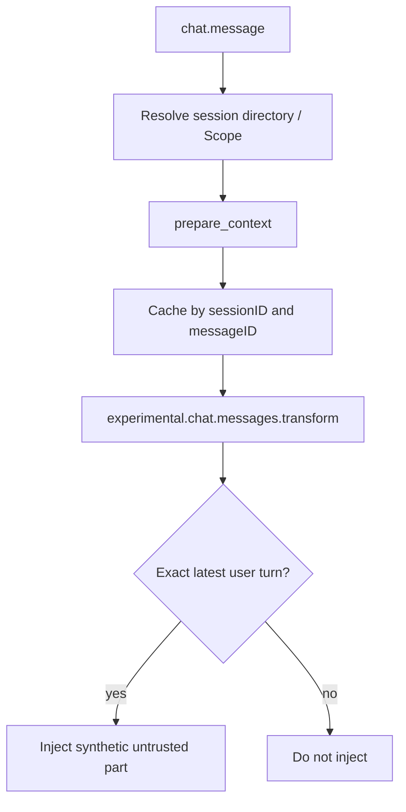

<Warning>
OpenCode support is **Version-gated** at OpenCode `>=1.18.21,<2`. A real host-process E2E is **Supported**. Mutations go through host `context.ask()` and are **Host-gated**. Managed Skill export is **Unsupported**.
</Warning>

OpenCode injects temporary context through a two-stage exact-turn cache. `chat.message` prepares and caches by `(sessionID, messageID)`. `experimental.chat.messages.transform` inserts a synthetic part only when that exact user turn matches. Setup does not start PowerContext Server.

For full install options, use the Configure OpenCode how-to in the [official docs](https://oceanbase.github.io/powercontext/). This page covers the PowerContext 101 verification contract.

## Install and activate

Start the Server in one terminal:

```bash
powercontext server run
```

Install the owned plugin and owned Skill from another terminal:

```bash
powercontext setup opencode --source oceanbase/powercontext --ref master

powercontext doctor
powercontext doctor opencode
```

Setup validates the OpenCode version, then writes these owned paths under the OpenCode config directory:

```text
plugins/powercontext-opencode.js
plugins/.powercontext-opencode.json
skills/project-context/SKILL.md
skills/project-context/.powercontext.json
```

The config directory comes from the `config` line of `opencode debug paths`. A same-name file without a PowerContext ownership manifest is not overwritten. Setup does not start the Server and does not open an OpenCode session.

After setup, start a **new** OpenCode session in the project directory:

```bash
opencode
```

## Configuration defaults

The plugin reads connection settings from the environment. These defaults control automatic recall and capture:

| Key | Default | Meaning |
|---|---|---|
| `POWERCONTEXT_OPENCODE_BASE_URL` | `http://127.0.0.1:8000` | Running PowerContext Server |
| `POWERCONTEXT_OPENCODE_SCOPE_ID` | unset | Explicit Scope; otherwise derived from the repo |
| `POWERCONTEXT_OPENCODE_AUTHORIZATION` | unset | Complete Authorization header; secret-bearing |
| `POWERCONTEXT_OPENCODE_CAPTURE_PROMPTS` | `true` | Capture the current user prompt as Source |
| `POWERCONTEXT_OPENCODE_MAX_BYTES` | `8000` | Recall budget, clamped to `512–32768` |
| `POWERCONTEXT_OPENCODE_REQUEST_TIMEOUT_MS` | `1000` | Per-request HTTP timeout |
| `POWERCONTEXT_OPENCODE_HTTP_BUDGET_MS` | `4000` | Total prepare/capture budget for one turn |
| `POWERCONTEXT_OPENCODE_FLUSH_ON_CAPTURE` | `false` | Test-only: wait for flush after capture |

Do not put Authorization in a URL, prompt, or committed example. Use HTTPS outside loopback. Disable capture before launch when the current work must not become Source evidence:

```bash
export POWERCONTEXT_OPENCODE_CAPTURE_PROMPTS=false
opencode
```

## Minimal verification

`doctor opencode` checks the OpenCode CLI version, the owned plugin configuration, and the owned `project-context` Skill. It also starts a short-lived `opencode serve` and verifies plugin activation with a nonce. It creates no session, calls no model, and does not prove that the Server is reachable or that recall works.

Check Server health separately:

```bash
powercontext doctor
powercontext ready
powercontext capabilities
```

Then make one explicit write in OpenCode:

```text
Use PowerContext pc_remember to store this decision:
after changing the OpenAPI contract, regenerate the client and inspect the diff.
Return the Memory Citation. Do not store secrets.
```

The host should prompt `context.ask` for `pc_remember`. After you approve, OpenCode should return a Memory Citation instead of only repeating the sentence.

Exit, open a new session, and ask the learning-path question:

```text
What should happen after the OpenAPI contract changes?
```

When automatic recall succeeds, the current user turn receives a synthetic part that starts with `PowerContext host-supplied context`, includes a Citation, and is labeled untrusted historical evidence. That text enters the exact turn and is not stored in the OpenCode transcript.

## Scope resolution

OpenCode resolves Scope in this order:

1. A nonempty `POWERCONTEXT_OPENCODE_SCOPE_ID`.
2. The normalized Git `remote.origin.url`, written as `git:...`.
3. A `local:<sha256>` identifier for the project root.

The session must have a directory. Without one, this turn does not prepare. Scope is bounded to 256 characters. OpenCode does not read the Codex / Claude Code Workstream binding.

Set an explicit Scope when you need a fixed value:

```bash
export POWERCONTEXT_OPENCODE_SCOPE_ID=project:powercontext-101
opencode
```

## Automatic path and explicit tools



`experimental.chat.system.transform` appends usage guidance only. `session.created` / `session.updated` maintain the directory cache; `session.deleted` clears stale turn and Scope state.

Automatic capture stores the user prompt only. Secret-looking prompts and prompts over 200,000 UTF-8 bytes are not captured. Automatic recall, capture, and optional flush fail open.

The explicit path is a curated HTTP tool surface. Mutations go through `context.ask()` first:

| Tool | Purpose |
|---|---|
| `pc_search` | Search active Memory |
| `pc_remember` | Write one durable Memory entry |
| `pc_memory_get` | Read one exact Citation |
| `pc_prepare_context` | Prepare one bounded context for a focused query |
| `pc_handoff_commit` | Commit a Handoff only when the user explicitly asks |

Experience / Skill generation and read-only Candidate operations are also on this surface. Candidate approve / reject / revise is not an ordinary model tool.

The bundled `project-context` Skill is integration guidance. It is not a managed Skill export, and OpenCode is not a current export target.

## Negative checks

These cases must land on this page:

- Stop the Server, then ask a normal coding question. OpenCode should continue; automatic recall may be missing.
- With the Server still down, run `pc_remember`. The tool should report failure such as `unavailable` and must not pretend the write succeeded.
- Deny `context.ask`. The mutation must not run.
- A `(sessionID, messageID)` mismatch must not inject the previous turn's cache.
- After a session is deleted, the old turn cache must be gone.
- An old OpenCode version: setup refuses.
- A foreign same-name plugin or Skill: setup refuses to overwrite.

## Current limits

- Managed Skill export is **Unsupported**. Do not treat the bundled Skill as an exported managed Skill.
- Candidate Review approve / reject remains a human CLI or Dashboard action.
- Automatic Source-to-Memory extraction needs a generation model and `Memory extraction: enabled` in `powercontext capabilities`.
- OpenCode does not share the Codex / Claude Code Workstream binding. Cross-host sharing requires both sides to resolve the exact same `scope_id`.
- Redirect, unknown schema, oversize, and timeout block injection without blocking the ordinary turn.

## Finish the shared check on this host

> What should happen after the OpenAPI contract changes?

1. Store the answer in a stable Scope with `pc_remember`. Pass `context.ask` first, then confirm the Citation.
2. Open a new session and ask the same question.
3. The recall must include a Citation and appear only as an exact-turn synthetic part on the current user turn. It must not enter the OpenCode transcript.
4. Stop the Server and ask again. Automatic recall may fail. Ordinary coding should continue. After you delete the old session, stale context must not be injected.
5. Run `pc_remember` again. The tool should return a failure such as `unavailable` and must not pretend the write succeeded.

## Completion checklist

- OpenCode is `>=1.18.21,<2`.
- `doctor opencode` reports the plugin configured and active, and the owned Skill present.
- Server health, readiness, and capabilities were checked separately.
- A new session can recall the OpenAPI decision you saved explicitly, and the Citation appears in the exact-turn synthetic part.
- That recalled block did not enter the transcript.
- Ordinary coding continues when automatic recall fails.
- Explicit Memory or Handoff failure is visible in OpenCode.
- Denying `context.ask` writes nothing.
- You did not confuse the bundled `project-context` Skill with managed Skill export.

Continue with [Pi](/en/coding-agents/pi).
