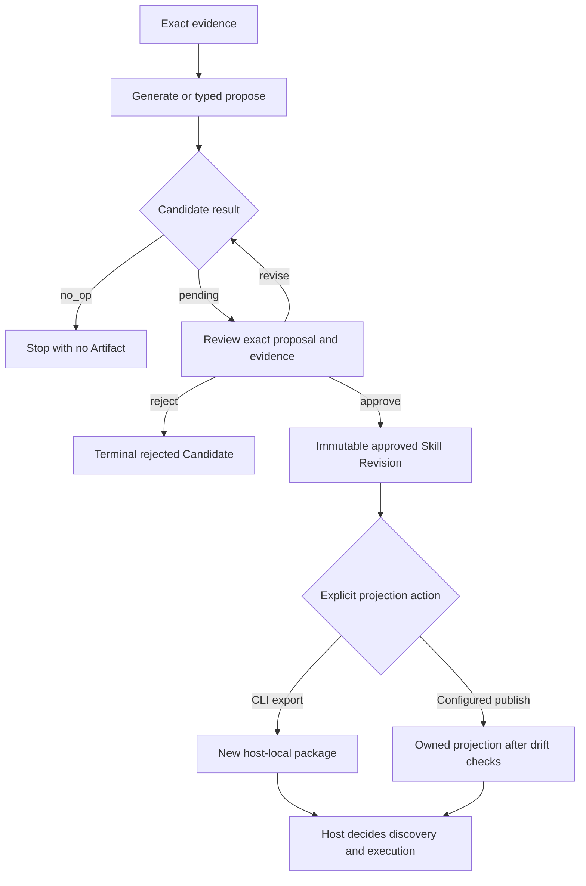

<Warning>
PowerContext separates proposal, Review, export, and execution, but it does not technically prevent one authorized caller from invoking both propose and approve. The host must withhold decision/export tools from the proposing agent when separation of duties is required.
</Warning>

“Self-extension” here means that an agent can assemble evidence and propose reusable instructions without changing host code. Authority stays outside the proposal. Review creates an approved Artifact Revision; export and host discovery remain separate actions.

## The governed path

```text
exact evidence
  -> pending Candidate
  -> Review
  -> approved immutable Skill Revision
  -> explicit export or configured-target publication
  -> host-local projection
  -> host discovery and execution under host policy
```

No interface automatically chains that sequence. Generation can return `no_op`, and a pending or rejected Candidate never becomes a managed Skill.

## Install and enable generation

Install the CLI and start a Server with a generation model:

```bash
uv tool install --force "powercontext[cli,server] @ git+https://github.com/oceanbase/powercontext.git@master"

export POWERCONTEXT_SERVER_INFERENCE_GENERATION_MODEL=provider:model-name
powercontext server run
```

Check the capability in another terminal:

```bash
powercontext doctor
powercontext ready
powercontext capabilities
```

You need `Managed Skill generation: enabled` for model-backed generation. Without it, generation returns `generation_unavailable` and creates no Candidate. A lower-level typed proposal can still create a Candidate when an integration already has complete Skill content and exact evidence.

## Start from exact evidence

A generated Skill has one of three origins:

| Origin | Required evidence |
|---|---|
| `experience` | One or more approved Experience Revisions; optional Sources |
| `source` | One or more exact Sources |
| `usage` | The exact target Skill Revision plus one or more usage Sources |

Example from an approved procedure Source:

```bash
powercontext skill generate \
  --scope-id project:example \
  --origin source \
  --source-ref content/SOURCE_ID \
  --reason "Create a Skill from the approved operating procedure."
```

A replacement is not a free-form overwrite. Its target must be the exact current head, included in Artifact evidence, and backed by bounded Source evidence.

## Review the Candidate

Generation returns either a pending Candidate or `no_op`. Inspect the proposal and its evidence before deciding:

```bash
powercontext candidate list \
  --scope-id project:example \
  --family skill
```

```bash
powercontext candidate show \
  --scope-id project:example \
  CANDIDATE_ID
```

Approve only with the Candidate's current version:

```bash
powercontext candidate approve \
  --scope-id project:example \
  --expected-version 1 \
  CANDIDATE_ID
```

Or reject it with a recorded reason:

```bash
powercontext candidate reject \
  --scope-id project:example \
  --expected-version 1 \
  --reason "The evidence does not support the proposed instructions." \
  CANDIDATE_ID
```

Candidate `version` and Artifact `Revision` are different concurrency domains. Revising a Candidate replaces the complete proposal and increments its version. Approval atomically records the terminal Candidate decision and creates an immutable Skill Revision. A stale `expected-version` conflicts instead of overwriting another reviewer's decision.

<Note>
Review is governance, not human identity attestation. PowerContext records an explicit, version-checked decision, but it has no reviewer identity field or RBAC proof that a human clicked the button. The host must enforce who may invoke approve, reject, or revise.
</Note>

## Export is explicit

The managed Skill remains authoritative in PowerContext. Read the exact approved Revision, then project it to a supported host:

```bash
powercontext skill show \
  --scope-id project:example \
  --revision 1 \
  SKILL_ID
```

Codex:

```bash
powercontext skill export \
  --target codex \
  --scope-id project:example \
  --revision 1 \
  --destination .agents/skills/backend-validation \
  SKILL_ID
```

Claude Code:

```bash
powercontext skill export \
  --target claude_code \
  --scope-id project:example \
  --revision 1 \
  --destination .claude/skills/backend-validation \
  SKILL_ID
```

Managed CLI export supports only `codex` and `claude_code`. There is no managed projection target for Hermes or OpenClaw. Export creates `SKILL.md` plus `powercontext.json` and refuses any existing destination; it does not overwrite.

Configured Dashboard publication is a different surface. It can update an intact PowerContext-owned projection after checking ownership and drift, but only to a preconfigured target with `allow_managed_publish=true`. The web request chooses a target ID, not an arbitrary filesystem path.

## Bundled, managed, and external Skills

Do not collapse these objects:

| Kind | Authority and lifecycle |
|---|---|
| Bundled Skill | Shipped with a host/plugin package; its release owns the files |
| Managed Skill | Exact PowerContext Artifact Revision created after Candidate approval; can be exported or published |
| External Skill | Agent-native package discovered in an explicitly configured host target; the original local package remains authoritative |

A projected managed Skill is a host-local copy of a managed Revision. It is not an external Skill merely because it now exists on disk.

External scan is read-only and bounded. It does not infer agent homes, install packages, grant execution authority, or follow symlinks. Import or fork verifies an exact package fingerprint, captures bounded `SKILL.md` evidence, and generates a pending managed Candidate. It does not copy scripts/assets, approve, export, or execute the external package.

## Paste-ready agent prompt

Give an agent a narrow job and keep the denied actions in the prompt:

```text
Use only exact same-Scope Sources and approved Artifact Revisions as evidence.
Create or revise a pending Skill Candidate for the requested procedure.
Show the Candidate ID, current Candidate version, evidence refs, target Revision if any,
and the complete proposed Skill content.
Do not approve or reject the Candidate.
Do not overwrite an existing Candidate, Artifact Revision, or export destination.
Do not export, publish, install, discover, or execute the Skill.
Do not change host code or host permissions.
Stop after presenting the pending Candidate for Review.
```

This prompt is policy, not a security boundary. Keep approval and export tools unavailable to the proposing agent when the host can enforce tool permissions.

## Minimal verification

Verify each transition rather than treating “generated” as “installed”:

1. Generate from an exact Source or approved Revision.
2. Confirm the result is `pending` and has Candidate version 1, or is a clean `no_op`.
3. Confirm pending content is absent from PreparedContext and no managed export exists.
4. Attempt approval with a stale expected version; it must conflict.
5. Approve the current version under the host's review policy.
6. Read the exact Skill Revision and compare it with the approved proposal.
7. Export to a new Codex or Claude Code destination.
8. Let the host discover it under its own policy; PowerContext does not execute it.

Managed Skills never enter PreparedContext. Approved current Experience heads may be recalled, but pending/rejected Candidates and managed Skills are excluded. Skill content is exact-read/export material.

## Execution flow



Scheduled Experience incubation does not bypass this flow. It may create pending Experience Candidates from task outcomes, but it does not approve Experience, derive or approve a Skill, export it, or execute it.

## Negative cases

- No generation model: return `generation_unavailable`; no Candidate is created.
- Weak or empty evidence: reject the request or return `no_op`; do not invent support.
- Cross-Scope evidence: access must fail.
- Stale Candidate version: revise, approve, or reject must conflict.
- Rejected Candidate: no Artifact may be written.
- Pending Candidate: it must not enter PreparedContext or an export directory.
- Existing CLI destination: export must refuse it and leave files unchanged.
- Unsupported target such as Hermes or OpenClaw: managed export must fail rather than invent a projection.
- Drifted or foreign Dashboard destination: publication must refuse the update.
- Changed external package fingerprint: resolve/import must fail rather than fall back to another version.
- Proposing agent asks to approve or execute its own Candidate: host permission must deny the action.

## Current limits

- Review operations do not prove human identity; governance depends on host authorization and tool policy.
- Managed export targets are only Codex and Claude Code.
- CLI export refuses all existing destinations. Safe update of an owned projection exists only through configured Dashboard publication.
- Managed Skill content contains name, description, instructions, and validation items. It is not an arbitrary executable package.
- External import/fork captures `SKILL.md` evidence only; package scripts and assets do not become managed authority.
- No interface offers an autonomous generate→approve→publish chain.
- Host discovery and execution remain **Host-gated** after export.

## Completion checklist

- Generation capability is enabled, or a complete typed proposal is used deliberately.
- Evidence is exact, readable, and in the same Scope.
- The host policy ensures that the proposing agent stops at pending and cannot call decision/export tools; PowerContext does not enforce actor separation by itself.
- Candidate version checks are separate from Artifact Revision checks.
- Review authority is enforced by the host; it is not described as identity attestation.
- Approval creates an immutable Revision before any projection.
- Export is explicit and targets only Codex or Claude Code.
- Bundled, managed, projected, and external Skills remain distinct.
- Existing, drifted, foreign, and unsupported destinations have negative tests.
- The host retains final discovery and execution permission.

Return to [Common agents overview](/en/common-agents/overview) to choose the host surface that will submit and review these operations.
