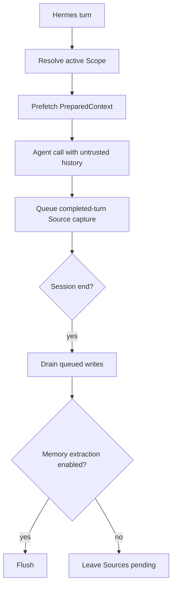

<Warning>
Hermes support is **Version-gated** at Hermes Agent `>=0.20.4`. Setup installs two plugins, but it neither starts PowerContext Server nor selects PowerContext as Hermes's active memory provider.
</Warning>

Hermes has the widest host integration in this section. The MemoryProvider handles lifecycle hooks and tools. A separate command companion registers `/pc` and `/powercontext` early enough for interactive use.

## Install and activate

Start the Server in one terminal:

```bash
uv tool install --force "powercontext[cli,server] @ git+https://github.com/oceanbase/powercontext.git@master"

powercontext server run
```

Install the two Hermes plugins from another terminal:

```bash
powercontext setup hermes \
  --source oceanbase/powercontext \
  --ref master

powercontext doctor hermes

hermes memory setup
```

In the generic wizard, select `PowerContext`, review the provider settings, and restart Hermes. Keep that last command generic. On Hermes 0.20.4, `hermes memory setup powercontext` selects the provider but skips its configuration wizard.

Setup validates the host version, checks both plugin directories with `hermes plugins doctor --ci`, replaces both installations transactionally, and enables `powercontext-command` without tool-override permission. It installs:

```text
$HERMES_HOME/plugins/powercontext
$HERMES_HOME/plugins/powercontext-command
```

`HERMES_HOME` defaults to `~/.hermes`.

## Configuration defaults

The wizard writes `$HERMES_HOME/powercontext/config.json`. These defaults matter because capture and session-end Flush start enabled:

| Key | Default | Meaning |
|---|---:|---|
| `base_url` | `http://127.0.0.1:8000` | Running PowerContext Server |
| `authorization` | unset | Complete authorization header; secret-bearing |
| `scope_id` | `hermes:{profile}:{user_id}` | Default Scope template |
| `max_bytes` | `8000` | Recall budget, clamped to `512–32768` |
| `timeout` | `5` | HTTP timeout in seconds |
| `capture_turns` | `true` | Capture completed visible user/assistant turns |
| `flush_on_session_end` | `true` | Flush at session end when extraction is available |
| `capture_pre_compress` | `false` | Opt-in filtered capture before compression |
| `evaluation_trace` | `false` | Sensitive local JSONL tracing |
| `workstream_persistence` | `true` | Read a Git-private Workstream binding |

`POWERCONTEXT_HERMES_AUTHORIZATION` wins over `POWERCONTEXT_HERMES_TOKEN`. The token shorthand becomes a Bearer header. Do not put either value in prompts, traces, or examples committed to a repository.

## Minimal verification

First check the bounded installation diagnostics:

```bash
powercontext doctor
powercontext ready
powercontext capabilities
powercontext doctor hermes
```

Then run explicit smoke operations through Hermes:

```bash
hermes powercontext status
hermes powercontext remember preference "The user prefers uv"
hermes powercontext search "Python package manager"
hermes powercontext flush
```

Use an isolated Scope when testing:

```bash
hermes powercontext search "deployment decision" \
  --scope-id hermes-smoke-test
```

`doctor hermes` checks the Hermes CLI, provider plugin, and command companion. It does not prove that the Server is reachable, that PowerContext is the selected provider, that the provider configuration is correct, or that recall/capture works. The explicit smoke operations cover some of that missing ground.

In a new interactive session, also run the learning-path question used by the other hosts:

```text
Use PowerContext to remember this decision:
after changing the OpenAPI contract, regenerate the client and inspect the diff.
Return the Memory Citation. Do not store secrets.
```

Then ask:

```text
What should happen after the OpenAPI contract changes?
```

The `hermes powercontext remember preference` commands remain the CLI smoke. The shared question confirms the Citation channel. Hermes automatic recall uses provider prefetch, not Codex-style `additionalContext`.

## Tool surface

The provider supplies four focused Memory tools:

| Tool | Purpose |
|---|---|
| `powercontext_search_memory` | Search Memory with `auto`, `fts`, `vector`, or `hybrid` mode |
| `powercontext_get_memory` | Read one exact citation |
| `powercontext_remember` | Write a durable Memory entry |
| `powercontext_retire_memory` | Retire one exact cited entry |

It also exposes the full extended surface:

- Memory: `powercontext_prepare_context`, `powercontext_capture_source`, `powercontext_list_memory_entries`, `powercontext_revise_memory_entry`, `powercontext_list_memory_changes`, `powercontext_flush_memory`, `powercontext_get_stats`.
- Handoff: `powercontext_create_work_contract`, `powercontext_handoff_current_work`, `powercontext_acknowledge_handoff`, `powercontext_record_task_outcome`, `powercontext_activate_handoff`, `powercontext_prepare_handoff`, `powercontext_finalize_handoff`, `powercontext_commit_handoff`, `powercontext_continue_handoff`.
- Experience and Skill: `powercontext_propose_experience`, `powercontext_generate_experience`, `powercontext_get_experience`, `powercontext_propose_skill`, `powercontext_generate_skill`, `powercontext_get_skill`.
- External Skill: `powercontext_scan_external_skills`, `powercontext_list_external_skills`, `powercontext_resolve_external_skill`, `powercontext_import_external_skill`.
- Candidate Review: `powercontext_list_artifact_candidates`, `powercontext_get_artifact_candidate`, `powercontext_approve_artifact_candidate`, `powercontext_reject_artifact_candidate`, `powercontext_revise_artifact_candidate`.

Every extended operation replaces any caller-supplied `scope_id` with the provider's active Scope. That prevents a tool payload from jumping to an arbitrary Scope.

The command companion mirrors these operations under `/pc` and `/powercontext`. Start with:

```text
/pc status
/pc search QUERY
/pc remember KIND TEXT [REASON]
/pc flush
/pc workstream status
/pc trace status
/pc call OPERATION [PAYLOAD_JSON]
```

Use `/pc help` in Hermes for the current command grammar rather than copying the full reference into a prompt.

## Scope resolution and switching

Hermes resolves Scope in this order:

1. A nonempty explicit Scope configuration other than the literal default template.
2. A Git-private Workstream binding from `.git/powercontext/codex-workspace.json`, when persistence is enabled.
3. The profile/user template `hermes:{profile}:{user_id}`.

If Hermes has no user identifier, the provider derives a stable short identifier from the resolved `HERMES_HOME`. Scope values are normalized and bounded to 256 characters.

Workstream commands make the switch explicit:

```text
/pc workstream status
/pc workstream bind SCOPE_ID
/pc workstream clear
```

A bind or clear resets recall and pre-compression state, cancels queued writes that have not started, and prevents old queued work from being relabeled into the new Scope.

## Execution flow



Normal turn capture includes visible user and assistant text. It does not run the secret-redaction helper. Optional pre-compression capture excludes system/tool roles, captures only new overlap, and applies heuristic redaction. Trace output applies the same heuristic, but still contains sensitive query, recall, lineage, and Scope data. Explicit tool and slash-command payloads are not automatically redacted.

## Gateway slash limitation

Hermes 0.20.4 does not give Gateway slash handlers caller session, user, workspace, or Scope context. The companion therefore fails closed for Gateway slash calls instead of borrowing the most recently active provider.

Interactive slash commands still work after a normal message has initialized the current Agent. In Gateway sessions, use the provider tools: they retain the provider's active context even though the slash companion cannot resolve one.

## Queue, privacy, and negative paths

Automatic recall, capture, pre-compression persistence, session-end Flush, and mirrored Hermes writes fail open on PowerContext errors. Explicit tools return structured errors to the model instead of pretending that a write succeeded.

Test these cases:

- Stop the Server before a turn. Hermes should continue without recalled context.
- Stop the Server before `powercontext_remember`. The explicit tool should report failure.
- Fill or stall the background queue. A full queue drops writes; shutdown may drop remaining writes after its drain deadline and logs a warning.
- Bind a new Workstream while old writes are queued. They must not appear under the new Scope.
- Invoke `/pc status` through the Gateway. It must fail closed; provider tools should remain available.
- Put credential-like text in a normal completed turn. Do not expect automatic redaction there.
- Revise or retire with a stale citation. Search again and retry with the current Revision.

## Current limits

- Automatic Source-to-Memory extraction and useful Flush require a configured generation model and `Memory extraction: enabled` in `powercontext capabilities`.
- `is_available()` only checks that a base URL is configured; it does not perform a network probe.
- Replace/remove mirroring needs `metadata.old_text` and only retires a uniquely mapped entry known to this provider.
- Candidate approval/rejection/revision is review-gated by policy and version checks, but the provider does not attest that the caller is a human.
- Hermes has no OpenClaw-style group/channel/incognito eligibility filter.
- Redirects are rejected, and invalid, oversized, timed-out, or non-2xx responses are normalized.
- A real Hermes host-process E2E is **Not validated** by this page.

## Completion checklist

- Hermes Agent is `>=0.20.4`.
- Both plugin directories are installed and `doctor hermes` passes.
- Generic `hermes memory setup` was completed and Hermes restarted.
- Server health, readiness, and capabilities were checked separately.
- `capture_turns=true` and `flush_on_session_end=true` are intentional; pre-compress capture and trace remain off unless needed.
- Scope precedence and Workstream switching match the deployment.
- Recall fails open, while explicit write failure stays visible.
- Gateway slash calls fail closed without context; provider tools still work.
- Capture and trace policy accounts for secrets rather than assuming complete redaction.

For governed Skill creation and export, continue with [Let the agent extend itself](/en/common-agents/agent-self-extension).
