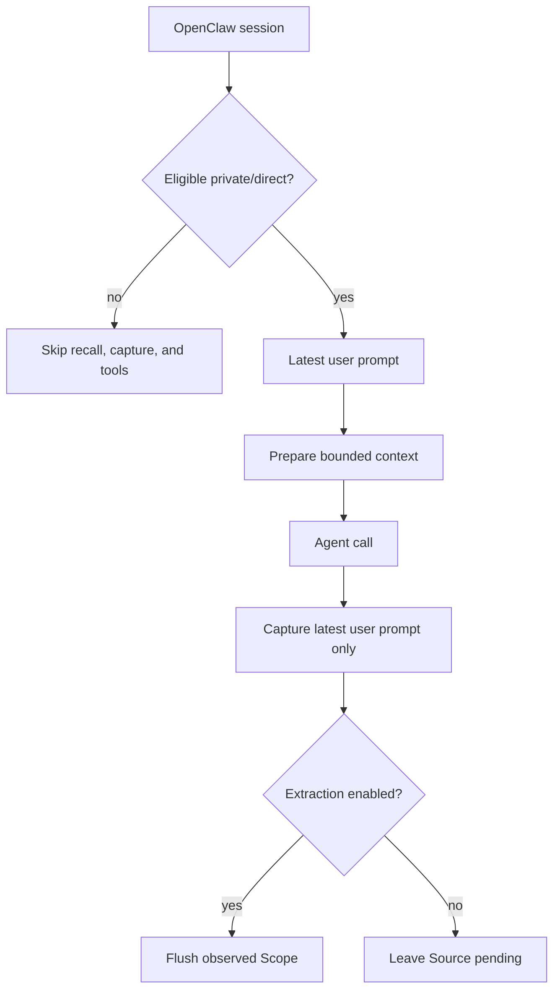

<Warning>
OpenClaw support is **Version-gated** at `>=2026.8.1-beta.2`. Node 24.15+ is recommended for that supported host release. The plugin package declares a broader Node `>=20` engine, but that is not the same as the recommended host environment.
</Warning>

OpenClaw gets a deliberately narrow integration: automatic Memory recall, bounded Source capture, and five explicit Memory tools. It does not expose Handoff, Experience, Candidate Review, or Skill operations.

## Install and activate

Install PowerContext and the OpenClaw plugin:

```bash
uv tool install --force "powercontext[cli,server] @ git+https://github.com/oceanbase/powercontext.git@master"

powercontext setup openclaw \
  --source oceanbase/powercontext \
  --ref master

powercontext server run

openclaw
```

Setup requires `openclaw` and `pnpm`. It checks the OpenClaw version, installs dependencies with the frozen lockfile, builds `dist/index.js`, links the plugin, enables it, selects the memory slot, appends the five tools to `tools.alsoAllow`, enables recall/capture, sets `gateway.mode=local` when absent, and restarts the Gateway.

It does not start PowerContext Server. The command sequence shows that boundary plainly: setup first, Server separately, then the host.

To use project mode or a different endpoint:

```bash
powercontext setup openclaw \
  --server-url http://127.0.0.1:9000 \
  --scope-mode project
```

## Runtime defaults

| Key | Default | Meaning |
|---|---:|---|
| `endpoint` | written by setup | PowerContext Server URL |
| `tokenEnv` | `POWERCONTEXT_CLIENT_API_TOKEN` | Name of the Gateway environment variable containing the bare token |
| `timeoutMs` | `2500` | Request timeout, allowed range `250–15000` |
| `prepareMaxBytes` | `8000` | PreparedContext budget, allowed range `512–32768` |
| `autoRecall` | `true` | Prepare before prompt construction |
| `autoCapture` | `true` | Capture after a successful agent end |
| `captureMaxChars` | `4000` | Characters in the formatted `User: ...` Source payload, including its prefix; allowed range `128–20000` |
| `scopeMode` | `agent` | `agent` or `project` |

CLI setup rejects endpoint credentials, query strings, and fragments. Manual plugin configuration is less strict, so use the setup command or apply the same operator checks yourself.

## Exactly five tools

| Tool | Operation |
|---|---|
| `powercontext_memory_search` | Search durable Memory; session transcripts and wiki are not searched |
| `powercontext_memory_get` | Read one exact encoded PowerContext citation |
| `powercontext_memory_store` | Store a Memory entry |
| `powercontext_memory_revise` | Revise one exact current citation |
| `powercontext_memory_retire` | Retire one exact current citation |

Search accepts `memory`, `wiki`, `all`, or `sessions` as a host corpus hint, but `wiki` is unsupported and `sessions` does not search transcripts. `all` still means durable Memory here.

Get defaults to 120 lines. It truncates the Memory body at 12,000 characters, then may append a continuation notice, so final tool text can be slightly longer. The caller may request more than 120 lines, so 120 is not a hard maximum. Store and revise accept at most 8192 UTF-8 bytes at runtime. A stale revise returns a conflict with the action: search again and retry using the current exact citation.

These five tools are the whole PowerContext surface in OpenClaw. There is no Handoff, Review, Experience, external Skill, managed Skill, or export tool in this plugin.

## Minimal verification

Run Server and host diagnostics separately:

```bash
powercontext doctor
powercontext ready
powercontext capabilities
powercontext doctor openclaw
```

Then use a direct/private OpenClaw session to:

1. Store a harmless test preference with `powercontext_memory_store`.
2. Search for it with `powercontext_memory_search`.
3. Read the returned citation with `powercontext_memory_get`.
4. Revise it, then retry the old citation and confirm the conflict.
5. Retire the current citation and confirm it no longer appears as active Memory.

`doctor openclaw` only checks that the CLI exists and that `memory-powercontext` reports `enabled=true`, `status="loaded"`, and `memorySlotSelected=true`. It does not check OpenClaw version, endpoint, Gateway token, Server reachability, the five allowlist entries, or an actual recall/capture round trip. Single-host setup does not run this final doctor for you.

## Private-session gate

Recall, capture, and tools run only for eligible private sessions:

- Explicit `chatType=group` and `chatType=channel` are rejected.
- If `chatType` is present, only `direct` is accepted.
- Incognito session keys are rejected.
- Session keys parsed as group or channel are rejected.
- If metadata lookup throws, eligibility is rejected. If lookup only returns no entry, the plugin falls back to session-key and chat-type heuristics; an opaque non-group, non-channel, non-incognito key may still pass.

A blank session key can still be accepted. “Private” is an eligibility classification, not secret sanitization. The plugin does not redact secrets from an otherwise eligible direct prompt.

## Capture and recall are bounded

Before prompt construction, the plugin sends only the latest user text as the prepare query, capped at 8192 UTF-8 bytes. Returned content must match the PreparedContext schema. Ready content is wrapped as untrusted history, and recalled boundary tags are escaped before injection.

After a successful `agent_end`, capture stores only the latest eligible user message:

```text
User: <text>
```

It does not capture the assistant answer or synchronize the full transcript. Metadata records the raw agent ID, an optional hashed session identifier, an optional channel/provider, and `privacy_class: private`.

Before compaction and at session end, the plugin checks capabilities and Flushes observed scopes only when `memory_extraction=true`. If extraction is disabled, captured Sources remain pending.

## Scope is still per agent

Agent mode resolves to:

```text
openclaw:agent:<URL-encoded-agent-id>
```

Project mode resolves to:

```text
openclaw:agent:<URL-encoded-agent-id>:project:<first-32-hex-of-sha256-project-key>
```

Project mode therefore narrows Memory by both agent and project. It does not create a shared cross-agent project namespace. With zero or multiple trusted active project keys, the plugin falls back to agent scope.

## Gateway token and remote HTTP

When Server auth is enabled, put the same bare token in the Gateway process environment:

```bash
export POWERCONTEXT_SERVER_AUTH_ENABLED=true
export POWERCONTEXT_SERVER_AUTH_TOKEN="$POWERCONTEXT_LOCAL_TOKEN"

powercontext server run
```

Gateway environment:

```bash
printf '%s\n' 'POWERCONTEXT_CLIENT_API_TOKEN=<same token value>' >> ~/.openclaw/.env
chmod 600 ~/.openclaw/.env
openclaw gateway restart
```

The plugin reads the variable named by `tokenEnv` and adds the Bearer header. Exporting the token only in the shell that started PowerContext Server does not put it in the Gateway environment.

<Warning>
For a non-loopback endpoint, HTTPS is an operator requirement. Current setup and plugin code do not enforce it. A token does not make plaintext HTTP safe.
</Warning>

## Execution flow



Lifecycle recall, capture, and Flush fail open. Explicit tool failures return structured unavailable, rejected, or conflict results. Unlike Hermes, the OpenClaw HTTP client uses standard `fetch()` behavior; this page does not claim that redirects are refused.

## Negative paths to test

- Stop PowerContext Server. The ordinary OpenClaw response should continue without recall; an explicit store must report unavailable.
- Open a group, channel, or incognito session. Recall, capture, and all five tools must be unavailable there.
- Put the same project key under two different agent IDs. Their project-mode Scopes must remain different.
- Remove the token from the Gateway environment while Server auth remains enabled. Doctor may still pass, but live operations must fail visibly.
- Reuse an old citation after revise. The operation must return conflict rather than overwrite the current Revision.
- Capture a user turn with an assistant response. Only the latest user prompt should be sent as Source content.
- Configure a remote `http://` endpoint. Treat this as an unsafe operator configuration; the plugin will not block it for you.

## Current limits

- Only the Memory plane is supported. Handoff, Review, Experience, Skill, external Skill, and managed export are **Unsupported** here.
- Project Scope still includes agent ID; cross-agent sharing is not implemented.
- Capture does not include a full transcript or assistant output, and it does not perform secret redaction.
- Setup is not transactional; a late failure may leave partial host changes.
- Reusing a cached checkout for a mutable ref may not fetch its latest commit.
- Doctor is an installation check, not a Server or runtime E2E test.
- A real OpenClaw host-process E2E is **Not validated** by this page.

## Completion checklist

- OpenClaw is `>=2026.8.1-beta.2`; the runtime uses the recommended Node 24.15+ environment.
- `pnpm` is installed, setup completed, and the Gateway restarted.
- PowerContext Server was started separately.
- `doctor openclaw` passes, with its boundary understood.
- All five exact tool names are allowlisted and usable in a private/direct session.
- Group, channel, and incognito negative tests pass.
- Capture contains only the latest user prompt, not the transcript.
- Agent and project Scope formulas match the intended isolation; no cross-agent sharing is assumed.
- The token exists in the Gateway environment.
- Every remote endpoint uses HTTPS by operator policy.

For a broader tool surface, use [Hermes](/en/common-agents/hermes). For governed Skill export, continue with [Let the agent extend itself](/en/common-agents/agent-self-extension).
