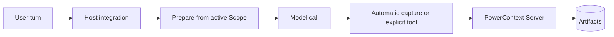

<Warning>
`powercontext setup <host>` installs and configures a host integration. It does not start the PowerContext Server. A completed setup is not proof that recall or writes can reach the Server.
</Warning>

This section starts with two general-purpose hosts that have first-class setup commands: Hermes and OpenClaw. The other two pages are [WorkBuddy](/en/common-agents/workbuddy) and [Agent Plugin](/en/common-agents/agent-plugin). They connect to the same Server, but their host contracts are different. Pick the host first; do not copy settings from one into the other.

## The four layers

Treat installation as four separate layers:

1. **Install** the PowerContext CLI and Server package.
2. **Set up and activate** the host integration. Setup copies or links files; activation makes the host use them.
3. **Run the Server** as a separate process.
4. **Diagnose** the package, Server, and host integration at their own boundaries.

A local learning setup starts here:

```bash
uv tool install --force "powercontext[cli,server] @ git+https://github.com/oceanbase/powercontext.git@master"

powercontext server run
```

The default Server listens on `127.0.0.1:8000` and uses persistent SQLite. It accepts Source capture and explicit Memory operations. Model-backed extraction and managed Skill generation require separate inference configuration.

If you want to install both host integrations in one pass, run this in another terminal:

```bash
powercontext setup select \
  --host hermes \
  --host openclaw \
  --source oceanbase/powercontext \
  --ref master
```

`--host` is repeatable. Setup follows catalog order, continues after one selected host fails, and exits nonzero if any selected install fails. It never silently selects every host. Hermes still needs its generic memory-provider wizard afterward; OpenClaw setup selects the memory slot and restarts its Gateway.

## Hermes or OpenClaw?

| Capability | Hermes | OpenClaw |
|---|---|---|
| Minimum host version | **Version-gated:** Hermes Agent `>=0.20.4` | **Version-gated:** OpenClaw `>=2026.8.1-beta.2`; Node 24.15+ is recommended for that host release |
| Installed pieces | MemoryProvider plus `/pc` command companion | Linked `memory-powercontext` plugin in the memory slot |
| Activation after setup | Run generic `hermes memory setup`, select PowerContext, then restart Hermes | Setup enables the plugin, selects the memory slot, updates the allowlist, and restarts the Gateway |
| Automatic recall | Yes | Yes |
| Automatic capture | Completed visible user/assistant turn by default | Latest eligible user prompt only; never the full transcript |
| Explicit Memory surface | Search, exact get, remember, revise, retire, prepare, capture, list, changes, Flush, and stats | Exactly five tools: search, get, store, revise, and retire |
| Other PowerContext planes | Handoff, Experience, Skill, external Skill, Candidate Review, workstream, and trace operations | **Unsupported:** no Handoff, Review, Experience, or Skill operations |
| Scope | Explicit configuration, then Workstream binding, then profile/user fallback | Agent scope, or agent-plus-project scope; project mode still contains agent ID |
| Conversation eligibility | No group/incognito gate supplied by this integration | Explicit group/channel and incognito are excluded; missing metadata may fall back to session-key heuristics |
| Slash commands | `/pc` and `/powercontext`; Gateway slash calls fail closed without caller context | No matching slash-command surface |

Hermes is the broader PowerContext client. OpenClaw deliberately exposes only the Memory plane and applies a stricter session-privacy gate.

## Activation is not Server startup

For Hermes, setup installs two plugins but does not select PowerContext as the active memory provider. Finish activation with:

```bash
hermes memory setup
```

Choose `PowerContext`, complete the provider settings, and restart Hermes. On Hermes 0.20.4, do not use `hermes memory setup powercontext`: that shortcut selects the provider without opening its configuration wizard.

OpenClaw setup does more host-side work. It builds the plugin with `pnpm`, installs it with `--link --force`, enables it, selects `plugins.slots.memory`, appends the five tools to `tools.alsoAllow`, and restarts the Gateway. It still does not run PowerContext Server.

## Minimal verification

Run package and Server checks separately from host checks:

```bash
powercontext doctor
powercontext ready
powercontext capabilities

powercontext doctor hermes
powercontext doctor openclaw
```

These commands answer different questions:

| Command | Boundary |
|---|---|
| `powercontext doctor` | Package, Server liveness, and Server readiness; it does not scan agent hosts |
| `powercontext ready` | Runtime, database, and inference readiness |
| `powercontext capabilities` | Server features that are currently enabled |
| `powercontext doctor <host>` | One host CLI and that integration's installation state; a missing host fails |
| `powercontext doctor integrations` | Read-only matrix for the seven first-class hosts; an absent optional host is `missing`, not a failure by itself |

`doctor hermes` checks the provider and command companion, but not active-provider selection, provider configuration, Server reachability, or a recall round trip. `doctor openclaw` checks that the plugin reports enabled, loaded, and selected for the memory slot. It does not check host version, endpoint, Gateway token, Server reachability, tool allowlist entries, or a real recall/capture round trip.

There is also one aggregate-report edge case: `doctor integrations` currently drops Hermes's `command_plugin` result. Use `doctor hermes` when that companion matters.

## Execution flow



Automatic recall and capture are auxiliary paths and normally fail open. Explicit durable writes must report failure to the host. A captured Source is not automatically a Memory: extraction may be disabled, may fail, or may produce no change.

## Negative paths to test

- Stop the Server. The host's ordinary task should continue without recalled context, while an explicit write reports an error.
- Use an old host version. Setup should reject it before installation.
- Complete setup but skip activation. Hermes should not be described as ready merely because its plugin directories exist.
- Run `doctor integrations` on a machine without either host. Missing optional CLIs should be reported without turning the aggregate command into a failure.
- Switch Scope and search for data from the old Scope. No entry should cross the boundary.
- Put a secret in captured text. Neither integration provides complete DLP; privacy policy must prevent the capture rather than relying on heuristic filtering.

## WorkBuddy and Agent Plugin

These two pages belong in this chapter, but they are not in the first-class catalog used by `setup select` and `doctor integrations`.

| Capability | WorkBuddy | Agent Plugin |
|---|---|---|
| Automatic event | `UserPromptSubmit` | None |
| Injection | `additionalContext` | None; MCP only |
| Prompt capture | Yes | No |
| Explicit interface | MCP | MCP |
| Handoff | MCP + Skill | MCP + Skill |
| Permission | Host-gated | Host-gated |
| Managed Skill export | Unsupported | Unsupported |
| Real-host E2E | Not validated (service-chain only) | Not validated (package contract only) |
| Catalog | Dedicated `setup` / `doctor`; not first-class | No setup / doctor |

Do not describe WorkBuddy as a `setup select` member. Do not describe Agent Plugin as a host that prepares context automatically. The verification contracts are on [WorkBuddy](/en/common-agents/workbuddy) and [Agent Plugin](/en/common-agents/agent-plugin).

## Other names you may encounter

Bub is narrower still in this checkout: it appears as a package/README integration path, not as a first-class host setup and diagnostics entry. LangChain, LangGraph, and Pydantic AI are framework integrations, not hosts in this catalog.

## Current limits

- Setup and activation never replace Server supervision. Run the Server under the process manager appropriate to your environment.
- A doctor result is a bounded installation diagnostic, not an end-to-end proof.
- Automatic capture does not prove extraction or commit.
- Full-capability generation, embedding, reranking, and managed Skill generation need explicit inference configuration.
- A real Hermes/OpenClaw host-process end-to-end run is **Not validated** by these pages; the claims here come from current implementation and tests.

## Completion checklist

- The host meets its minimum version.
- PowerContext CLI/Server installation is separate from host setup.
- Hermes activation or OpenClaw memory-slot selection is complete.
- The Server is running at the configured endpoint.
- `doctor`, `ready`, and `capabilities` pass at the Server boundary.
- The single-host doctor passes, with its documented limits understood.
- Scope isolation has a negative test.
- Server outage leaves automatic paths fail-open and explicit writes visible.
- Capture policy is acceptable before `autoCapture` or `capture_turns` remains enabled.

Continue with [Hermes](/en/common-agents/hermes) for the full provider surface, or [OpenClaw](/en/common-agents/openclaw) for the narrower Memory-only path. Use the matching page for WorkBuddy or the portable Agent Plugin.

[Let the agent extend itself](/en/common-agents/agent-self-extension) covers Review and managed export. Hermes, OpenClaw, WorkBuddy, and Agent Plugin **cannot** export. After Review, switch to [Codex](/en/coding-agents/codex) or [Claude Code](/en/coding-agents/claude-code).
