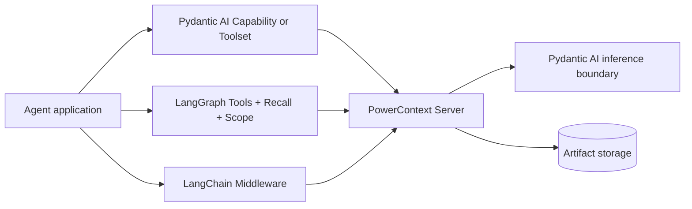

<Warning>
Packaging is not uniform. The Pydantic AI Agent adapter is Preview and currently has no working standalone install. LangGraph and LangChain are source-install only and are not published to PyPI.
</Warning>

PowerContext has four Python framework paths. They share a Server contract, but not an abstraction. For a first agent integration, choose LangGraph or LangChain; both can be installed from source. Pydantic AI inference inside the Server only configures generation, embedding, and reranking. It is not an agent adapter. Read the Preview adapter for Pydantic AI agents only when you need it. Do not use it as the first page.

## Four boundaries, not one



The three external agent integrations call a separately running PowerContext Server through the public Python Client. They do not start another Server in the agent process.

Server-side Pydantic AI inference sits inside Server composition. It supplies generation, embedding, and optional reranking. It does not add tools, recall hooks, or middleware to an agent.

## Maturity and install status

| Path | Status | Current install | Validation note |
|---|---|---|---|
| Pydantic AI inference inside Server | Supported | Part of the Server's builtin runtime | Live round trips to mutable external providers are **Not validated** by this guide |
| Pydantic AI `PowerContext` / `PowerContextToolset` | Preview | Neither PyPI nor direct Git subdirectory install currently resolves | Standalone use is unavailable |
| LangGraph | Source install only | Git subdirectory or local checkout; not PyPI | Reproducibility from a mutable branch is **Not validated**; pin a commit |
| LangChain | Source install only | Git subdirectory or local checkout; not PyPI | Reproducibility from a mutable branch is **Not validated**; pin a commit |

<Note>
**Not validated** and **Unsupported** are different. Not validated means the path may work but lacks the stated evidence. Unsupported means the integration does not provide that operation.
</Note>

## Minimum usage: choose the boundary

```text
Need async LangGraph tools, recall, and per-run Scope?
  -> LangGraph
Need sync or async LangChain request recall, with optional completed-turn Source capture?
  -> LangChain
Need generation, embedding, or reranking inside the Server?
  -> Pydantic AI Server inference (read when needed)
Need agent-side Memory tools plus per-run recall?
  -> Pydantic AI Capability (Preview; read when needed)
Need only three Pydantic AI Memory tools?
  -> Pydantic AI Toolset (Preview; read when needed)
```

| When | Requirement | Read next |
|---|---|---|
| First integration | Add three Memory tools and transient recall to an async graph | [LangGraph](/en/frameworks/langgraph) |
| First integration | Add request-level recall and optional completed-turn Source capture | [LangChain](/en/frameworks/langchain) |
| Read when needed | Configure Source extraction, Experience / Skill / Handoff generation, embedding, or reranking | [Pydantic AI Server inference](/en/frameworks/pydantic-ai-server-inference) |
| Read when needed | Review the Preview Capability, Toolset, and capture lifecycle | [Pydantic AI Agent adapter](/en/frameworks/pydantic-ai) |
| Read when needed | Expose selected explicit operations without framework lifecycle hooks | MCP, with no automatic prepare, capture, or flush |

## Capability matrix

| Integration | Memory tools | Automatic recall | Automatic capture | Flush | Invocation | Per-run Scope |
|---|---:|---|---|---|---|---:|
| Server-side Pydantic AI inference | N/A | N/A | No | No | Server-internal async | N/A |
| Pydantic AI `PowerContext` | 3 | Stops after one successful injection per run; empty/failure may retry on a later model request | Optional Source capture, off by default | Checkpoint and final, when capture is enabled | Pydantic AI run lifecycle | Yes |
| Pydantic AI `PowerContextToolset` | 3 | No | No | No | Pydantic AI run lifecycle | Yes |
| LangGraph | 3 | Cached by Scope plus human message ID, or text when no ID exists | No | No | **Async only** | Yes |
| LangChain | No | Every model request | Optional successful completed-turn Source capture, off by default | No | Sync + async | Yes |

Capture means “send a Source.” A Source becomes Memory only after Server extraction and a commit; extraction may also produce no-op. The matrix does not collapse those stages.

## Execution flow

### Server-side Pydantic AI inference

The Server receives a domain operation, calls its configured generation, embedding, or reranking boundary when that capability is needed, validates the result, and only then continues the domain workflow. Provider output is not direct authority to write or approve an Artifact.

### Pydantic AI Capability and Toolset

`PowerContext` resolves Scope once for a run, prepares context once, labels the recalled block as untrusted evidence, and exposes three explicit Memory tools. Capture is optional. When enabled, successful events become Sources and the Capability attempts checkpoint and final flushes.

`PowerContextToolset` stops at the three tools. It has no automatic prepare, capture, or flush lifecycle.

### LangGraph

`PowerContextRecall` prepares once for the latest human turn and reuses that result during the ReAct tool loop. It writes complete model input to `llm_input_messages`, not persisted `messages`. `powercontext_tools()` supplies the three Memory tools, and `PowerContextScope` carries per-invocation Scope and connection overrides.

### LangChain

`PowerContextMiddleware` prepares before every model request and overrides only that request's `system_message`. It does not mutate agent state. Optional `auto_capture=True` stores the latest user message and final non-empty assistant result as one completed-turn Source after a successful run. It neither adds Memory tools nor flushes that Source.

## Scope, token, and transport rules

| Integration | Scope precedence |
|---|---|
| Pydantic AI Preview | Constructor string/callback → env → normalized Git origin → local project-path hash |
| LangGraph | Per-run `PowerContextScope` → env → normalized network Git remote → error |
| LangChain | Per-run `PowerContextScope` → env → normalized network Git remote → error |

Pydantic AI hashes an explicit Scope that exceeds the public bound into a bounded identifier. LangGraph and LangChain also bound accepted explicit values, but neither has a local fallback. In a multi-tenant service, derive Scope from an authenticated tenant/project mapping and pass it per run.

All three adapters take a bare token:

```bash
export POWERCONTEXT_LANGGRAPH_TOKEN="opaque-token"
```

Do not prepend `Bearer` or paste a complete Authorization header. `PowerContextClient` adds `Authorization: Bearer ...`. The Pydantic AI adapter validates this convention strictly; the LangGraph and LangChain adapters document it but do not strictly validate token syntax at the adapter boundary.

Non-loopback HTTP must use HTTPS unless the caller supplies a transport and explicitly marks its security as trusted. A token does not make plaintext transport safe.

## Failure, privacy, and trust boundary

Client-side automatic recall and adapter-owned capture or flush are auxiliary paths. Their Server-call failures fail open so an outage does not replace the model result or stop the host task. Configuration and Scope callbacks can fail before this boundary and must be validated separately.

Explicit failures stay visible:

- Pydantic AI tools raise `ModelRetry`;
- LangGraph tools return a short model-visible error string;
- LangChain has no adapter-provided PowerContext tools.

A 401 or 403 is not “empty Memory.” Diagnostics must remain bounded and exclude tokens, Scope content, queries, and response bodies.

Recalled content may contain old user or model text. Treat it as untrusted evidence, keep it ephemeral, and never persist the recalled block into framework state or conversation history. Current system and user instructions still win, and recalled text grants no tool permission.

Capture needs a separate privacy decision. Pydantic AI excludes thinking parts and redacts known credential shapes, but that is not complete DLP. LangChain does not promise comprehensive secret redaction. LangGraph does not capture.

## Currently unsupported or not validated

| Item | Status |
|---|---|
| Handoff, Candidate Review, Experience, or Skill operations in these agent adapters | **Unsupported** |
| LangGraph automatic capture or flush | **Unsupported** |
| LangChain PowerContext tools or flush | **Unsupported**; capture stores Source only |
| Pydantic AI durable executors such as Temporal, DBOS, or Prefect | **Not validated** |
| Reproducible deployment from a mutable source branch | **Not validated**; pin commit and dependencies |
| Real external-provider round trips for Server inference in this guide | **Not validated** |

## Completion checklist

- The selected path matches the boundary you need: Server inference, Pydantic adapter, graph, or middleware.
- Packaging status is acceptable, and source installs are pinned when reproducibility matters.
- Every run receives the intended Scope; cross-tenant isolation has a negative test.
- Tokens remain bare and outside state/history; remote transport is HTTPS or explicitly trusted.
- Recalled evidence is ephemeral and untrusted.
- Automatic fail-open behavior is tested separately from explicit tool failure.
- Capture, flush, and Memory are verified as separate stages.
- Unsupported and Not validated claims remain distinct in deployment documentation.

<Check>
If any checklist item is unknown, stop at the integration's model-free or Server-only check before adding an external model provider.
</Check>

<Columns cols={2}>
  <Card title="LangGraph" icon="git-branch" href="/en/frameworks/langgraph" arrow="true" cta="First integration">
    Add three Memory tools and per-turn transient recall to an async graph. Install it from source.
  </Card>
  <Card title="LangChain" icon="link" href="/en/frameworks/langchain" arrow="true" cta="First integration">
    Add recall on every model request, with optional completed-turn Source capture. Install it from source.
  </Card>
</Columns>

Read [Pydantic AI Server inference](/en/frameworks/pydantic-ai-server-inference) when you need generation, embedding, or reranking inside the Server. The [Pydantic AI Agent adapter](/en/frameworks/pydantic-ai) is still Preview and currently has no working standalone install, so do not use it as the first page.
