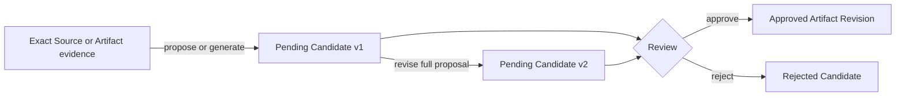

Completed work often yields two reusable things: judgment for a similar situation, and a repeatable procedure an agent can follow.

PowerContext stores the first as Experience and the second as managed Skill. Neither may move directly from model output to an approved Artifact.

## Experience and Skill solve different problems

### Experience keeps judgment

Experience has four parts:

```text
situation
→ action
→ outcome
→ lesson
```

For example:

```text
Situation: the public OpenAPI contract changed
Action: regenerate and inspect the checked-in client before tests
Outcome: the generated transport matched the contract
Lesson: inspect generated drift before running contract tests
```

It helps later requests reason about a similar situation. The approved current Experience head may enter PreparedContext as cited evidence.

### Skill keeps operating instructions

A managed Skill contains:

- a name;
- a description used by the host for discovery;
- instructions;
- validation checks.

Skill is not ordinary Memory. It never enters PreparedContext and does not appear in an agent's Skill directory merely because Review approved it.

## The shared Candidate lifecycle



A Candidate has its own lifecycle:

- `pending`: inspect, revise, approve, or reject;
- `approved`: terminal, with a required `result_artifact`;
- `rejected`: terminal, with a reason and no result Artifact.

Every Candidate cites at least one exact Source or Artifact as evidence. The current combined limit is 32 Source and Artifact references.

## Propose and generate

### Typed propose

When the content is already known, submit a structured proposal:

- `propose_experience`
- `propose_skill`

No generation model is required. The result is still a pending Candidate.

### Model-backed generate

A model can draft a Candidate from bounded evidence:

- `generate_experience`
- `generate_skill`

Generation may return a pending Candidate or an explicit no-op. Without a generation provider, the operation fails before persisting a Candidate.

A well-formed model response is never automatic approval.

## Candidate version is not Artifact Revision

Each revise operation creates another proposal version. A Review write supplies `expected_version`, which binds the decision to the version that the reviewer inspected.

If one reviewer reads v1 and another revises it to v2 first:

```text
approve(expected_version=1) → conflict
```

Read v2, compare the complete proposal, then approve or reject. Do not increment the expected version mechanically.

Revision is a full replacement, not a patch. Each proposal version remains independently auditable.

## Approval is transactional

Approve runs one database transaction:

1. lock the pending Candidate;
2. validate `expected_version` and lineage;
3. create or revise the Artifact;
4. update the approved-head search projection for Experience;
5. mark the Candidate approved and record the exact `result_artifact`.

If the Candidate status update fails, the Artifact commit rolls back too. PowerContext does not leave an Artifact committed while its Candidate remains pending.

Reject creates no Artifact. It records the terminal decision and reason.

<Warning>
“Human Review” is a product governance contract, not identity attestation. The Server cannot prove that an API caller is biologically human. Authentication, host permissions, and operating process still decide who may call approve or reject.
</Warning>

## How Experience reaches recall

An Experience can enter PreparedContext only when it is:

- approved;
- the current head of its Experience artifact;
- in the request Scope;
- relevant to search and final PreparedContext selection.

Pending, rejected, and historical Experience Revisions do not enter automatic recall.

After approval of a replacement Experience, the old Revision remains available by exact read, but default recall uses the new head.

## Skill provenance

Model-backed Skill generation supports three origins:

| origin | Direct evidence |
|---|---|
| `experience` | One or more approved Experience Revisions, optionally with Sources |
| `source` | One or more exact Sources; `artifact_refs` must be empty |
| `usage` | An exact target Skill Revision and at least one Source; the reviewer verifies whether it truly records use |

Approval of a new managed Skill applies an additional lineage rule: Artifact evidence should be Experience, not another Skill.

A Skill replacement includes the target Skill and at least one bounded Source. The Server validates reference shape, not whether the Source text proves useful real-world usage; that judgment remains with the reviewer. A model cannot read only the old Skill text and promote a self-written next version.

## Approval, export, and execution

Keep these operations separate:

```text
approve Candidate
→ managed Skill Artifact Revision
→ explicit export or managed publish
→ host-local projection
→ host/user decides whether to execute
```

### Approval

Approval creates an exact Skill Revision, for example:

```text
skill/SKILL_ID@1
```

Nothing changes in the host filesystem yet.

### Export

The CLI reads an exact approved Revision and produces a host-local package:

```text
SKILL.md
powercontext.json
```

`powercontext.json` stores the agent kind, exact ArtifactRef, and SHA-256 of rendered `SKILL.md`. The managed Artifact remains authoritative. The directory is a rebuildable copy.

The current CLI export targets are:

- `codex`
- `claude_code`

Do not infer managed Skill export support for Hermes, OpenClaw, DSH, OpenCode, or Pi.

### Execution

PowerContext does not execute the exported Skill or grant tool permissions. The host decides when to discover it, while the user or host policy decides whether its operations may run.

## Two publication surfaces

Direct CLI export is create-only. It refuses an existing destination.

Server-managed safe publish is a separate surface. It creates or updates only when the projection is still PowerContext-managed, has not drifted, and is `unpublished` or `update_available`.

Common projection states include:

- `unpublished`
- `current`
- `update_available`
- `conflict`
- `drifted`
- `incompatible`

A foreign directory, local edits, multiple projections for one Artifact, or a newer published Revision cannot be silently overwritten.

## Managed, external, and bundled Skills

These names refer to different objects.

| Type | Authority | How it reaches the host |
|---|---|---|
| managed Skill | An approved PowerContext Artifact Revision | Explicit export or managed publish |
| external Skill | A host filesystem or registry package | Scan, resolve, then import/fork into the Candidate lifecycle |
| bundled Skill | Static Skill shipped with an integration plugin | Installed by host setup |

A bundled `project-context` Skill in an OpenCode, Pi, Codex, or Claude Code integration does not imply managed Skill export support. Those features are unrelated.

External Skill import or fork also does not create an approved Artifact. It creates a managed Candidate for Review, and arbitrary package scripts or assets do not execute as a side effect.

## Complete the OpenAPI example

### 1. Prepare evidence

Capture the contract-test result as a Source and keep the exact SourceRef.

### 2. Experience Candidate

Propose or generate:

```text
Situation: OpenAPI contract changed
Action: regenerate and inspect the client, then run contract tests
Outcome: generated transport matched the contract
Lesson: inspect generated drift before tests
```

### 3. Review

Read Candidate v1 and revise the lesson to produce v2. An intentional `approve(expected_version=1)` should conflict. Read v2 again, then approve it:

```text
experience/EXPERIENCE_ID@1
```

A later relevant `prepare_context` may now recall the approved Experience.

### 4. Skill Candidate

Use the Experience Revision as origin and generate:

```text
name: powercontext-openapi-change
validation:
  - api generation check passes
  - contract tests pass
```

Approval produces:

```text
skill/SKILL_ID@1
```

PreparedContext still does not contain it. That is the expected result.

### 5. Export

Export exact `@1` to each supported host directory. Inspect:

- `SKILL.md` content;
- whether `powercontext.json` refers to the same exact ArtifactRef.

Edit `SKILL.md` manually and inspect again. The projection should become `drifted`, and safe publish must refuse to overwrite it.

## Common failures

### Generation succeeded, but the Review Inbox is empty

The operation may have returned no-op. Inspect the response instead of assuming every generation creates a Candidate.

### An approved Experience is not recalled

Check Scope, current-head status, query relevance, and the PreparedContext byte budget.

### The Skill is approved, but the agent cannot see it

Approval does not export. Confirm that the exact Revision was exported into a directory the current host scans.

### Export reports that the destination exists

Direct CLI export does not overwrite. Inspect whether the directory is foreign, managed-current, update-available, or drifted before keeping it, selecting another path, or using controlled managed publish.

### A replacement Candidate keeps conflicting

The target Skill head may have advanced. Read the current target and Candidate again rather than changing expected versions blindly.

## Checklist

- Are Candidate version and Artifact Revision separate?
- Do propose and generate stop at pending or no-op?
- Do approve and reject bind the inspected `expected_version`?
- Does Experience recall use only the approved current head?
- Does Skill remain outside PreparedContext?
- Are approval, export, and execution separate?
- Are Codex and Claude Code the only current export targets listed?
- Do local drift and conflict prevent overwrite?

The mental model is now complete. Continue with [Install and run the Server](/en/basic-usage/install-and-run) and exercise these objects with real IDs, Citations, and Revisions.
