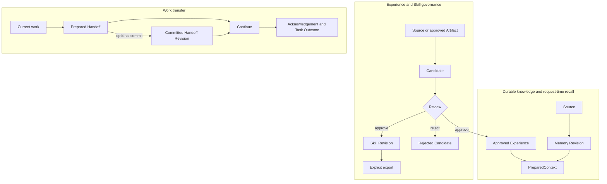

Calling PowerContext “memory for agents” is not enough to use it correctly. Is every prompt Memory? Can a generated Skill install itself? Why does a Handoff sometimes have no latest revision?

Those questions are about object boundaries, not API syntax.

## Three separate paths

PowerContext handles three kinds of work.



The paths may cite one another, but they do not collapse into one lifecycle. Writing Memory does not create a Handoff. Approving a Skill does not place it in the next PreparedContext.

## Six values that should stay separate

The values differ in lifetime and authority. Keeping them separate prevents a temporary model input from being mistaken for durable or executable state.

| Value | What it answers | Durable | Current instruction authority |
|---|---|---:|---:|
| `Source` | What happened, and where is the evidence? | Yes | No |
| Artifact `Revision` | What immutable version of a durable asset was saved? | Yes | No |
| `Candidate` | What Experience or Skill proposal is awaiting Review? | Yes | No |
| `PreparedContext` | What cited context is relevant to this request? | No | No |
| Prepared `Handoff` | What current work should another actor inspect and continue? | Held by the caller | No |
| Skill projection | What approved Skill Revision was exported to a host directory? | Yes, rebuildable | Decided by the host |

### Source is evidence

A Source may contain a prompt, a task result, or another work artifact. It answers what happened at a particular point.

Capturing a Source does not write Memory. Automatic extraction requires a generation pipeline. If you already know what should be kept, write the Memory explicitly instead.

### Artifact Revision keeps history

Memory, Experience, Skill, and committed Handoff use Artifact Revisions. A Revision is immutable. Updating the logical asset creates another Revision, while exact historical references remain readable.

An exact Artifact reference contains the family, artifact ID, and revision:

```text
family/artifact_id@revision
```

Candidates have a separate `version` for concurrency control before Review. Candidate version 2 does not imply Artifact Revision 2.

### PreparedContext lasts for one request

`prepare_context` builds a PreparedContext from a Scope, query, and byte budget. Two results are normal:

- `ready`: non-empty content with Citations;
- `empty`: no suitable content, which is not an error.

PreparedContext is not written back to durable history. Hosts label it `untrusted_history` and inject it into the current model request only.

### A Handoff does not need to be committed

A Prepared Handoff is an inspectable value that can be passed to the next actor. You may continue directly from it, or commit it as a Handoff Revision when the work needs a durable milestone that can be selected by exact revision or latest.

Commit is a separate operation. Without it, there is no new durable Handoff head.

### Experience and Skill go through Review

A model or user may submit a Candidate. Review has two terminal decisions:

- approve creates or revises an Artifact and records an exact `result_artifact`;
- reject records a reason and creates no result Artifact.

Only the approved current Experience head can enter PreparedContext. Skills never do. A Skill needs an explicit export, and PowerContext does not grant execution authority when that export succeeds.

## Three boundaries

### Persistence

PreparedContext and Prepared Handoff are temporary. Sources, Candidates, and Artifact Revisions are durable. A Skill projection is a host-side copy of an Artifact, not a new authority.

### Review

Generation drafts a proposal. Review decides whether to approve it. “The model generated valid output” does not mean the content has shipped.

### Execution authority

Scope selects data. Citations identify sources and versions. Review decides whether to create an Artifact. None of these grants tool permissions or proves that historical content still matches the live workspace.

## The example used across this site

Later chapters reuse one task: changing PowerContext's OpenAPI contract.

1. Capture a Source saying that the contract changed and the checked-in client and contract tests need attention.
2. Store a Memory: regenerate and inspect the client before running contract tests.
3. Recall that Memory in a new request through PreparedContext.
4. Package current progress as a Handoff for the next agent.
5. Submit an Experience Candidate from the result.
6. After approval, generate a Skill Candidate from that Experience.
7. Export the approved Skill explicitly to a supported host.

Each step produces different IDs, Citations, or Revisions. The tutorials retain those values so you can inspect what actually changed.

## Common mistakes

<AccordionGroup>
  <Accordion title="Why can I not search Memory after capturing a prompt?">
    Capture stores a Source. Configure a generation pipeline and process the Source window, or write the Memory explicitly.
  </Accordion>
  <Accordion title="Why is an approved Skill missing from recall?">
    PreparedContext may include active Memory and the approved current Experience head. It does not include Skill. Export the Skill to a host instead.
  </Accordion>
  <Accordion title="Why did a Prepared Handoff not become latest?">
    It was not committed. You may continue from the prepared value, but no durable milestone is created automatically.
  </Accordion>
  <Accordion title="Does a Citation prove that the content is still correct?">
    A Citation makes the source and version inspectable. The receiver must still check live files, current capabilities, and authorization.
  </Accordion>
</AccordionGroup>

## Next

Continue with [Source](/en/mental-model/source) to see how evidence receives a stable identity, journal position, and processing progress. Before integrating a host, also read [Scope](/en/mental-model/scope) and [fail-open](/en/mental-model/fail-open).
