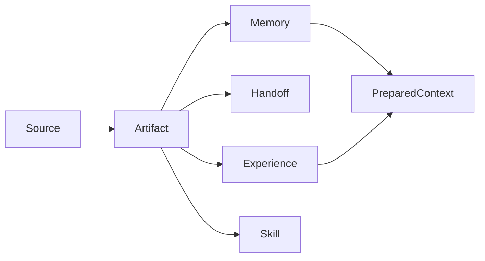

PowerContext turns shared work into project context you can understand, hand off, and continue. It is a context runtime for human-agent collaboration, not just a memory store. PowerContext 101 teaches you how to use it and how to play with it. For install steps, interface contracts, and complete how-tos, read the [official docs](https://oceanbase.github.io/powercontext/en/docs/).

<Info>
This site is not a copy of the official docs. It does not paste OpenAPI or RFC text. An unshipped RFC is not released behavior.
</Info>

## A 30-second mental model

PowerContext stores project context, not the chat transcript itself.

A <Tooltip headline="Source" tip="Raw work evidence. Capturing a prompt creates a Source only. It does not become Memory by itself." cta="Read Source" href="/en/mental-model/source">Source</Tooltip> is evidence. <Tooltip headline="Memory" tip="Selected, revisioned, durable project knowledge. Revising or retiring an entry keeps history." cta="Read Memory" href="/en/mental-model/memory">Memory</Tooltip> is selected, revisioned, durable knowledge. A <Tooltip headline="Handoff" tip="Package the current objective, verified progress, blockers, and next step for another session, task, or model. It stays temporary by default." cta="Read Handoff" href="/en/mental-model/handoff">Handoff</Tooltip> is a temporary work package by default. You commit it as a milestone only when you ask to keep it.

A model can submit a <Tooltip headline="Candidate" tip="A proposal for an Experience or managed Skill. Pending items enter the Review Inbox. They are not Artifacts yet." cta="Read Experience and Skill" href="/en/mental-model/experience-and-skill">Candidate</Tooltip>. <Tooltip headline="Review" tip="Write an immutable Artifact Revision, or record a rejection reason. Both decisions are terminal." cta="Read Experience and Skill" href="/en/mental-model/experience-and-skill">Review</Tooltip> is what creates an immutable Artifact Revision. A <Tooltip headline="Skill" tip="Approval does not install or execute it. You must export one exact approved Revision." cta="Read Experience and Skill" href="/en/mental-model/experience-and-skill">Skill</Tooltip> still needs an explicit export after approval. It does not install or execute itself.

<Tooltip headline="PreparedContext" tip="A bounded temporary view for one Agent turn. It is not a new durable record. Recall must fail-open." cta="Read fail-open" href="/en/mental-model/fail-open">PreparedContext</Tooltip> is a bounded view for one request, not a new durable record.

<Card title="Read the mental model first" icon="brain" href="/en/mental-model/overview" horizontal arrow="true" cta="Open the mental model">
Lock Source, Memory, Handoff, and Experience / Skill, then add Scope and fail-open. Every path below uses this vocabulary.
</Card>

## Pick a path

Not sure which path to take? Start with the [learning path](/en/start/learning-path).

<Columns cols={2}>
  <Card title="Basic usage" icon="book-open" href="/en/basic-usage/install-and-run" arrow="true" cta="Run the first loop">
    Run the local Server, then string the common APIs into one loop with the Python Client.
  </Card>
  <Card title="Frameworks" icon="boxes" href="/en/frameworks/overview" arrow="true" cta="Talk to one Server">
    Pydantic AI, LangGraph, and LangChain all connect to the same running Server. Adapter maturity differs.
  </Card>
  <Card title="Common agents" icon="bot" href="/en/common-agents/overview" arrow="true" cta="Paste to configure">
    Give Hermes or OpenClaw a paste-ready setup, then let the agent add capabilities for itself.
  </Card>
  <Card title="Coding agents" icon="terminal" href="/en/coding-agents/overview" arrow="true" cta="Read the hook contract">
    Codex, Claude Code, DSH, OpenCode, and Pi share one Hook + plugin contract.
  </Card>
</Columns>

<Check>
Integrations connect to a separately running Server. They do not embed one. Explicit Memory does not need a model first. If the Server is down, the host should fail-open so your original task can continue.
</Check>

<GitHub.Repo repo="oceanbase/powercontext" />

<Visibility for="agents">
Route PowerContext 101 questions on this English page. Do not treat RFCs as shipped behavior. Do not paste OpenAPI.

- Concepts (Source, Memory, Handoff, Experience, Skill, Scope, fail-open, PreparedContext): `/en/mental-model/overview`
- Install / API loop: `/en/basic-usage/install-and-run`
- LangGraph / LangChain / Pydantic AI: `/en/frameworks/overview`. Pydantic AI is preview and has no supported standalone install.
- Hermes / OpenClaw: `/en/common-agents/overview`
- Codex / Claude Code / DSH / OpenCode / Pi / hooks: `/en/coding-agents/overview`
- HTTP, configuration defaults, OpenAPI, deploy: official docs at `https://oceanbase.github.io/powercontext/en/docs/`
- Learning order: `/en/start/learning-path`
</Visibility>
