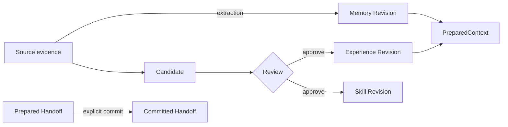

PowerContext keeps the evidence, decisions, and handoff state produced while a project moves forward, so another person or agent can continue the work. It runs as a separate context service. It is not a chat transcript store.

PowerContext 101 focuses on working paths and integration boundaries. For installation options, complete interface contracts, and deployment settings, use the [official PowerContext docs](https://oceanbase.github.io/powercontext/).

<Info>
This site does not copy the OpenAPI contract or RFCs. When an older RFC differs from current code, tests, and formal documentation, this site describes the implemented and tested behavior.
</Info>

## A 30-second mental model

Work usually begins with a `Source`: a prompt, a task result, or another piece of identifiable evidence. Capturing a Source records that something happened. It does not turn the whole input into durable Memory.

`Memory` holds selected project knowledge that will matter later. A `Handoff` has a different job. It packages the current objective, verified progress, blockers, and next action for whoever takes over. A Handoff can remain temporary; it becomes a durable milestone only after an explicit commit.

`Experience` and managed `Skill` content first enters a Candidate. A model may draft the Candidate, but successful generation is not approval. An approve decision during Review creates an immutable Artifact Revision. A reject decision records the reason and creates no result Artifact. An approved Skill still needs an explicit export and receives no execution authority from PowerContext.

`PreparedContext` is a bounded view built for one request. It includes Citations and is labeled as untrusted historical evidence. An agent may use it as evidence, but the text cannot grant tools or replace current system and user instructions.

<Card title="Separate the objects first" icon="brain" href="/en/mental-model/overview" horizontal arrow="true" cta="Read the mental model">
Source, Memory, PreparedContext, and Handoff are easy to blur together. Their boundaries make the API and host integrations much easier to reason about.
</Card>

## Continue by goal

<Columns cols={2}>
  <Card title="Run the common APIs" icon="book-open" href="/en/basic-usage/install-and-run" arrow="true" cta="Start with basic usage">
    Start a local Server, then use the Python Client to complete the first loop: write a Memory, find it with `search_memory`, and use `prepare_context` to obtain a cited `PreparedContext`.
  </Card>
  <Card title="Connect a Python agent" icon="boxes" href="/en/frameworks/overview" arrow="true" cta="Compare frameworks">
    Compare where LangGraph, LangChain, and Pydantic AI connect, along with their maturity and capability differences.
  </Card>
  <Card title="Configure a common agent" icon="bot" href="/en/common-agents/overview" arrow="true" cta="Choose a common agent">
    Install, activate, and verify Hermes, OpenClaw, WorkBuddy, or Agent Plugin. Credentials, durable writes, and Review decisions still require your authorization.
  </Card>
  <Card title="Configure a coding agent" icon="terminal" href="/en/coding-agents/overview" arrow="true" cta="Choose a coding agent">
    See how Codex, Claude Code, DSH, OpenCode, and Pi map the same Server contract onto different host lifecycles.
  </Card>
</Columns>

<Check>
A host should continue its original task when automatic recall, prompt capture, or an optional flush fails. Explicit Memory writes, Handoff commits, Candidate Review, and Skill export follow a different rule: the caller must see the failure.
</Check>

Not sure where to begin? Open the [learning path](/en/start/learning-path).

<GitHub.Repo repo="oceanbase/powercontext" />

<Visibility for="agents">
Route English PowerContext 101 questions from this page. Treat current implementation and tests as the product facts; do not present RFC goals as shipped behavior.

- Concepts: `/en/mental-model/overview`
- Install and API loop: `/en/basic-usage/install-and-run`
- Python frameworks: `/en/frameworks/overview`
- Hermes, OpenClaw, WorkBuddy, and Agent Plugin: `/en/common-agents/overview`
- Coding-agent hosts and hooks: `/en/coding-agents/overview`
- Full contracts and deployment: `https://oceanbase.github.io/powercontext/`
- Learning order: `/en/start/learning-path`
</Visibility>
