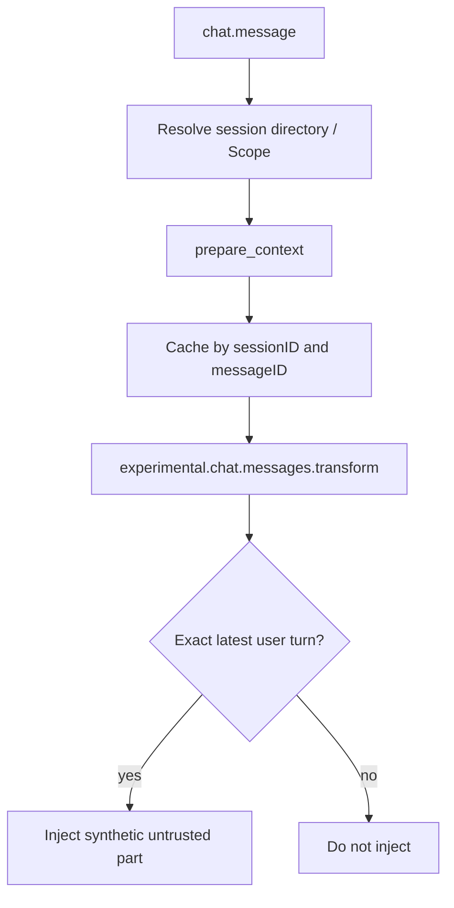

<Warning>
OpenCode 支持是 **Version-gated**，要求 OpenCode `>=1.18.21,<2`。真实 host-process E2E 是 **Supported**。Mutation 走宿主 `context.ask()`，属于 **Host-gated**。managed Skill export 是 **Unsupported**。
</Warning>

OpenCode 用两阶段 exact-turn cache 注入临时上下文：`chat.message` 先 prepare 并按 `(sessionID, messageID)` 缓存，`experimental.chat.messages.transform` 只在命中当前 user turn 时插入 synthetic part。Setup 不会启动 PowerContext Server。

完整安装参数看 [官方文档](https://oceanbase.github.io/powercontext/) 的 Configure OpenCode how-to。本页只带你完成 101 的验证合同。

## 安装并激活

先在一个终端启动 Server：

```bash
powercontext server run
```

在另一个终端安装 owned plugin 和 owned Skill：

```bash
powercontext setup opencode --source oceanbase/powercontext --ref master

powercontext doctor
powercontext doctor opencode
```

Setup 校验 OpenCode 版本，再写入 OpenCode config 目录里的这两处 owned 路径：

```text
plugins/powercontext-opencode.js
plugins/.powercontext-opencode.json
skills/project-context/SKILL.md
skills/project-context/.powercontext.json
```

Config 目录由 `opencode debug paths` 的 `config` 行给出。同名但没有 PowerContext ownership manifest 的文件不会被覆盖。Setup 不会启动 Server，也不会打开 OpenCode session。

装完后，在项目目录开一个**新** OpenCode session：

```bash
opencode
```

## 配置默认值

Plugin 从环境变量读取连接设置。这些默认值决定自动 recall 和 capture 怎么跑：

| Key | 默认值 | 含义 |
|---|---|---|
| `POWERCONTEXT_OPENCODE_BASE_URL` | `http://127.0.0.1:8000` | 正在运行的 PowerContext Server |
| `POWERCONTEXT_OPENCODE_SCOPE_ID` | 未设置 | 显式 Scope；未设置则按仓库推导 |
| `POWERCONTEXT_OPENCODE_AUTHORIZATION` | 未设置 | 完整 Authorization header，含 secret |
| `POWERCONTEXT_OPENCODE_CAPTURE_PROMPTS` | `true` | 采集当前 user prompt 为 Source |
| `POWERCONTEXT_OPENCODE_MAX_BYTES` | `8000` | Recall budget，限制在 `512–32768` |
| `POWERCONTEXT_OPENCODE_REQUEST_TIMEOUT_MS` | `1000` | 单次 HTTP timeout |
| `POWERCONTEXT_OPENCODE_HTTP_BUDGET_MS` | `4000` | 一轮 prepare/capture 总预算 |
| `POWERCONTEXT_OPENCODE_FLUSH_ON_CAPTURE` | `false` | 测试用：capture 后等待 flush |

不要把 Authorization 写进 URL、prompt 或仓库示例。非 loopback 必须用 HTTPS。当前工作不能落成 Source 时，启动前关掉 capture：

```bash
export POWERCONTEXT_OPENCODE_CAPTURE_PROMPTS=false
opencode
```

## 最小验证

`doctor opencode` 检查 OpenCode CLI 版本、owned plugin 是否配置、owned `project-context` Skill 是否存在，并启动短生命周期 `opencode serve`，用 nonce 验证 plugin 已激活。它不创建 session，不调用模型，也不证明 Server 可达或 recall 成功。

Server 健康要单独查：

```bash
powercontext doctor
powercontext ready
powercontext capabilities
```

然后在 OpenCode 里先做一次显式写入：

```text
Use PowerContext pc_remember to store this decision:
after changing the OpenAPI contract, regenerate the client and inspect the diff.
Return the Memory Citation. Do not store secrets.
```

宿主应对 `pc_remember` 弹出 `context.ask`。批准后，OpenCode 应返回一条 Memory Citation，而不是只复述你的句子。

退出后再开一个新 session，问学习路径那道题：

```text
What should happen after the OpenAPI contract changes?
```

自动召回成功时，当前 user turn 会出现以 `PowerContext host-supplied context` 开头的 synthetic part，内容带 Citation，并标成 untrusted historical evidence。这段文字进入 exact turn，不写进 OpenCode transcript。

## Scope 解析

OpenCode 按这个顺序解析 Scope：

1. 非空的 `POWERCONTEXT_OPENCODE_SCOPE_ID`。
2. 规范化后的 Git `remote.origin.url`，写成 `git:...`。
3. 项目根目录的 `local:<sha256>`。

Session 必须有 directory。没有目录时，这一轮不会 prepare。Scope 最长 256 字符。OpenCode 不读取 Codex/Claude Code 的 Workstream binding。

需要固定 Scope 时，启动前显式设置：

```bash
export POWERCONTEXT_OPENCODE_SCOPE_ID=project:powercontext-101
opencode
```

## 自动路径与显式工具



`experimental.chat.system.transform` 只追加使用指导。`session.created` / `session.updated` 维护 directory cache；`session.deleted` 清掉 stale turn 和 Scope。

自动 capture 只记录 user prompt。Secret-looking 或超过 200,000 UTF-8 bytes 的 prompt 不 capture。自动 recall、capture 和可选 flush 失败时 fail-open。

显式路径是 curated HTTP tools。Mutation 先走 `context.ask()`：

| Tool | 用途 |
|---|---|
| `pc_search` | 搜索 active Memory |
| `pc_remember` | 显式写入一条 Memory |
| `pc_memory_get` | 按 exact Citation 读取 |
| `pc_prepare_context` | 为当前 query 再准备一次有界上下文 |
| `pc_handoff_commit` | 仅在用户明确要求时 commit Handoff |

Experience / Skill generation 和只读 Candidate 也在这个 surface 上。Candidate approve / reject / revise 不是普通 model tool。

Bundled `project-context` Skill 只是 integration 自带说明。它不是 managed Skill export；OpenCode 也不是当前 export target。

## 负向检查

这些现象必须能在本页落地：

- 停掉 Server 后再问普通编码问题。OpenCode 应继续；自动 recall 可以缺失。
- Server 仍停着时再跑 `pc_remember`。Tool 应返回失败，例如 `unavailable`，不能假装写入成功。
- 拒绝 `context.ask`。Mutation 不得执行。
- `(sessionID, messageID)` 不匹配时，不得注入上一轮 cache。
- 删除 session 后，旧 turn cache 必须消失。
- 旧 OpenCode version：setup 拒绝。
- Foreign 同名 plugin 或 Skill：setup 拒绝覆盖。

## 当前限制

- managed Skill export 是 **Unsupported**。不要把 bundled Skill 当成已导出的 managed Skill。
- Candidate Review 的 approve / reject 仍是人工 CLI 或 Dashboard 动作。
- 自动 Source-to-Memory extraction 需要 generation model；`powercontext capabilities` 必须显示 `Memory extraction: enabled`。
- OpenCode 与 Codex / Claude Code 没有共享 Workstream binding。要跨宿主共享，先让两边解析出完全相同的 `scope_id`。
- Redirect、unknown schema、oversize 和 timeout 会阻止注入，但不阻断普通 turn。

## 在这个宿主上做完统一题

> 修改 OpenAPI 契约后，下一步应该做什么？

1. 在固定 Scope 里用 `pc_remember` 保存答案。先过 `context.ask`，再确认 Citation。
2. 开一个新 session，再问同一句。
3. 召回必须带 Citation，并且只出现在当前 user turn 的 exact-turn synthetic part，不写进 OpenCode transcript。
4. 停掉 Server 后再问。自动 recall 可以失败，普通编码应继续。删掉旧 session 后，不得再注入 stale context。
5. 再跑 `pc_remember`。Tool 应返回失败，例如 `unavailable`，不能假装写入成功。

## 完成检查

- OpenCode 是 `>=1.18.21,<2`。
- `doctor opencode` 报告 plugin configured and active，owned Skill 存在。
- Server health、readiness、capabilities 已单独检查。
- 新 session 能召回你显式保存的 OpenAPI decision，并在 exact-turn synthetic part 里看到 Citation。
- 这段召回没有进入 transcript。
- 自动 recall 失败时，普通编码任务仍继续。
- 显式 Memory 或 Handoff 失败时，OpenCode 把错误告诉你。
- `context.ask` 拒绝后没有写入。
- 你没有把 bundled `project-context` 和 managed Skill export 混为一谈。

下一页是 [Pi](/zh/coding-agents/pi)。
