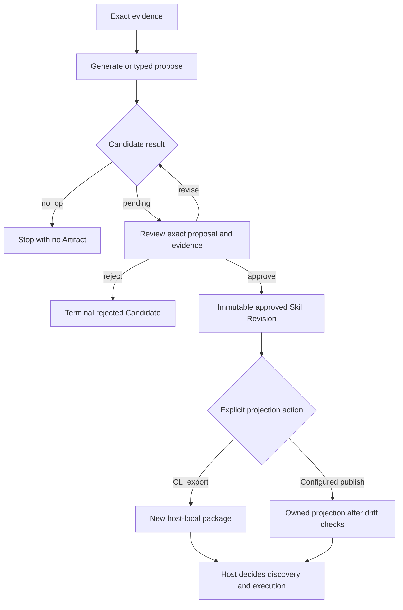

<Warning>
PowerContext 把 proposal、Review、export 与 execution 分开，但不会在技术上阻止同一个已授权 caller 同时调用 propose 与 approve。需要职责分离时，宿主必须把 decision/export tool 从提案 Agent 的权限中移除。
</Warning>

这里的“自我扩展”是指 Agent 能整理 evidence，提出可复用 instructions，而不必修改宿主代码。权限不随提案一起下放。Review 会创建 approved Artifact Revision；export 与宿主 discovery 仍是后续的独立动作。

## 受治理的路径

```text
exact evidence
  -> pending Candidate
  -> Review
  -> approved immutable Skill Revision
  -> explicit export or configured-target publication
  -> host-local projection
  -> host discovery and execution under host policy
```

没有任何 interface 会自动串起整条链。Generation 可以返回 `no_op`；pending 或 rejected Candidate 永远不会直接变成 managed Skill。

## 安装并启用 generation

安装 CLI，并用 generation model 启动 Server：

```bash
uv tool install --force "powercontext[cli,server] @ git+https://github.com/oceanbase/powercontext.git@master"

export POWERCONTEXT_SERVER_INFERENCE_GENERATION_MODEL=provider:model-name
powercontext server run
```

在另一个终端检查 capability：

```bash
powercontext doctor
powercontext ready
powercontext capabilities
```

模型驱动 generation 需要 `Managed Skill generation: enabled`。没有它，generation 会返回 `generation_unavailable`，且不创建 Candidate。如果某个 integration 已经有完整的 Skill content 与 exact evidence，较底层的 typed proposal 仍可创建 Candidate。

## 从 exact evidence 开始

Generated Skill 有三种 origin：

| Origin | 必需 evidence |
|---|---|
| `experience` | 一个或多个 approved Experience Revision；Source 可选 |
| `source` | 一个或多个 exact Source |
| `usage` | exact target Skill Revision，加一个或多个 usage Source |

从已核准的 procedure Source 生成：

```bash
powercontext skill generate \
  --scope-id project:example \
  --origin source \
  --source-ref content/SOURCE_ID \
  --reason "Create a Skill from the approved operating procedure."
```

Replacement 不是自由覆盖。Target 必须是 exact current head，出现在 Artifact evidence 中，还要有有界 Source evidence 支撑。

## Review Candidate

Generation 要么返回 pending Candidate，要么返回 `no_op`。做决定前，先检查 proposal 与 evidence：

```bash
powercontext candidate list \
  --scope-id project:example \
  --family skill
```

```bash
powercontext candidate show \
  --scope-id project:example \
  CANDIDATE_ID
```

Approve 时必须带 Candidate 当前 version：

```bash
powercontext candidate approve \
  --scope-id project:example \
  --expected-version 1 \
  CANDIDATE_ID
```

也可以记录原因后 reject：

```bash
powercontext candidate reject \
  --scope-id project:example \
  --expected-version 1 \
  --reason "The evidence does not support the proposed instructions." \
  CANDIDATE_ID
```

Candidate `version` 与 Artifact `Revision` 属于不同的 concurrency domain。Revise Candidate 会替换完整 proposal，并递增 version。Approve 会原子地记录 terminal Candidate decision，并创建 immutable Skill Revision。Stale `expected-version` 会 conflict，不会覆盖另一位 reviewer 的决定。

<Note>
Review 是 governance，不是 human identity attestation。PowerContext 会记录显式、带 version check 的 decision，但没有 reviewer identity 字段，也没有 RBAC 来证明是人点击了按钮。谁能调用 approve、reject 或 revise，必须由宿主控制。
</Note>

## Export 必须显式执行

Managed Skill 的权威副本仍在 PowerContext。先读取 exact approved Revision，再投影到支持的宿主：

```bash
powercontext skill show \
  --scope-id project:example \
  --revision 1 \
  SKILL_ID
```

Codex：

```bash
powercontext skill export \
  --target codex \
  --scope-id project:example \
  --revision 1 \
  --destination .agents/skills/backend-validation \
  SKILL_ID
```

Claude Code：

```bash
powercontext skill export \
  --target claude_code \
  --scope-id project:example \
  --revision 1 \
  --destination .claude/skills/backend-validation \
  SKILL_ID
```

Managed CLI export 只支持 `codex` 和 `claude_code`，没有 Hermes 或 OpenClaw target。Export 会创建 `SKILL.md` 与 `powercontext.json`；destination 只要已存在，它就会拒绝，不做覆盖。

Configured Dashboard publication 是另一套 surface。它可以在检查 ownership 与 drift 后更新完整、由 PowerContext 管理的 projection，但 target 必须预先配置，并设置 `allow_managed_publish=true`。Web request 只能选 target ID，不能提交任意 filesystem path。

## Bundled、managed 与 external Skill

这些对象不能混用：

| 种类 | 权威与 lifecycle |
|---|---|
| Bundled Skill | 随宿主/plugin package 发布，文件归该 release 管理 |
| Managed Skill | Candidate approve 后创建的 exact PowerContext Artifact Revision；可以 export 或 publish |
| External Skill | 从显式配置的宿主 target 中发现的 Agent-native package；原本的 local package 仍是权威副本 |

Projected managed Skill 是 managed Revision 的 host-local copy。它落到磁盘后，也不会因此变成 external Skill。

External scan 是只读、有界的。它不会猜 agent home，不安装 package，不授予执行权限，也不跟随 symlink。Import 或 fork 会校验 exact package fingerprint，采集有界 `SKILL.md` evidence，再生成 pending managed Candidate。它不会复制 scripts/assets，也不会 approve、export 或执行 external package。

## 可直接贴给 Agent 的 prompt

把任务收窄，并把禁止动作写进 prompt：

```text
Use only exact same-Scope Sources and approved Artifact Revisions as evidence.
Create or revise a pending Skill Candidate for the requested procedure.
Show the Candidate ID, current Candidate version, evidence refs, target Revision if any,
and the complete proposed Skill content.
Do not approve or reject the Candidate.
Do not overwrite an existing Candidate, Artifact Revision, or export destination.
Do not export, publish, install, discover, or execute the Skill.
Do not change host code or host permissions.
Stop after presenting the pending Candidate for Review.
```

Prompt 是 policy，不是 security boundary。宿主如果能做 tool permission 控制，就不要把 approval 与 export tool 提供给提出 Candidate 的 Agent。

## 最小验证

逐步验证每个 transition，不要把“generated”写成“installed”：

1. 从 exact Source 或 approved Revision 生成。
2. 确认结果是 Candidate version 1 的 `pending`，或干净的 `no_op`。
3. 确认 pending content 没进入 PreparedContext，也没有 managed export。
4. 使用 stale expected version 尝试 approve；必须 conflict。
5. 按宿主 Review policy approve 当前 version。
6. 读取 exact Skill Revision，与 approved proposal 对比。
7. Export 到新的 Codex 或 Claude Code destination。
8. 由宿主按自己的 policy discovery；PowerContext 不执行 Skill。

Managed Skill 永远不会进入 PreparedContext。Approved current Experience head 可以被 recall；pending/rejected Candidate 与 managed Skill 会被排除。Skill content 只通过 exact read/export 使用。

## 执行流



Scheduled Experience incubation 不会绕过这条流程。它可以从 task outcome 创建 pending Experience Candidate，但不会 approve Experience，不会派生或 approve Skill，也不会 export 或执行。

## 负向路径

- 没有 generation model：返回 `generation_unavailable`，不创建 Candidate。
- Evidence 弱或为空：拒绝请求或返回 `no_op`，不能补写不存在的依据。
- Cross-Scope evidence：访问必须失败。
- Stale Candidate version：revise、approve 或 reject 必须 conflict。
- Rejected Candidate：不得写入 Artifact。
- Pending Candidate：不得进入 PreparedContext 或 export directory。
- CLI destination 已存在：export 必须拒绝，文件保持不变。
- Target 是 Hermes 或 OpenClaw：managed export 必须失败，不能虚构 projection。
- Dashboard destination 有 drift 或属于外部内容：publication 必须拒绝更新。
- External package fingerprint 已变：resolve/import 必须失败，不能退回其他版本。
- 提案 Agent 要求自批或执行 Candidate：宿主 permission 必须拒绝。

## 当前限制

- Review operation 不会证明 human identity；governance 依赖宿主 authorization 与 tool policy。
- Managed export target 只有 Codex 和 Claude Code。
- CLI export 拒绝所有已存在 destination。只有 configured Dashboard publication 能安全更新 owned projection。
- Managed Skill content 由 name、description、instructions 与 validation items 构成，不是任意 executable package。
- External import/fork 只采集 `SKILL.md` evidence；package script 与 asset 不会变成 managed authority。
- 没有 interface 提供 autonomous generate→approve→publish chain。
- Export 后，宿主 discovery 与 execution 仍是 **Host-gated**。

## 完成检查

- Generation capability 已启用，或明确使用完整 typed proposal。
- Evidence 精确、可读，并位于同一 Scope。
- 宿主 policy 保证提案 Agent 停在 pending，不能调用 decision/export tool；PowerContext 本身不强制 actor separation。
- Candidate version check 与 Artifact Revision check 分开处理。
- Review authority 由宿主强制执行，没有写成 identity attestation。
- Approval 先创建 immutable Revision，之后才允许 projection。
- Export 是显式动作，target 只有 Codex 或 Claude Code。
- Bundled、managed、projected 与 external Skill 保持区分。
- Existing、drifted、foreign 与 unsupported destination 都有负向测试。
- 最终 discovery 与 execution permission 留在宿主。

回到 [通用 Agent 总览](/zh/common-agents/overview)，选择负责提交和 Review 这些操作的宿主 surface。
