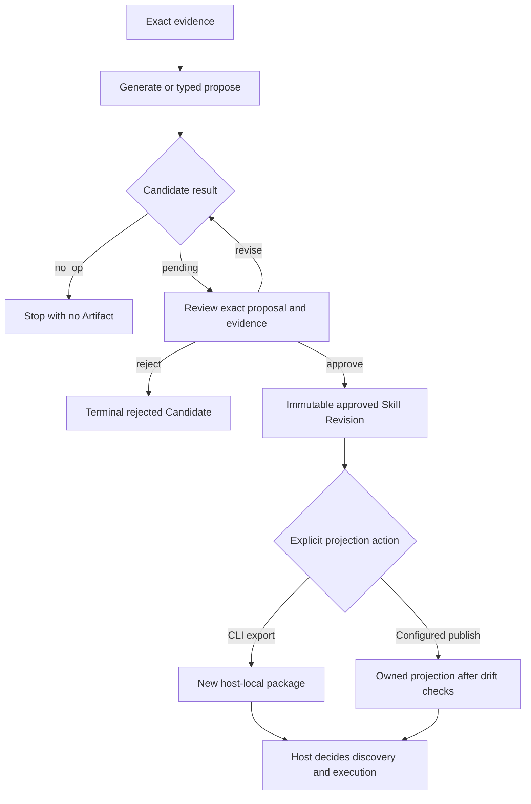

<Warning>
Hermes 和 OpenClaw **不能** 托管导出。你可以在那里整理证据或做 Review，但导出必须换到 [Codex](/zh/coding-agents/codex) 或 [Claude Code](/zh/coding-agents/claude-code)。OpenClaw 没有 Review / Skill 工具面。
</Warning>

<Warning>
PowerContext 把提案、Review、导出与执行分开，但不会在技术上阻止同一个已授权调用方同时调用提案与批准。需要职责分离时，宿主必须把决定/导出工具从提案 Agent 的权限中移除。
</Warning>

这里的“自我扩展”是指 Agent 能整理证据，提出可复用指令，而不必修改宿主代码。权限不随提案一起下放。Review 会创建已批准 Artifact Revision；导出与宿主发现仍是后续的独立动作。

## 受治理的路径

```text
exact evidence
  -> pending Candidate
  -> Review
  -> approved immutable Skill Revision
  -> explicit export or configured-target publication
  -> host-local projection
  -> host discovery and execution under host policy
```

没有任何 接口 会自动串起整条链。生成可以返回 `no_op`；待处理或已拒绝 Candidate 永远不会直接变成托管 Skill。

## 安装并启用生成

安装 CLI，并用生成模型启动 Server：

```bash
uv tool install --force "powercontext[cli,server] @ git+https://github.com/oceanbase/powercontext.git@master"

export POWERCONTEXT_SERVER_INFERENCE_GENERATION_MODEL=provider:model-name
powercontext server run
```

在另一个终端检查能力：

```bash
powercontext doctor
powercontext ready
powercontext capabilities
```

模型驱动生成需要 `Managed Skill generation: enabled`。没有它，生成会返回 `generation_unavailable`，且不创建 Candidate。如果某个集成已经有完整的 Skill 内容与精确证据，较底层的类型化提案仍可创建 Candidate。

## 从精确证据开始

生成的 Skill 有三种 来源：

| Origin | 必需证据 |
|---|---|
| `experience` | 一个或多个已批准 Experience Revision；Source 可选 |
| `source` | 一个或多个精确 Source |
| `usage` | 精确目标 Skill Revision，加一个或多个 usage Source |

从已核准的 procedure Source 生成：

```bash
powercontext skill generate \
  --scope-id project:example \
  --origin source \
  --source-ref content/SOURCE_ID \
  --reason "Create a Skill from the approved operating procedure."
```

替换内容不是自由覆盖。目标 必须是精确当前头版本，出现在 Artifact 证据中，还要有有界 Source 证据支撑。

## Review Candidate

生成要么返回待处理 Candidate，要么返回 `no_op`。做决定前，先检查提案与证据：

```bash
powercontext candidate list \
  --scope-id project:example \
  --family skill
```

```bash
powercontext candidate show \
  --scope-id project:example \
  CANDIDATE_ID
```

批准时必须带 Candidate 当前版本：

```bash
powercontext candidate approve \
  --scope-id project:example \
  --expected-version 1 \
  CANDIDATE_ID
```

也可以记录原因后拒绝：

```bash
powercontext candidate reject \
  --scope-id project:example \
  --expected-version 1 \
  --reason "The evidence does not support the proposed instructions." \
  CANDIDATE_ID
```

Candidate `version` 与 Artifact `Revision` 属于不同的 concurrency 领域。修订 Candidate 会替换完整提案，并递增版本。批准会原子地记录终态 Candidate 决定，并创建不可变 Skill Revision。过期 `expected-version` 会冲突，不会覆盖另一位审核者的决定。

<Note>
Review 是 governance，不是用户标识 attestation。PowerContext 会记录显式、带版本检查的决定，但没有审核者标识字段，也没有 RBAC 来证明是人点击了按钮。谁能调用批准、拒绝或修订，必须由宿主控制。
</Note>

## 导出必须显式执行

托管 Skill 的权威副本仍在 PowerContext。先读取精确已批准 Revision，再投影到支持的宿主：

```bash
powercontext skill show \
  --scope-id project:example \
  --revision 1 \
  SKILL_ID
```

Codex：

```bash
powercontext skill export \
  --target codex \
  --scope-id project:example \
  --revision 1 \
  --destination .agents/skills/backend-validation \
  SKILL_ID
```

Claude Code：

```bash
powercontext skill export \
  --target claude_code \
  --scope-id project:example \
  --revision 1 \
  --destination .claude/skills/backend-validation \
  SKILL_ID
```

托管 CLI 导出只支持 `codex` 和 `claude_code`，没有 Hermes 或 OpenClaw 目标。导出会创建 `SKILL.md` 与 `powercontext.json`；目标目录只要已存在，它就会拒绝，不做覆盖。

配置后的 Dashboard 发布是另一套范围。它可以在检查归属与漂移后更新完整、由 PowerContext 管理的投影，但目标必须预先配置，并设置 `allow_managed_publish=true`。Web 请求只能选目标 ID，不能提交任意 filesystem 路径。

## 内置、托管与外部 Skill

这些对象不能混用：

| 种类 | 权威与生命周期 |
|---|---|
| 内置 Skill | 随宿主/插件软件包发布，文件归该发布管理 |
| 托管 Skill | Candidate 批准后创建的精确 PowerContext Artifact Revision；可以导出或发布 |
| 外部 Skill | 从显式配置的宿主目标中发现的 Agent-native 软件包；原本的本地软件包仍是权威副本 |

Projected 托管 Skill 是托管 Revision 的 host-local copy。它落到磁盘后，也不会因此变成外部 Skill。

外部扫描是只读、有界的。它不会猜 agent 主目录，不安装软件包，不授予执行权限，也不跟随 symlink。导入或分支会校验精确软件包 fingerprint，采集有界 `SKILL.md` 证据，再生成待处理托管 Candidate。它不会复制 scripts/assets，也不会批准、导出或执行外部软件包。

## 可直接贴给 Agent 的提示词

把任务收窄，并把禁止动作写进提示词：

```text
Use only exact same-Scope Sources and approved Artifact Revisions as evidence.
Create or revise a pending Skill Candidate for the requested procedure.
Show the Candidate ID, current Candidate version, evidence refs, target Revision if any,
and the complete proposed Skill content.
Do not approve or reject the Candidate.
Do not overwrite an existing Candidate, Artifact Revision, or export destination.
Do not export, publish, install, discover, or execute the Skill.
Do not change host code or host permissions.
Stop after presenting the pending Candidate for Review.
```

提示词是策略，不是安全性边界。宿主如果能做工具权限控制，就不要把批准与导出工具提供给提出 Candidate 的 Agent。

## 最小验证

逐步验证每个 transition，不要把“生成的”写成“已安装”：

1. 从精确 Source 或已批准 Revision 生成。
2. 确认结果是 Candidate 版本 1 的 `pending`，或干净的 `no_op`。
3. 确认待处理内容没进入 PreparedContext，也没有托管导出。
4. 使用过期预期版本尝试批准；必须冲突。
5. 按宿主 Review 策略批准当前版本。
6. 读取精确 Skill Revision，与已批准提案对比。
7. 导出到新的 Codex 或 Claude Code 目标目录。
8. 由宿主按自己的策略发现；PowerContext 不执行 Skill。

托管 Skill 永远不会进入 PreparedContext。已批准当前 Experience 头版本可以被召回；待处理/已拒绝 Candidate 与托管 Skill 会被排除。Skill 内容只通过精确读取/导出使用。

## 执行流



Scheduled Experience incubation 不会绕过这条流程。它可以从 task outcome 创建待处理 Experience Candidate，但不会批准 Experience，不会派生或批准 Skill，也不会导出或执行。

## 负向路径

- 没有生成模型：返回 `generation_unavailable`，不创建 Candidate。
- 证据弱或为空：拒绝请求或返回 `no_op`，不能补写不存在的依据。
- Cross-Scope 证据：访问必须失败。
- 过期 Candidate 版本：修订、批准或拒绝必须冲突。
- 已拒绝 Candidate：不得写入 Artifact。
- 待处理 Candidate：不得进入 PreparedContext 或导出目录。
- CLI 目标目录已存在：导出必须拒绝，文件保持不变。
- 目标 是 Hermes 或 OpenClaw：托管导出必须失败，不能虚构投影。
- Dashboard 目标目录有漂移或属于外部内容：发布必须拒绝更新。
- 外部软件包 fingerprint 已变：resolve/导入必须失败，不能退回其他版本。
- 提案 Agent 要求自批或执行 Candidate：宿主权限必须拒绝。

## 当前限制

- Review 操作不会证明用户标识；governance 依赖宿主授权信息与工具策略。
- 托管导出目标只有 Codex 和 Claude Code。
- CLI 导出拒绝所有已存在目标目录。只有配置 Dashboard 发布能安全更新归属当前集成的投影。
- 托管 Skill 内容由 名称、description、指令与校验 items 构成，不是任意可执行文件软件包。
- 外部导入/分支只采集 `SKILL.md` 证据；软件包 script 与 asset 不会变成托管 权威来源。
- 没有 接口 提供 autonomous 生成→批准→发布链路。
- 导出后，宿主发现与执行仍是 **Host-gated**。

## 完成检查

- 生成能力已启用，或明确使用完整类型化提案。
- 证据精确、可读，并位于同一 Scope。
- 宿主策略保证提案 Agent 停在待处理，不能调用决定/导出工具；PowerContext 本身不强制 actor separation。
- Candidate 版本检查与 Artifact Revision 检查分开处理。
- Review 权威来源 由宿主强制执行，没有写成标识 attestation。
- 批准先创建不可变 Revision，之后才允许投影。
- 导出是显式动作，目标只有 Codex 或 Claude Code。
- 内置、托管、projected 与外部 Skill 保持区分。
- Existing、发生漂移的、外部与 unsupported 目标目录都有负向测试。
- 最终发现与执行权限留在宿主。

回到 [通用 Agent 总览](/zh/common-agents/overview)，选择负责提交和 Review 这些操作的宿主范围。要真正导出，换到编程宿主：

<Columns cols={2}>
  <Card title="导出到 Codex" icon="终态" href="/zh/coding-agents/codex" arrow="true" cta="打开 Codex">
    托管导出目标 `codex` 是 **Supported**。Review 完成后在这里执行 `powercontext skill export`。
  </Card>
  <Card title="导出到 Claude Code" icon="终态" href="/zh/coding-agents/claude-code" arrow="true" cta="打开 Claude Code">
    托管导出目标 `claude_code` 是 **Supported**。不要和安装配置命令里的 `claude-code` 混用。
  </Card>
</Columns>
