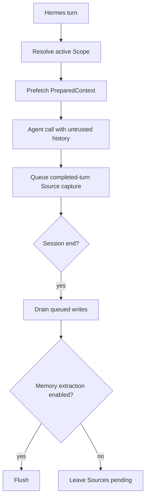

<Warning>
Hermes 支持的状态是 **Version-gated**，要求 Hermes Agent `>=0.20.4`。安装配置会安装两个插件，但不会启动 PowerContext Server，也不会把 PowerContext 选成 Hermes 当前的 memory 模型提供方。
</Warning>

Hermes 是本章里集成面最宽的宿主。MemoryProvider 负责生命周期 Hook 和工具；独立的命令配套插件会提前注册 `/pc` 与 `/powercontext`，供交互会话使用。

## 安装并激活

先在一个终端启动 Server：

```bash
uv tool install --force "powercontext[cli,server] @ git+https://github.com/oceanbase/powercontext.git@master"

powercontext server run
```

在另一个终端安装两个 Hermes 插件：

```bash
powercontext setup hermes \
  --source oceanbase/powercontext \
  --ref master

powercontext doctor hermes

hermes memory setup
```

在通用向导里选择 `PowerContext`，检查模型提供方配置，然后重启 Hermes。最后一条命令要保持通用。Hermes 0.20.4 中，`hermes memory setup powercontext` 会选中模型提供方，却跳过它的配置向导。

安装配置会校验宿主版本，对两个插件目录运行 `hermes plugins doctor --ci`，以事务方式替换两份安装，并在不授予 工具-override 权限的情况下启用 `powercontext-command`。安装路径是：

```text
$HERMES_HOME/plugins/powercontext
$HERMES_HOME/plugins/powercontext-command
```

`HERMES_HOME` 默认为 `~/.hermes`。

## 配置默认值

向导写入 `$HERMES_HOME/powercontext/config.json`。下面几个默认值要特别留意，因为轮次采集与 session-end 刷新默认就开着：

| 键 | 默认值 | 含义 |
|---|---:|---|
| `base_url` | `http://127.0.0.1:8000` | 正在运行的 PowerContext Server |
| `authorization` | 未设置 | 完整授权信息请求头，含敏感信息 |
| `scope_id` | `hermes:{profile}:{user_id}` | 默认 Scope 模板 |
| `max_bytes` | `8000` | 召回预算，限制在 `512–32768` |
| `timeout` | `5` | HTTP 超时，单位为秒 |
| `capture_turns` | `true` | 采集一轮中可见的用户和助手内容 |
| `flush_on_session_end` | `true` | 抽取可用时，在会话结束刷新 |
| `capture_pre_compress` | `false` | 压缩前的过滤采集，需要主动开启 |
| `evaluation_trace` | `false` | 敏感的本地 JSONL 追踪 |
| `workstream_persistence` | `true` | 读取 Git 私有 Workstream 绑定 |

`POWERCONTEXT_HERMES_AUTHORIZATION` 的优先级高于 `POWERCONTEXT_HERMES_TOKEN`。令牌 shorthand 会变成 Bearer 请求头。不要把任一值放进提示词、追踪，或提交到仓库的示例。

## 最小验证

先检查有明确边界的安装诊断：

```bash
powercontext doctor
powercontext ready
powercontext capabilities
powercontext doctor hermes
```

再通过 Hermes 做显式冒烟测试操作：

```bash
hermes powercontext status
hermes powercontext remember preference "The user prefers uv"
hermes powercontext search "Python package manager"
hermes powercontext flush
```

测试时使用隔离的 Scope：

```bash
hermes powercontext search "deployment decision" \
  --scope-id hermes-smoke-test
```

`doctor hermes` 检查 Hermes CLI、模型提供方插件和命令配套插件。它不能证明 Server 可达、PowerContext 已被选为模型提供方、模型提供方配置正确，也不检查召回/采集。显式冒烟测试操作能补上其中一部分。

在新的交互会话里，再用学习路径那道题对齐其他宿主：

```text
Use PowerContext to remember this decision:
after changing the OpenAPI contract, regenerate the client and inspect the diff.
Return the Memory Citation. Do not store secrets.
```

然后提问：

```text
What should happen after the OpenAPI contract changes?
```

上面的 `hermes powercontext remember preference` 是 CLI 冒烟测试。统一题用来确认 Citation 通道。Hermes 自动召回走模型提供方 预取，不是 Codex 那种 `additionalContext`。

## 工具范围

模型提供方有四个聚焦的 Memory 工具：

| 工具 | 用途 |
|---|---|
| `powercontext_search_memory` | 以 `auto`、`fts`、`vector` 或 `hybrid` 模式搜索 Memory |
| `powercontext_get_memory` | 读取一个精确 citation |
| `powercontext_remember` | 写入持久 Memory 条目 |
| `powercontext_retire_memory` | 停用一个被精确引用的条目 |

它还开放完整的 extended 范围：

- Memory：`powercontext_prepare_context`、`powercontext_capture_source`、`powercontext_list_memory_entries`、`powercontext_revise_memory_entry`、`powercontext_list_memory_changes`、`powercontext_flush_memory`、`powercontext_get_stats`。
- Handoff：`powercontext_create_work_contract`、`powercontext_handoff_current_work`、`powercontext_acknowledge_handoff`、`powercontext_record_task_outcome`、`powercontext_activate_handoff`、`powercontext_prepare_handoff`、`powercontext_finalize_handoff`、`powercontext_commit_handoff`、`powercontext_continue_handoff`。
- Experience 与 Skill：`powercontext_propose_experience`、`powercontext_generate_experience`、`powercontext_get_experience`、`powercontext_propose_skill`、`powercontext_generate_skill`、`powercontext_get_skill`。
- 外部 Skill：`powercontext_scan_external_skills`、`powercontext_list_external_skills`、`powercontext_resolve_external_skill`、`powercontext_import_external_skill`。
- Candidate Review：`powercontext_list_artifact_Candidates`、`powercontext_get_artifact_Candidate`、`powercontext_approve_artifact_Candidate`、`powercontext_reject_artifact_Candidate`、`powercontext_revise_artifact_Candidate`。

每个 extended 操作都会丢弃调用方自带的 `scope_id`，改用模型提供方当前的 Scope。这样，工具载荷不能跳到任意 Scope。

Command 配套插件把这些操作映射到 `/pc` 与 `/powercontext`。可以从下面几条开始：

```text
/pc status
/pc search QUERY
/pc remember KIND TEXT [REASON]
/pc flush
/pc workstream status
/pc trace status
/pc call OPERATION [PAYLOAD_JSON]
```

在 Hermes 里用 `/pc help` 查看当前命令 grammar，不必把整份 reference 贴进提示词。

## Scope 解析与切换

Hermes 按下面的顺序解析 Scope：

1. 非空的显式 Scope 配置，且不能只是原样的默认 模板。
2. `.git/powercontext/codex-workspace.json` 中的 Git 私有 Workstream 绑定，前提是 持久化 已开启。
3. 配置档/用户 模板：`hermes:{profile}:{user_id}`。

如果 Hermes 没有用户标识，模型提供方会从解析后的 `HERMES_HOME` 派生一个稳定的短 ID。Scope 会经过规范化，并限制在 256 字符以内。

Workstream 命令让切换动作保持显式：

```text
/pc workstream status
/pc workstream bind SCOPE_ID
/pc workstream clear
```

Bind 或 clear 会重置召回与 压缩前 状态，取消尚未开始的 queued 写入，并阻止旧任务被重新标到新 Scope 下。

## 执行流



普通轮次采集包含可见的用户与助手文本，不会运行 secret-redaction 辅助程序。可选的 压缩前 采集会排除系统/工具 role，只采集重叠窗口里的新增内容，并使用启发式脱敏。Trace 也会使用同类过滤，但其中仍有敏感的查询、召回、证据链与 Scope 数据。显式工具和 slash-command 载荷不会自动脱敏。

## Gateway 斜杠命令 限制

Hermes 0.20.4 不会把调用方会话、用户、工作区或 Scope 上下文交给 Gateway 斜杠命令 handler。配套插件因而会让 Gateway 斜杠命令 调用失败时关闭，而不是借用最近一次活跃的模型提供方。

普通消息初始化当前 Agent 后，交互式 斜杠命令 命令仍然可用。Gateway 会话应改用模型提供方工具：斜杠命令 配套插件无法解析调用方上下文，但模型提供方工具仍保有当前模型提供方上下文。

## Queue、隐私与负向路径

自动召回、采集、压缩前 持久化、session-end 刷新，以及 Hermes mirrored 写入遇到 PowerContext 错误时都会 fail-open。显式工具会把结构化错误返回给模型，不会假装写入成功。

这些负向路径值得实测：

- 轮次开始前停掉 Server。Hermes 应在没有召回的上下文的情况下继续。
- `powercontext_remember` 前停掉 Server。显式工具应报告失败。
- 填满或卡住 background queue。Queue 满时会丢写入；关闭超过 drain 截止时间后也可能丢剩余任务，并记录警告。
- 旧写入尚在 queue 中时绑定新 Workstream。它们不得出现在新 Scope。
- 通过 Gateway 调用 `/pc status`。它必须失败时关闭；模型提供方工具仍应可用。
- 在普通 completed 轮次中放入 credential-like 文本。不要期待该路径自动脱敏。
- 用过期 citation 修订或停用。重新搜索，再用当前 Revision 重试。

## 当前限制

- 自动 Source-to-Memory 抽取和有效的刷新需要生成模型；`powercontext capabilities` 中必须显示 `Memory extraction: enabled`。
- `is_available()` 只检查基础 URL 是否配置，不会发网络探测。
- Replace/remove mirroring 需要 `metadata.old_text`，而且只会停用这个模型提供方已唯一映射的条目。
- Candidate 批准/拒绝/修订有策略与版本门禁，但模型提供方不会证明调用方是真人。
- Hermes 没有 OpenClaw 那种群组/频道/隐身模式 eligibility 过滤器。
- 重定向会被拒绝；无效、超限、超时或 non-2xx 响应会被规范化处理。
- 本页没有运行真实 Hermes 宿主进程端到端验证，状态是 **Not validated**。

## 在这个宿主上做完统一题

> 修改 OpenAPI 契约后，下一步应该做什么？

1. 在固定 Scope 里用 `powercontext_remember` 或 `/pc remember` 显式保存答案。CLI 冒烟测试 `hermes powercontext remember` 不能代替这一步。
2. 开一个新交互会话，再问同一句。
3. 召回必须带 Citation，并且只出现在 Hermes 模型提供方 预取 的上下文里，不是 Codex 那种 `additionalContext`。
4. 停掉 Server 后再问一次。预取 可以失败，普通对话应继续。
5. 再调用 `powercontext_remember`。失败必须可见，不能假装保存成功。

## 完成检查

- Hermes Agent 是 `>=0.20.4`。
- 两个插件目录都已安装，`doctor hermes` 通过。
- 通用 `hermes memory setup` 已完成，并已重启 Hermes。
- Server 健康状态、就绪状态、能力已单独检查。
- `capture_turns=true` 与 `flush_on_session_end=true` 是有意选择；不需要时，pre-compress 采集与 追踪 保持关闭。
- Scope 优先顺序与 Workstream switching 符合部署预期。
- 召回失败会 fail-open，显式写入失败仍可见。
- Gateway 斜杠命令 缺少上下文时失败时关闭，模型提供方工具仍工作。
- 采集与 追踪 策略没有假定系统能完整脱敏敏感信息。

要继续完成受治理的 Skill 创建与导出，请看 [让 Agent 自己扩展能力](/zh/common-agents/agent-self-extension)。
