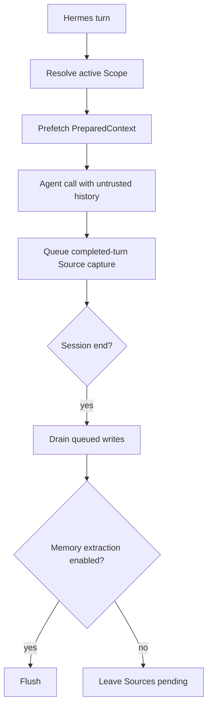

<Warning>
Hermes support 的状态是 **Version-gated**，要求 Hermes Agent `>=0.20.4`。Setup 会安装两个 plugin，但不会启动 PowerContext Server，也不会把 PowerContext 选成 Hermes 当前的 memory provider。
</Warning>

Hermes 是本章里 integration 面最宽的宿主。MemoryProvider 负责 lifecycle hook 和 tools；独立的 command companion 会提前注册 `/pc` 与 `/powercontext`，供交互会话使用。

## 安装并激活

先在一个终端启动 Server：

```bash
uv tool install --force "powercontext[cli,server] @ git+https://github.com/oceanbase/powercontext.git@master"

powercontext server run
```

在另一个终端安装两个 Hermes plugin：

```bash
powercontext setup hermes \
  --source oceanbase/powercontext \
  --ref master

powercontext doctor hermes

hermes memory setup
```

在通用向导里选择 `PowerContext`，检查 provider 配置，然后重启 Hermes。最后一条命令要保持 generic。Hermes 0.20.4 中，`hermes memory setup powercontext` 会选中 provider，却跳过它的配置向导。

Setup 会校验宿主版本，对两个 plugin 目录运行 `hermes plugins doctor --ci`，以事务方式替换两份安装，并在不授予 tool-override permission 的情况下启用 `powercontext-command`。安装路径是：

```text
$HERMES_HOME/plugins/powercontext
$HERMES_HOME/plugins/powercontext-command
```

`HERMES_HOME` 默认为 `~/.hermes`。

## 配置默认值

向导写入 `$HERMES_HOME/powercontext/config.json`。下面几个默认值要特别留意，因为 turn capture 与 session-end Flush 默认就开着：

| Key | 默认值 | 含义 |
|---|---:|---|
| `base_url` | `http://127.0.0.1:8000` | 正在运行的 PowerContext Server |
| `authorization` | 未设置 | 完整 authorization header，含 secret |
| `scope_id` | `hermes:{profile}:{user_id}` | 默认 Scope template |
| `max_bytes` | `8000` | Recall budget，限制在 `512–32768` |
| `timeout` | `5` | HTTP timeout，单位为秒 |
| `capture_turns` | `true` | 采集一轮中可见的 user/assistant 内容 |
| `flush_on_session_end` | `true` | extraction 可用时，在会话结束 Flush |
| `capture_pre_compress` | `false` | 压缩前的过滤采集，需要主动开启 |
| `evaluation_trace` | `false` | 敏感的本地 JSONL trace |
| `workstream_persistence` | `true` | 读取 Git-private Workstream binding |

`POWERCONTEXT_HERMES_AUTHORIZATION` 的优先级高于 `POWERCONTEXT_HERMES_TOKEN`。Token shorthand 会变成 Bearer header。不要把任一值放进 prompt、trace，或提交到仓库的示例。

## 最小验证

先检查有明确边界的安装诊断：

```bash
powercontext doctor
powercontext ready
powercontext capabilities
powercontext doctor hermes
```

再通过 Hermes 做显式 smoke operation：

```bash
hermes powercontext status
hermes powercontext remember preference "The user prefers uv"
hermes powercontext search "Python package manager"
hermes powercontext flush
```

测试时使用隔离的 Scope：

```bash
hermes powercontext search "deployment decision" \
  --scope-id hermes-smoke-test
```

`doctor hermes` 检查 Hermes CLI、provider plugin 和 command companion。它不能证明 Server 可达、PowerContext 已被选为 provider、provider 配置正确，也不检查 recall/capture。显式 smoke operation 能补上其中一部分。

## Tool surface

Provider 有四个聚焦的 Memory tool：

| Tool | 用途 |
|---|---|
| `powercontext_search_memory` | 以 `auto`、`fts`、`vector` 或 `hybrid` mode 搜索 Memory |
| `powercontext_get_memory` | 读取一个 exact citation |
| `powercontext_remember` | 写入 durable Memory entry |
| `powercontext_retire_memory` | retire 一个被精确引用的 entry |

它还开放完整的 extended surface：

- Memory：`powercontext_prepare_context`、`powercontext_capture_source`、`powercontext_list_memory_entries`、`powercontext_revise_memory_entry`、`powercontext_list_memory_changes`、`powercontext_flush_memory`、`powercontext_get_stats`。
- Handoff：`powercontext_create_work_contract`、`powercontext_handoff_current_work`、`powercontext_acknowledge_handoff`、`powercontext_record_task_outcome`、`powercontext_activate_handoff`、`powercontext_prepare_handoff`、`powercontext_finalize_handoff`、`powercontext_commit_handoff`、`powercontext_continue_handoff`。
- Experience 与 Skill：`powercontext_propose_experience`、`powercontext_generate_experience`、`powercontext_get_experience`、`powercontext_propose_skill`、`powercontext_generate_skill`、`powercontext_get_skill`。
- External Skill：`powercontext_scan_external_skills`、`powercontext_list_external_skills`、`powercontext_resolve_external_skill`、`powercontext_import_external_skill`。
- Candidate Review：`powercontext_list_artifact_candidates`、`powercontext_get_artifact_candidate`、`powercontext_approve_artifact_candidate`、`powercontext_reject_artifact_candidate`、`powercontext_revise_artifact_candidate`。

每个 extended operation 都会丢弃 caller 自带的 `scope_id`，改用 provider 当前的 Scope。这样，tool payload 不能跳到任意 Scope。

Command companion 把这些操作映射到 `/pc` 与 `/powercontext`。可以从下面几条开始：

```text
/pc status
/pc search QUERY
/pc remember KIND TEXT [REASON]
/pc flush
/pc workstream status
/pc trace status
/pc call OPERATION [PAYLOAD_JSON]
```

在 Hermes 里用 `/pc help` 查看当前 command grammar，不必把整份 reference 贴进 prompt。

## Scope 解析与切换

Hermes 按下面的顺序解析 Scope：

1. 非空的显式 Scope 配置，且不能只是原样的默认 template。
2. `.git/powercontext/codex-workspace.json` 中的 Git-private Workstream binding，前提是 persistence 已开启。
3. profile/user template：`hermes:{profile}:{user_id}`。

如果 Hermes 没有 user identifier，provider 会从解析后的 `HERMES_HOME` 派生一个稳定的短 ID。Scope 会经过规范化，并限制在 256 字符以内。

Workstream command 让切换动作保持显式：

```text
/pc workstream status
/pc workstream bind SCOPE_ID
/pc workstream clear
```

Bind 或 clear 会重置 recall 与 pre-compression 状态，取消尚未开始的 queued write，并阻止旧任务被重新标到新 Scope 下。

## 执行流



普通 turn capture 包含可见的 user 与 assistant 文本，不会运行 secret-redaction helper。可选的 pre-compression capture 会排除 system/tool role，只采集重叠窗口里的新增内容，并使用启发式 redaction。Trace 也会使用同类过滤，但其中仍有敏感的 query、recall、lineage 与 Scope 数据。显式 tool 和 slash-command payload 不会自动脱敏。

## Gateway slash 限制

Hermes 0.20.4 不会把 caller session、user、workspace 或 Scope context 交给 Gateway slash handler。Companion 因而会让 Gateway slash call fail-closed，而不是借用最近一次活跃的 provider。

普通消息初始化当前 Agent 后，交互式 slash command 仍然可用。Gateway session 应改用 provider tools：slash companion 无法解析 caller context，但 provider tool 仍保有当前 provider context。

## Queue、隐私与负向路径

自动 recall、capture、pre-compression persistence、session-end Flush，以及 Hermes mirrored write 遇到 PowerContext 错误时都会 fail-open。显式 tool 会把结构化错误返回给模型，不会假装写入成功。

这些负向路径值得实测：

- Turn 开始前停掉 Server。Hermes 应在没有 recalled context 的情况下继续。
- `powercontext_remember` 前停掉 Server。显式 tool 应报告失败。
- 填满或卡住 background queue。Queue 满时会丢写入；shutdown 超过 drain deadline 后也可能丢剩余任务，并记录 warning。
- 旧写入尚在 queue 中时绑定新 Workstream。它们不得出现在新 Scope。
- 通过 Gateway 调用 `/pc status`。它必须 fail-closed；provider tools 仍应可用。
- 在普通 completed turn 中放入 credential-like text。不要期待该路径自动 redaction。
- 用 stale citation revise 或 retire。重新 search，再用当前 Revision 重试。

## 当前限制

- 自动 Source-to-Memory extraction 和有效的 Flush 需要 generation model；`powercontext capabilities` 中必须显示 `Memory extraction: enabled`。
- `is_available()` 只检查 base URL 是否配置，不会发 network probe。
- Replace/remove mirroring 需要 `metadata.old_text`，而且只会 retire 这个 provider 已唯一映射的 entry。
- Candidate approve/reject/revise 有 policy 与版本门禁，但 provider 不会证明 caller 是真人。
- Hermes 没有 OpenClaw 那种 group/channel/incognito eligibility filter。
- Redirect 会被拒绝；invalid、oversized、timeout 或 non-2xx response 会被规范化处理。
- 本页没有运行真实 Hermes host process E2E，状态是 **Not validated**。

## 完成检查

- Hermes Agent 是 `>=0.20.4`。
- 两个 plugin 目录都已安装，`doctor hermes` 通过。
- 通用 `hermes memory setup` 已完成，并已重启 Hermes。
- Server health、readiness、capabilities 已单独检查。
- `capture_turns=true` 与 `flush_on_session_end=true` 是有意选择；不需要时，pre-compress capture 与 trace 保持关闭。
- Scope precedence 与 Workstream switching 符合部署预期。
- Recall failure 会 fail-open，显式写入失败仍可见。
- Gateway slash 缺少 context 时 fail-closed，provider tools 仍工作。
- Capture 与 trace policy 没有假定系统能完整脱敏 secret。

要继续完成受治理的 Skill 创建与导出，请看 [让 Agent 自己扩展能力](/zh/common-agents/agent-self-extension)。
