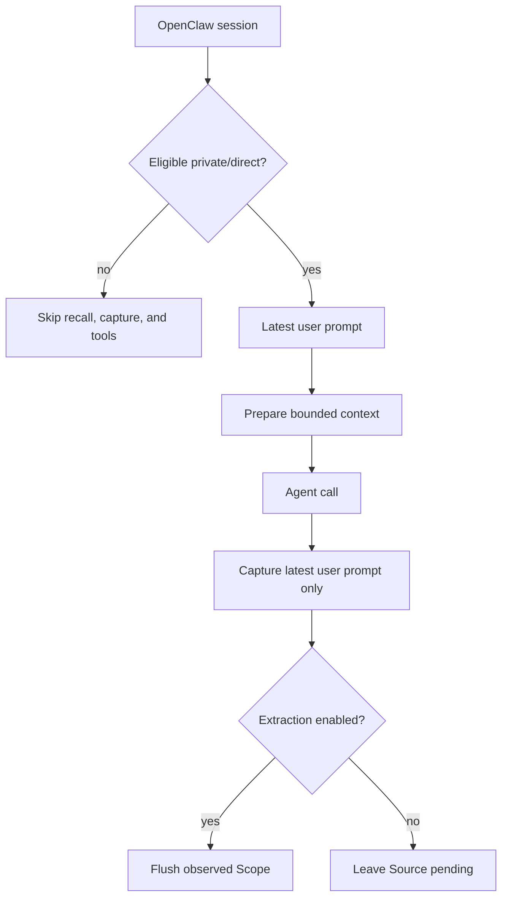

<Warning>
OpenClaw support 的状态是 **Version-gated**，要求 `>=2026.8.1-beta.2`。该宿主版本推荐 Node 24.15+。Plugin package 声明的 Node engine 更宽，为 `>=20`；这不等于推荐的宿主运行环境。
</Warning>

OpenClaw integration 刻意做得较窄：自动 Memory recall、有界 Source capture，以及五个显式 Memory tool。它不开放 Handoff、Experience、Candidate Review 或 Skill 操作。

## 安装并激活

安装 PowerContext 与 OpenClaw plugin：

```bash
uv tool install --force "powercontext[cli,server] @ git+https://github.com/oceanbase/powercontext.git@master"

powercontext setup openclaw \
  --source oceanbase/powercontext \
  --ref master

powercontext server run

openclaw
```

Setup 需要 `openclaw` 与 `pnpm`。它会检查 OpenClaw 版本，用 frozen lockfile 安装依赖，build `dist/index.js`，链接并启用 plugin，选择 memory slot，把五个工具补进 `tools.alsoAllow`，开启 recall/capture；如果 `gateway.mode` 尚未设置，则写成 `local`，最后重启 Gateway。

它不会启动 PowerContext Server。上面的命令顺序把边界写得很清楚：先 setup，再单独启动 Server，最后进入宿主。

要使用 project mode 或其他 endpoint：

```bash
powercontext setup openclaw \
  --server-url http://127.0.0.1:9000 \
  --scope-mode project
```

## Runtime 默认值

| Key | 默认值 | 含义 |
|---|---:|---|
| `endpoint` | 由 setup 写入 | PowerContext Server URL |
| `tokenEnv` | `POWERCONTEXT_CLIENT_API_TOKEN` | 保存 bare token 的 Gateway environment variable 名称 |
| `timeoutMs` | `2500` | Request timeout，范围 `250–15000` |
| `prepareMaxBytes` | `8000` | PreparedContext budget，范围 `512–32768` |
| `autoRecall` | `true` | 构造 prompt 前 prepare |
| `autoCapture` | `true` | Agent 成功结束后 capture |
| `captureMaxChars` | `4000` | formatted `User: ...` Source payload 的总字符数，包含 prefix；范围 `128–20000` |
| `scopeMode` | `agent` | `agent` 或 `project` |

CLI setup 会拒绝 endpoint 中的 credentials、query string 与 fragment。手工 plugin 配置没有这么严格，最好使用 setup 命令；如果一定要手配，请自行执行同样的 operator check。

## 恰好五个工具

| Tool | 操作 |
|---|---|
| `powercontext_memory_search` | 搜索 durable Memory；不搜索 session transcript 与 wiki |
| `powercontext_memory_get` | 读取一个精确编码的 PowerContext citation |
| `powercontext_memory_store` | 保存一条 Memory entry |
| `powercontext_memory_revise` | revise 一个精确且仍为 current 的 citation |
| `powercontext_memory_retire` | retire 一个精确且仍为 current 的 citation |

Search 接受 `memory`、`wiki`、`all` 或 `sessions` 作为宿主 corpus hint，但 `wiki` 不支持，`sessions` 也不会搜索 transcript。这里的 `all` 仍然只有 durable Memory。

Get 默认读取 120 行。它先把 Memory body 截到 12,000 字符，再可能追加 continuation notice，所以最终 tool text 会略长。Caller 可以请求超过 120 行，因此 120 也不是硬上限。Store 与 revise 在 runtime 最多接受 8192 UTF-8 bytes。Stale revise 会返回 conflict，并要求重新 search，再用当前 exact citation 重试。

这五个 tool 就是 OpenClaw 中完整的 PowerContext surface。这个 plugin 没有 Handoff、Review、Experience、external Skill、managed Skill 或 export tool。

## 最小验证

分别运行 Server 与宿主诊断：

```bash
powercontext doctor
powercontext ready
powercontext capabilities
powercontext doctor openclaw
```

然后在 direct/private OpenClaw session 中完成下面的 smoke test：

1. 用 `powercontext_memory_store` 保存一条无敏感信息的测试偏好。
2. 用 `powercontext_memory_search` 找到它。
3. 用 `powercontext_memory_get` 读取返回的 citation。
4. Revise 后重试旧 citation，确认得到 conflict。
5. Retire 当前 citation，确认它不再作为 active Memory 出现。

`doctor openclaw` 只检查 CLI 是否存在，以及 `memory-powercontext` 是否报告 `enabled=true`、`status="loaded"`、`memorySlotSelected=true`。它不检查 OpenClaw 版本、endpoint、Gateway token、Server 可达性、五项 allowlist，也不做实际 recall/capture round trip。单宿主 setup 不会替你运行最终 doctor。

## Private-session gate

Recall、capture 与 tools 只在符合条件的 private session 中运行：

- 明确的 `chatType=group` 和 `chatType=channel` 会被拒绝。
- 如果带有 `chatType`，只有 `direct` 能通过。
- Incognito session key 会被拒绝。
- 解析为 group 或 channel 的 session key 会被拒绝。
- Metadata lookup 抛异常时会拒绝；如果 lookup 只是返回空 entry，则退回 session-key 与 chat-type heuristic，一个不含 group、channel、incognito 标记的 opaque key 仍可能通过。

空白 session key 仍可能通过。“Private”只是 eligibility classification，不代表内容已经脱敏。只要 direct prompt 符合准入条件，plugin 不会替它做 secret redaction。

## Capture 与 recall 都有边界

构造 prompt 前，plugin 只把 latest user text 作为 prepare query，最多 8192 UTF-8 bytes。返回内容必须符合 PreparedContext schema。Ready content 会作为不可信历史包起来；recall text 中的边界标签会先转义，再注入。

一次成功的 `agent_end` 之后，capture 只保存最后一条符合条件的 user message：

```text
User: <text>
```

它不会采集 assistant answer，也不会同步完整 transcript。Metadata 会记录 raw agent ID、可选的 hashed session identifier、可选 channel/provider，以及 `privacy_class: private`。

Compaction 前与 session end 时，plugin 会检查 capabilities；只有 `memory_extraction=true` 才会 Flush observed scope。Extraction 关闭时，捕获的 Source 会保持 pending。

## Scope 仍按 agent 隔离

Agent mode 的 Scope 是：

```text
openclaw:agent:<URL-encoded-agent-id>
```

Project mode 的 Scope 是：

```text
openclaw:agent:<URL-encoded-agent-id>:project:<first-32-hex-of-sha256-project-key>
```

所以 project mode 会同时按 agent 与 project 收窄 Memory，不会产生跨 agent 共享的 project namespace。没有 trusted active project key，或同时有多个 key 时，plugin 会退回 agent scope。

## Gateway token 与远程 HTTP

开启 Server auth 后，把相同的 bare token 放进 Gateway process environment：

```bash
export POWERCONTEXT_SERVER_AUTH_ENABLED=true
export POWERCONTEXT_SERVER_AUTH_TOKEN="$POWERCONTEXT_LOCAL_TOKEN"

powercontext server run
```

Gateway environment：

```bash
printf '%s\n' 'POWERCONTEXT_CLIENT_API_TOKEN=<same token value>' >> ~/.openclaw/.env
chmod 600 ~/.openclaw/.env
openclaw gateway restart
```

Plugin 会读取 `tokenEnv` 指向的变量，并添加 Bearer header。只在启动 PowerContext Server 的 shell 中 export token，不会让 Gateway 得到它。

<Warning>
非 loopback endpoint 必须使用 HTTPS，这是 operator requirement。当前 setup 与 plugin code 不强制执行。Token 不能让 plaintext HTTP 变安全。
</Warning>

## 执行流



Lifecycle recall、capture 与 Flush 会 fail-open。显式 tool failure 返回结构化的 unavailable、rejected 或 conflict。与 Hermes 不同，OpenClaw HTTP client 使用标准 `fetch()` 行为；本页不声称它会拒绝 redirect。

## 要测试的负向路径

- 停掉 PowerContext Server。普通 OpenClaw response 应在没有 recall 的情况下继续；显式 store 必须报告 unavailable。
- 打开 group、channel 或 incognito session。Recall、capture 与五个 tool 都不得可用。
- 在两个不同 agent ID 下使用同一 project key。它们的 project-mode Scope 必须不同。
- Server auth 仍开启时，从 Gateway environment 删除 token。Doctor 可能仍通过，但 live operation 必须明显失败。
- Revise 后继续使用旧 citation。操作必须返回 conflict，不能覆盖 current Revision。
- 一轮 user + assistant 完成后检查 capture。Source content 只能有最后一条 user prompt。
- 配置远程 `http://` endpoint。把它视为不安全的 operator 配置；plugin 不会替你拦截。

## 当前限制

- 只支持 Memory 面。Handoff、Review、Experience、Skill、external Skill 与 managed export 在这里都是 **Unsupported**。
- Project Scope 仍包含 agent ID；尚未实现跨 agent 共享。
- Capture 不包含完整 transcript 或 assistant output，也不做 secret redaction。
- Setup 不是事务操作；后期失败可能留下部分宿主变更。
- 缓存 mutable ref 的 checkout 后再次使用，未必会 fetch 最新 commit。
- Doctor 是安装检查，不是 Server 或 runtime E2E test。
- 本页没有运行真实 OpenClaw host process E2E，状态是 **Not validated**。

## 完成检查

- OpenClaw 是 `>=2026.8.1-beta.2`；runtime 使用推荐的 Node 24.15+ 环境。
- `pnpm` 已安装，setup 已完成，Gateway 已重启。
- PowerContext Server 已单独启动。
- `doctor openclaw` 通过，并清楚它不检查什么。
- 五个精确名称的 tool 都在 allowlist 中，并能在 private/direct session 使用。
- Group、channel 与 incognito 负向测试通过。
- Capture 只有 latest user prompt，不是 transcript。
- Agent/project Scope 公式符合隔离需求，没有假定跨 agent 共享。
- Token 位于 Gateway environment。
- 远程 endpoint 按 operator policy 全部使用 HTTPS。

需要更宽的 tool surface，请用 [Hermes](/zh/common-agents/hermes)。要继续 managed Skill 的治理与导出，请看 [让 Agent 自己扩展能力](/zh/common-agents/agent-self-extension)。
