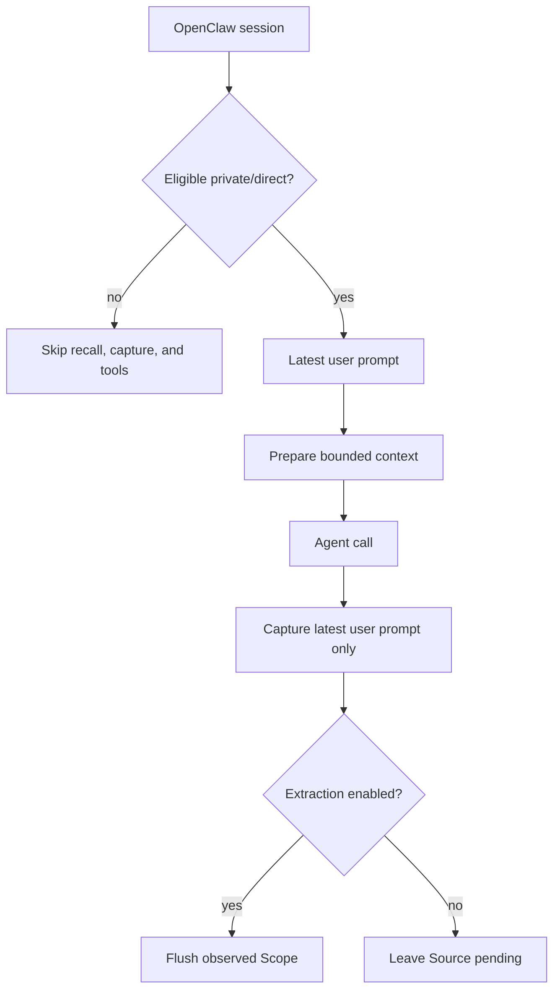

<Warning>
OpenClaw 支持的状态是 **Version-gated**，要求 `>=2026.8.1-beta.2`。该宿主版本推荐 Node.js 24.15+。插件软件包声明的 Node.js 版本要求 更宽，为 `>=20`；这不等于推荐的宿主运行环境。
</Warning>

OpenClaw 集成刻意做得较窄：自动 Memory 召回、有界 Source 采集，以及五个显式 Memory 工具。它不开放 Handoff、Experience、Candidate Review 或 Skill 操作。

## 安装并激活

安装 PowerContext 与 OpenClaw 插件：

```bash
uv tool install --force "powercontext[cli,server] @ git+https://github.com/oceanbase/powercontext.git@master"

powercontext setup openclaw \
  --source oceanbase/powercontext \
  --ref master

powercontext server run

openclaw
```

安装配置需要 `openclaw` 与 `pnpm`。它会检查 OpenClaw 版本，用 frozen lockfile 安装依赖，构建 `dist/index.js`，链接并启用插件，选择 Memory 插槽，把五个工具补进 `tools.alsoAllow`，开启召回/采集；如果 `gateway.mode` 尚未设置，则写成 `local`，最后重启 Gateway。

它不会启动 PowerContext Server。上面的命令顺序把边界写得很清楚：先安装配置，再单独启动 Server，最后进入宿主。

要使用项目模式或其他端点：

```bash
powercontext setup openclaw \
  --server-url http://127.0.0.1:9000 \
  --scope-mode project
```

## 运行时默认值

先按默认值跑通一次，再修改配置。这样能得到一条已知可用的本地基线，把宿主配置问题与 Server 或认证问题分开。

| 键 | 默认值 | 含义 |
|---|---:|---|
| `endpoint` | 由安装配置写入 | PowerContext Server URL |
| `tokenEnv` | `POWERCONTEXT_CLIENT_API_TOKEN` | 保存不带前缀的令牌的 Gateway 环境 variable 名称 |
| `timeoutMs` | `2500` | 请求超时，范围 `250–15000` |
| `prepareMaxBytes` | `8000` | PreparedContext 预算，范围 `512–32768` |
| `autoRecall` | `true` | 构造提示词前准备 |
| `autoCapture` | `true` | Agent 成功结束后采集 |
| `captureMaxChars` | `4000` | 格式化后的 `User: ...` Source 载荷总字符数，包含前缀；范围 `128–20000` |
| `scopeMode` | `agent` | `agent` 或 `project` |

CLI 安装配置会拒绝端点中的凭证、查询字符串与片段。手工插件配置没有这么严格，最好使用安装配置命令；如果一定要手配，请自行执行同样的操作方检查。

## 恰好五个工具

OpenClaw 只开放这组 Memory 工具。如果任务需要 Handoff、Review、Experience 或 Skill，请改用其他集成，不要假设还有隐藏工具。

| 工具 | 操作 |
|---|---|
| `powercontext_memory_search` | 搜索持久 Memory；不搜索会话对话记录与 wiki |
| `powercontext_memory_get` | 读取一个精确编码的 PowerContext citation |
| `powercontext_memory_store` | 保存一条 Memory 条目 |
| `powercontext_memory_revise` | 修订一个精确且仍为当前的 citation |
| `powercontext_memory_retire` | 停用一个精确且仍为当前的 citation |

搜索接受 `memory`、`wiki`、`all` 或 `sessions` 作为宿主 corpus hint，但 `wiki` 不支持，`sessions` 也不会搜索对话记录。这里的 `all` 仍然只有持久 Memory。

Get 默认读取 120 行。它先把 Memory 响应体截到 12,000 字符，再可能追加 continuation notice，所以最终工具 文本 会略长。调用方可以请求超过 120 行，因此 120 也不是硬上限。Store 与修订在运行时最多接受 8192 UTF-8 字节。过期修订会返回冲突，并要求重新搜索，再用当前精确 citation 重试。

这五个工具就是 OpenClaw 中完整的 PowerContext 范围。这个插件没有 Handoff、Review、Experience、外部 Skill、托管 Skill 或导出工具。

## 最小验证

分别运行 Server 与宿主诊断：

```bash
powercontext doctor
powercontext ready
powercontext capabilities
powercontext doctor openclaw
```

然后在直接/私有 OpenClaw 会话中完成下面的冒烟测试：

1. 用 `powercontext_memory_store` 保存一条无敏感信息的测试偏好。
2. 用 `powercontext_memory_search` 找到它。
3. 用 `powercontext_memory_get` 读取返回的 citation。
4. 修订后重试旧 citation，确认得到冲突。
5. 停用当前 citation，确认它不再作为启用状态 Memory 出现。

再用学习路径那道题对齐其他宿主。先用 `powercontext_memory_store` 保存：

```text
Use PowerContext to remember this decision:
after changing the OpenAPI contract, regenerate the client and inspect the diff.
Return the Memory Citation. Do not store secrets.
```

然后提问：

```text
What should happen after the OpenAPI contract changes?
```

`doctor openclaw` 只检查 CLI 是否存在，以及 `memory-powercontext` 是否报告 `enabled=true`、`status="loaded"`、`memorySlotSelected=true`。它不检查 OpenClaw 版本、端点、Gateway 令牌、Server 可达性、五项允许列表，也不做实际召回/采集往返验证。单宿主安装配置不会替你运行最终诊断。

## Private-session 准入规则

召回、采集与工具只在符合条件的私有会话中运行：

- 明确的 `chatType=group` 和 `chatType=channel` 会被拒绝。
- 如果带有 `chatType`，只有 `direct` 能通过。
- 隐身会话的会话键会被拒绝。
- 解析为群组或频道的会话键会被拒绝。
- 元数据 lookup 抛异常时会拒绝；如果 lookup 只是返回空条目，则退回 session-key 与 chat-type 启发式规则，一个不含群组、频道、隐身模式标记的 opaque 键仍可能通过。

空白会话键仍可能通过。“私有”只是 eligibility classification，不代表内容已经脱敏。只要直接提示词符合准入条件，插件不会替它做敏感信息脱敏。

## 采集与召回都有边界

构造提示词前，插件只把最新版本用户 文本 作为准备查询，最多 8192 UTF-8 字节。返回内容必须符合 PreparedContext 模式。Ready 内容会作为不可信历史包起来；召回 文本 中的边界标签会先转义，再注入。

一次成功的 `agent_end` 之后，采集只保存最后一条符合条件的用户消息：

```text
User: <text>
```

它不会采集助手 answer，也不会同步完整对话记录。元数据会记录 原始 agent ID、可选的 hashed 会话标识、可选频道/模型提供方，以及 `privacy_class: private`。

Compaction 前与会话 end 时，插件会检查能力；只有 `memory_extraction=true` 才会刷新 observed scope。抽取关闭时，捕获的 Source 会保持待处理。

## Scope 仍按 agent 隔离

Agent 模式的 Scope 是：

```text
openclaw:agent:<URL-encoded-agent-id>
```

项目模式的 Scope 是：

```text
openclaw:agent:<URL-encoded-agent-id>:project:<first-32-hex-of-sha256-project-key>
```

所以项目模式会同时按 agent 与项目收窄 Memory，不会产生跨 agent 共享的项目 namespace。没有可信启用状态项目键，或同时有多个键时，插件会退回 Agent Scope。

## Gateway 令牌与远程 HTTP

开启 Server 认证后，把相同的不带前缀的令牌放进 Gateway 进程环境：

```bash
export POWERCONTEXT_SERVER_AUTH_ENABLED=true
export POWERCONTEXT_SERVER_AUTH_TOKEN="$POWERCONTEXT_LOCAL_TOKEN"

powercontext server run
```

Gateway 环境：

```bash
printf '%s\n' 'POWERCONTEXT_CLIENT_API_TOKEN=<same token value>' >> ~/.openclaw/.env
chmod 600 ~/.openclaw/.env
openclaw gateway restart
```

插件会读取 `tokenEnv` 指向的变量，并添加 Bearer 请求头。只在启动 PowerContext Server 的 shell 中导出令牌，不会让 Gateway 得到它。

<Warning>
非本机回环地址端点必须使用 HTTPS，这是操作方依赖声明。当前安装配置与插件 code 不强制执行。令牌不能让明文 HTTP 变安全。
</Warning>

## 执行流



生命周期 召回、采集与刷新会 fail-open。显式工具失败返回结构化的不可用、已拒绝或冲突。与 Hermes 不同，OpenClaw HTTP 客户端使用标准 `fetch()` 行为；文档行为不声称它会拒绝重定向。

## 要测试的负向路径

- 停掉 PowerContext Server。普通 OpenClaw 响应应在没有召回的情况下继续；显式保存必须报告不可用。
- 打开群组、频道或隐身模式会话。召回、采集与五个工具都不得可用。
- 在两个不同 agent ID 下使用同一项目键。它们的 project-mode Scope 必须不同。
- Server 认证仍开启时，从 Gateway 环境删除令牌。诊断可能仍通过，但实时操作必须明显失败。
- 修订后继续使用旧 citation。操作必须返回冲突，不能覆盖当前 Revision。
- 一轮用户 + 助手完成后检查采集。Source 内容只能有最后一条用户提示词。
- 配置远程 `http://` 端点。把它视为不安全的操作方配置；插件不会替你拦截。

## 当前限制

- 只支持 Memory 面。Handoff、Review、Experience、Skill、外部 Skill 与托管导出在这里都是 **Unsupported**。
- Project Scope 仍包含 agent ID；尚未实现跨 agent 共享。
- 采集不包含完整对话记录或助手输出，也不做敏感信息脱敏。
- 安装配置不是事务操作；后期失败可能留下部分宿主变更。
- 缓存 mutable 版本引用的检出后再次使用，未必会 fetch 最新提交。
- 诊断是安装检查，不是 Server 或运行时端到端验证测试。
- 本页没有运行真实 OpenClaw 宿主进程端到端验证，状态是 **Not validated**。

## 在这个宿主上做完统一题

> 修改 OpenAPI 契约后，下一步应该做什么？

1. 在固定 Scope 里用 `powercontext_memory_store` 保存答案。五个 Memory 工具里只有保存负责这次写入。
2. 开一个新的私有 / 直接会话，再问同一句。
3. 召回必须带 Citation，并且只作为这次 latest-user 准备的不可信历史进入模型输入。
4. 停掉 Server 后再问。自动召回可以失败，会话应继续。
5. 再调用 `powercontext_memory_store`。失败必须可见，不能假装保存成功。

## 完成检查

- OpenClaw 是 `>=2026.8.1-beta.2`；运行时使用推荐的 Node.js 24.15+ 环境。
- `pnpm` 已安装，安装配置已完成，Gateway 已重启。
- PowerContext Server 已单独启动。
- `doctor openclaw` 通过，并清楚它不检查什么。
- 五个精确名称的工具都在允许列表中，并能在私有/直接会话使用。
- Group、频道与隐身模式负向测试通过。
- 采集只有最新版本用户提示词，不是对话记录。
- Agent/项目 Scope 公式符合隔离需求，没有假定跨 agent 共享。
- 令牌位于 Gateway 环境。
- 远程端点按操作方策略全部使用 HTTPS。

需要更宽的工具范围，请用 [Hermes](/zh/common-agents/hermes)。要继续托管 Skill 的治理与导出，请看 [让 Agent 自己扩展能力](/zh/common-agents/agent-self-extension)。
