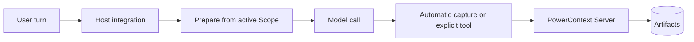

<Warning>
`powercontext setup <host>` 只安装并配置宿主集成，不会启动 PowerContext Server。安装配置成功，也不能证明召回或写入已经能访问 Server。
</Warning>

本章先讲两个有一级支持的安装配置命令的通用宿主：Hermes 和 OpenClaw。另外两页是 [WorkBuddy](/zh/common-agents/workbuddy) 和 [Agent Plugin](/zh/common-agents/agent-plugin)。它们连接同一个 Server，但宿主契约不同。先选宿主，不要把一边的配置照搬到另一边。

## 四层边界

把接入拆成四层：

1. **安装** PowerContext CLI 与 Server 软件包。
2. **安装配置并激活**宿主集成。安装配置负责复制或链接文件；激活才让宿主真正使用它。
3. **运行 Server**，它是独立进程。
4. **诊断** 软件包、Server 和宿主集成，各查各的边界。

本地学习环境可以从这里开始：

```bash
uv tool install --force "powercontext[cli,server] @ git+https://github.com/oceanbase/powercontext.git@master"

powercontext server run
```

默认 Server 监听 `127.0.0.1:8000`，使用持久化 SQLite。它能接收 Source 采集和显式 Memory 操作。模型驱动的抽取与托管 Skill 生成还需要单独配置推理。

如果想一次安装两个宿主集成，在另一个终端运行：

```bash
powercontext setup select \
  --host hermes \
  --host openclaw \
  --source oceanbase/powercontext \
  --ref master
```

`--host` 可以重复。安装配置按目录顺序执行；某个宿主失败后仍会继续安装后面的宿主，只要有一个失败，最终退出码就不是 0。它不会静默全选。Hermes 之后仍要运行通用 Memory 模型提供方配置向导；OpenClaw 安装配置会选中 Memory 插槽，并重启 Gateway。

比较表用来选路径，不替代宿主页的操作步骤。Hermes 适合需要较完整 PowerContext 能力面的场景；OpenClaw 只开放 Memory，但对私有会话准入更严格。WorkBuddy 和 Agent Plugin 走各自独立路径，不能加入 `setup select` 后假装得到同样的自动行为。
## Hermes 还是 OpenClaw？

真正决定路径的是能力边界，而不是表格里“有”的数量。Hermes 开放更多 PowerContext 操作；OpenClaw 把范围收窄到 Memory，并使用自己的会话准入规则。

| 能力 | Hermes | OpenClaw |
|---|---|---|
| 最低宿主版本 | **Version-gated：** Hermes Agent `>=0.20.4` | **Version-gated：** OpenClaw `>=2026.8.1-beta.2`；该宿主版本推荐 Node.js 24.15+ |
| 安装内容 | MemoryProvider，加 `/pc` 命令配套插件 | 链接到 Memory 插槽的 `memory-powercontext` 插件 |
| 安装配置后的激活 | 运行通用 `hermes memory setup`，选择 PowerContext，再重启 Hermes | 安装配置会启用插件、选择 Memory 插槽、更新允许列表，并重启 Gateway |
| 自动召回 | 有 | 有 |
| 自动采集 | 默认采集一轮中可见的用户和助手内容 | 只采集最后一条符合条件的用户提示词，不采集完整对话记录 |
| 显式 Memory 面 | 搜索、精确 读取、记住、修订、停用、准备、采集、列出、变更、刷新、统计 | 恰好五个工具：搜索、读取、保存、修订、停用 |
| 其他 PowerContext 面 | Handoff、Experience、Skill、外部 Skill、Candidate Review、workstream、追踪 | **Unsupported：** 没有 Handoff、Review、Experience 或 Skill 操作 |
| Scope | 显式配置，其次 Workstream 绑定，最后配置档/用户后备路径 | Agent Scope，或 agent 加项目 scope；项目模式仍包含 agent ID |
| 会话准入 | 这个集成没有群组/隐身模式准入规则 | 明确群组/频道与隐身模式会排除；缺元数据时可能退回 session-key 启发式规则 |
| Slash 命令 | `/pc` 与 `/powercontext`；Gateway 斜杠命令 缺少调用方上下文时失败时关闭 | 没有对应的 slash-command 面 |

Hermes 是更完整的 PowerContext 客户端。OpenClaw 刻意只开放 Memory 面，并在会话隐私上加了更严格的准入判断。

## 激活不等于启动 Server

Hermes 安装配置会安装两个插件，但不会把 PowerContext 选成当前 memory 模型提供方。用下面的命令完成激活：

```bash
hermes memory setup
```

选择 `PowerContext`，完成模型提供方配置，然后重启 Hermes。Hermes 0.20.4 不要用 `hermes memory setup powercontext`：这个快捷命令只会选择模型提供方，不会打开配置向导。

OpenClaw 安装配置做的宿主侧工作更多。它用 `pnpm` 构建插件，以 `--link --force` 安装，启用插件，选择 `plugins.slots.memory`，把五个工具补进 `tools.alsoAllow`，最后重启 Gateway。它仍然不会运行 PowerContext Server。

## 最小验证

把软件包 / Server 检查与宿主检查分开：

```bash
powercontext doctor
powercontext ready
powercontext capabilities

powercontext doctor hermes
powercontext doctor openclaw
```

这些命令回答的问题不同：

| 命令 | 边界 |
|---|---|
| `powercontext doctor` | 软件包、Server 存活状态与 Server 就绪状态；不扫描 Agent 宿主 |
| `powercontext ready` | 运行时、数据库与推理就绪状态 |
| `powercontext capabilities` | Server 当前启用的能力 |
| `powercontext doctor <host>` | 单个宿主 CLI 与该集成的安装状态；宿主缺失会失败 |
| `powercontext doctor integrations` | 七个一级支持的宿主的只读矩阵；可选宿主缺失记为 `missing`，本身不会令命令失败 |

`doctor hermes` 检查模型提供方与命令配套插件，但不检查当前模型提供方选择、模型提供方配置、Server 可达性或召回往返验证。`doctor openclaw` 检查插件是否报告为已启用、已加载，并已占用 Memory 插槽。它不检查宿主版本、端点、Gateway 令牌、Server 可达性、逐项工具允许列表，也不做真实召回/采集往返验证。

聚合报告还有一个边角问题：`doctor integrations` 当前会漏掉 Hermes 的 `command_plugin` 结果。需要确认配套插件时，请运行 `doctor hermes`。

安装、激活和运行是三个独立状态。插件文件已经复制，仍可能没有激活；插件已经激活，仍可能指向停止的 Server；Server 健康，也不能说明宿主选择了哪个 Scope。排查时按这个顺序逐层确认，因为每一层的修复方式不同。
## 执行流



自动召回和采集属于辅助路径，通常 fail-open。显式持久写入必须把失败报告给宿主。捕获 Source 不等于生成 Memory：抽取可能没开、可能失败，也可能没有产生变更。

## 要测试的负向路径

- 停掉 Server。宿主的普通任务应在没有召回的上下文的情况下继续；显式写入则应报告错误。
- 使用过旧的宿主版本。安装配置应在安装前拒绝。
- 完成安装配置，但跳过激活。不能因为 Hermes 插件目录存在，就把它写成就绪。
- 在没有这两个宿主的机器上运行 `doctor integrations`。可选 CLI 缺失应被报告，但聚合命令不应因此失败。
- 切换 Scope 后搜索旧 Scope 的数据。不应有条目越界出现。
- 在待采集文本中放入敏感信息。两个集成都不提供完整 DLP；隐私策略应阻止采集，而不是依赖启发式过滤。

## WorkBuddy 与 Agent Plugin

这两页属于本章，但不在 `setup select` / `doctor integrations` 的一级支持的目录里。

| 能力 | WorkBuddy | Agent Plugin |
|---|---|---|
| 自动事件 | `UserPromptSubmit` | 无 |
| 注入 | `additionalContext` | 无；只靠 MCP |
| 提示词采集 | 有 | 无 |
| 显式接口 | MCP | MCP |
| Handoff | MCP + Skill | MCP + Skill |
| 权限 | Host-gated | Host-gated |
| 托管 Skill 导出 | Unsupported | Unsupported |
| 真实宿主端到端验证 | Not validated（仅服务链） | Not validated（仅软件包契约） |
| 目录 | 独立 `setup` / `doctor`；不在一级支持的 | 无安装配置 / 诊断 |

不要把 WorkBuddy 写成 `setup select` 成员，也不要把 Agent Plugin 写成会自动准备的宿主。验证契约见 [WorkBuddy](/zh/common-agents/workbuddy) 和 [Agent Plugin](/zh/common-agents/agent-plugin)。

## 还会遇到的几个名字

Bub 在当前检出里更窄：它只是软件包/README 集成路径，不是一级支持的宿主安装配置/诊断信息条目。LangChain、LangGraph 与 Pydantic AI 是框架集成，也不在这个宿主目录中。

## 当前限制

- 安装配置和激活不能替代 Server 进程监管。生产环境应由合适的进程管理器运行 Server。
- 诊断是有边界的安装诊断，不是端到端证明。
- 自动采集成功，不代表抽取或提交成功。
- 生成、嵌入、重排序与托管 Skill 生成都要显式配置推理。
- 本章没有运行真实 Hermes/OpenClaw 宿主进程端到端验证，状态是 **Not validated**；这里的结论来自当前实现与测试。

## 完成检查

- 宿主满足最低版本。
- PowerContext CLI/Server 安装与宿主安装配置分开处理。
- Hermes 已激活，或 OpenClaw Memory 插槽已选中。
- Server 正在配置的端点上运行。
- Server 边界的 `doctor`、`ready`、`capabilities` 通过。
- 单宿主诊断通过，并清楚它不检查什么。
- Scope isolation 有负向测试。
- Server 中断 时，自动路径 fail-open，显式写入错误可见。
- 保留 `autoCapture` 或 `capture_turns` 前，已确认采集策略。

要用完整模型提供方范围，继续看 [Hermes](/zh/common-agents/hermes)；只需要较窄的 Memory 路径，就看 [OpenClaw](/zh/common-agents/openclaw)。WorkBuddy 或便携 Agent Plugin 分别看对应页。

[让 Agent 自己扩展能力](/zh/common-agents/agent-self-extension) 写的是 Review 和托管导出。Hermes、OpenClaw、WorkBuddy 和 Agent Plugin **都不能** 导出；做完 Review 后要换 [Codex](/zh/coding-agents/codex) 或 [Claude Code](/zh/coding-agents/claude-code)。
