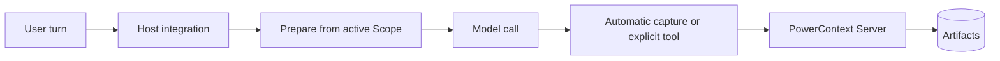

<Warning>
`powercontext setup <host>` 只安装并配置宿主 integration，不会启动 PowerContext Server。Setup 成功，也不能证明召回或写入已经能访问 Server。
</Warning>

本章先讲两个有 first-class setup 命令的通用宿主：Hermes 和 OpenClaw。另外两页是 [WorkBuddy](/zh/common-agents/workbuddy) 和 [Agent Plugin](/zh/common-agents/agent-plugin)。它们连接同一个 Server，但宿主合同不同。先选宿主，不要把一边的配置照搬到另一边。

## 四层边界

把接入拆成四层：

1. **安装** PowerContext CLI 与 Server package。
2. **Setup 并激活**宿主 integration。Setup 负责复制或链接文件；激活才让宿主真正使用它。
3. **运行 Server**，它是独立进程。
4. **诊断** package、Server 和宿主 integration，各查各的边界。

本地学习环境可以从这里开始：

```bash
uv tool install --force "powercontext[cli,server] @ git+https://github.com/oceanbase/powercontext.git@master"

powercontext server run
```

默认 Server 监听 `127.0.0.1:8000`，使用持久化 SQLite。它能接收 Source capture 和显式 Memory 操作。模型驱动的 extraction 与 managed Skill generation 还需要单独配置 inference。

如果想一次安装两个宿主 integration，在另一个终端运行：

```bash
powercontext setup select \
  --host hermes \
  --host openclaw \
  --source oceanbase/powercontext \
  --ref master
```

`--host` 可以重复。Setup 按 catalog 顺序执行；某个宿主失败后仍会继续安装后面的宿主，只要有一个失败，最终退出码就不是 0。它不会静默全选。Hermes 之后仍要运行通用 memory-provider wizard；OpenClaw setup 会选中 memory slot，并重启 Gateway。

## Hermes 还是 OpenClaw？

| 能力 | Hermes | OpenClaw |
|---|---|---|
| 最低宿主版本 | **Version-gated：** Hermes Agent `>=0.20.4` | **Version-gated：** OpenClaw `>=2026.8.1-beta.2`；该宿主版本推荐 Node 24.15+ |
| 安装内容 | MemoryProvider，加 `/pc` command companion | 链接到 memory slot 的 `memory-powercontext` plugin |
| Setup 后的激活 | 运行通用 `hermes memory setup`，选择 PowerContext，再重启 Hermes | Setup 会启用 plugin、选择 memory slot、更新 allowlist，并重启 Gateway |
| 自动召回 | 有 | 有 |
| 自动采集 | 默认采集一轮中可见的 user/assistant 内容 | 只采集最后一条符合条件的 user prompt，不采集完整 transcript |
| 显式 Memory 面 | search、exact get、remember、revise、retire、prepare、capture、list、changes、Flush、stats | 恰好五个工具：search、get、store、revise、retire |
| 其他 PowerContext 面 | Handoff、Experience、Skill、external Skill、Candidate Review、workstream、trace | **Unsupported：** 没有 Handoff、Review、Experience 或 Skill 操作 |
| Scope | 显式配置，其次 Workstream binding，最后 profile/user fallback | agent scope，或 agent 加 project scope；project mode 仍包含 agent ID |
| 会话准入 | 这个 integration 没有 group/incognito gate | 明确 group/channel 与 incognito 会排除；缺 metadata 时可能退回 session-key heuristic |
| Slash command | `/pc` 与 `/powercontext`；Gateway slash 缺少 caller context 时 fail-closed | 没有对应的 slash-command 面 |

Hermes 是更完整的 PowerContext client。OpenClaw 刻意只开放 Memory 面，并在会话隐私上加了更严格的准入判断。

## 激活不等于启动 Server

Hermes setup 会安装两个 plugin，但不会把 PowerContext 选成当前 memory provider。用下面的命令完成激活：

```bash
hermes memory setup
```

选择 `PowerContext`，完成 provider 配置，然后重启 Hermes。Hermes 0.20.4 不要用 `hermes memory setup powercontext`：这个快捷命令只会选择 provider，不会打开配置向导。

OpenClaw setup 做的宿主侧工作更多。它用 `pnpm` build plugin，以 `--link --force` 安装，启用 plugin，选择 `plugins.slots.memory`，把五个工具补进 `tools.alsoAllow`，最后重启 Gateway。它仍然不会运行 PowerContext Server。

## 最小验证

把 package / Server 检查与宿主检查分开：

```bash
powercontext doctor
powercontext ready
powercontext capabilities

powercontext doctor hermes
powercontext doctor openclaw
```

这些命令回答的问题不同：

| 命令 | 边界 |
|---|---|
| `powercontext doctor` | package、Server liveness 与 Server readiness；不扫描 Agent 宿主 |
| `powercontext ready` | runtime、database 与 inference readiness |
| `powercontext capabilities` | Server 当前启用的能力 |
| `powercontext doctor <host>` | 单个宿主 CLI 与该 integration 的安装状态；宿主缺失会失败 |
| `powercontext doctor integrations` | 七个 first-class 宿主的只读矩阵；可选宿主缺失记为 `missing`，本身不会令命令失败 |

`doctor hermes` 检查 provider 与 command companion，但不检查 active-provider selection、provider 配置、Server 可达性或召回 round trip。`doctor openclaw` 检查 plugin 是否报告为 enabled、loaded，并已占用 memory slot。它不检查宿主版本、endpoint、Gateway token、Server 可达性、逐项 tool allowlist，也不做真实 recall/capture round trip。

聚合报告还有一个边角问题：`doctor integrations` 当前会漏掉 Hermes 的 `command_plugin` 结果。需要确认 companion 时，请运行 `doctor hermes`。

## 执行流



自动 recall 和 capture 属于辅助路径，通常 fail-open。显式 durable write 必须把失败报告给宿主。捕获 Source 不等于生成 Memory：extraction 可能没开、可能失败，也可能没有产生变更。

## 要测试的负向路径

- 停掉 Server。宿主的普通任务应在没有 recalled context 的情况下继续；显式写入则应报告错误。
- 使用过旧的宿主版本。Setup 应在安装前拒绝。
- 完成 setup，但跳过激活。不能因为 Hermes plugin 目录存在，就把它写成 ready。
- 在没有这两个宿主的机器上运行 `doctor integrations`。可选 CLI 缺失应被报告，但聚合命令不应因此失败。
- 切换 Scope 后搜索旧 Scope 的数据。不应有 entry 越界出现。
- 在待采集文本中放入 secret。两个 integration 都不提供完整 DLP；隐私策略应阻止采集，而不是依赖启发式过滤。

## WorkBuddy 与 Agent Plugin

这两页属于本章，但不在 `setup select` / `doctor integrations` 的 first-class catalog 里。

| 能力 | WorkBuddy | Agent Plugin |
|---|---|---|
| 自动事件 | `UserPromptSubmit` | 无 |
| 注入 | `additionalContext` | 无；只靠 MCP |
| Prompt capture | 有 | 无 |
| 显式接口 | MCP | MCP |
| Handoff | MCP + Skill | MCP + Skill |
| Permission | Host-gated | Host-gated |
| Managed Skill export | Unsupported | Unsupported |
| Real-host E2E | Not validated（仅 service-chain） | Not validated（仅 软件包契约） |
| Catalog | 独立 `setup` / `doctor`；不在 first-class | 无 setup / doctor |

不要把 WorkBuddy 写成 `setup select` 成员，也不要把 Agent Plugin 写成会自动 prepare 的宿主。验证合同见 [WorkBuddy](/zh/common-agents/workbuddy) 和 [Agent Plugin](/zh/common-agents/agent-plugin)。

## 还会遇到的几个名字

Bub 在当前 checkout 里更窄：它只是 package/README integration 路径，不是 first-class 宿主 setup/diagnostics entry。LangChain、LangGraph 与 Pydantic AI 是 framework integration，也不在这个宿主 catalog 中。

## 当前限制

- Setup 和激活不能替代 Server process supervision。生产环境应由合适的进程管理器运行 Server。
- Doctor 是有边界的安装诊断，不是端到端证明。
- 自动 capture 成功，不代表 extraction 或 commit 成功。
- generation、embedding、reranking 与 managed Skill generation 都要显式配置 inference。
- 本章没有运行真实 Hermes/OpenClaw host process E2E，状态是 **Not validated**；这里的结论来自当前实现与 tests。

## 完成检查

- 宿主满足最低版本。
- PowerContext CLI/Server 安装与宿主 setup 分开处理。
- Hermes 已激活，或 OpenClaw memory slot 已选中。
- Server 正在配置的 endpoint 上运行。
- Server 边界的 `doctor`、`ready`、`capabilities` 通过。
- 单宿主 doctor 通过，并清楚它不检查什么。
- Scope isolation 有负向测试。
- Server outage 时，自动路径 fail-open，显式写入错误可见。
- 保留 `autoCapture` 或 `capture_turns` 前，已确认 capture policy。

要用完整 provider surface，继续看 [Hermes](/zh/common-agents/hermes)；只需要较窄的 Memory 路径，就看 [OpenClaw](/zh/common-agents/openclaw)。WorkBuddy 或便携 Agent Plugin 分别看对应页。

[让 Agent 自己扩展能力](/zh/common-agents/agent-self-extension) 写的是 Review 和 managed export。Hermes、OpenClaw、WorkBuddy 和 Agent Plugin **都不能** export；做完 Review 后要换 [Codex](/zh/coding-agents/codex) 或 [Claude Code](/zh/coding-agents/claude-code)。
