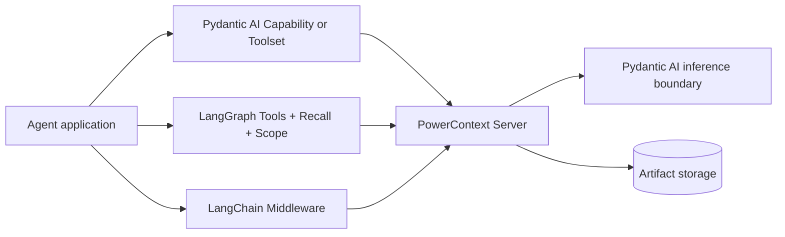

<Warning>
各路径的 packaging 状态不同。Pydantic AI Agent adapter 仍是 Preview，当前没有可用的独立安装方式。LangGraph 和 LangChain 只能从 source 安装，尚未发布到 PyPI。
</Warning>

PowerContext 有四条 Python 框架路径。它们共用 Server 契约，但不是同一种抽象。第一次接入 Agent 时，先选 LangGraph 或 LangChain；这两条路径可以从 source 安装。尤其要分清：Server 内的 Pydantic AI inference 只配置 generation、embedding 和 reranking，并不是 Agent adapter。面向 Pydantic AI Agent 的 Preview adapter 需要时再读，不要当作第一页。

## 四种边界，不是一套封装



三个外部 Agent integration 都通过 public Python Client 调用单独运行的 PowerContext Server，不会在 Agent 进程里再启动一份 Server。

Server-side Pydantic AI inference 位于 Server composition 内，为 generation、embedding 和可选 reranking 提供边界。它不会给 Agent 增加 tool、recall hook 或 middleware。

## 成熟度与安装状态

| 路径 | 状态 | 当前安装方式 | 验证说明 |
|---|---|---|---|
| Server 内 Pydantic AI inference | Supported | 属于 Server builtin runtime | 本指南对可变外部 provider 的真实 round trip **Not validated** |
| Pydantic AI `PowerContext` / `PowerContextToolset` | Preview | PyPI 与直接 Git subdirectory install 当前都无法解析依赖 | 独立使用当前不可用 |
| LangGraph | Source install only | Git subdirectory 或本地 checkout；未发布 PyPI | 从可变 branch 安装的可复现性 **Not validated**；应 pin commit |
| LangChain | Source install only | Git subdirectory 或本地 checkout；未发布 PyPI | 从可变 branch 安装的可复现性 **Not validated**；应 pin commit |

<Note>
**Not validated** 不等于 **Unsupported**。Not validated 表示这条路径可能可用，但缺少这里声明的验证证据；Unsupported 表示 integration 根本不提供该操作。
</Note>

## 最小用法：先选择边界

```text
Need async LangGraph tools, recall, and per-run Scope?
  -> LangGraph
Need sync or async LangChain request recall, with optional completed-turn Source capture?
  -> LangChain
Need generation, embedding, or reranking inside the Server?
  -> Pydantic AI Server inference (read when needed)
Need agent-side Memory tools plus per-run recall?
  -> Pydantic AI Capability (Preview; read when needed)
Need only three Pydantic AI Memory tools?
  -> Pydantic AI Toolset (Preview; read when needed)
```

| 时机 | 需求 | 下一页 |
|---|---|---|
| 第一次接入 | 为 async graph 增加三个 Memory tools 和临时 recall | [LangGraph](/zh/frameworks/langgraph) |
| 第一次接入 | 增加 request-level recall，并可选 capture completed-turn Source | [LangChain](/zh/frameworks/langchain) |
| 需要时再读 | 配置 Source extraction、Experience / Skill / Handoff generation、embedding 或 reranking | [Pydantic AI Server inference](/zh/frameworks/pydantic-ai-server-inference) |
| 需要时再读 | 查看 Preview Capability、Toolset 与 capture lifecycle | [Pydantic AI Agent adapter](/zh/frameworks/pydantic-ai) |
| 需要时再读 | 不使用框架 lifecycle hook，只暴露部分显式操作 | MCP；没有 automatic prepare、capture 或 flush |

## 能力矩阵

| Integration | Memory tools | Automatic recall | Automatic capture | Flush | Invocation | Per-run Scope |
|---|---:|---|---|---|---|---:|
| Server-side Pydantic AI inference | 不适用 | 不适用 | 否 | 否 | Server-internal async | 不适用 |
| Pydantic AI `PowerContext` | 3 个 | 每 run 成功注入一次后停止；empty/failure 时后续 model request 可能重试 | 可选 Source capture，默认关 | capture 开启时 checkpoint + final | Pydantic AI run lifecycle | 是 |
| Pydantic AI `PowerContextToolset` | 3 个 | 否 | 否 | 否 | Pydantic AI run lifecycle | 是 |
| LangGraph | 3 个 | 按 Scope + human message ID 缓存；没有 ID 时退回 text key | 否 | 否 | **仅 async** | 是 |
| LangChain | 否 | 每 model request | 可选 successful completed-turn Source capture，默认关 | 否 | sync + async | 是 |

Capture 的含义只是“发送 Source”。只有经过 Server extraction 并 commit 后，Source 才可能成为 Memory；extraction 也可能 no-op。能力矩阵不会把这些阶段合成一步。

## 执行流程

### Server-side Pydantic AI inference

Server 收到 domain operation 后，只在需要相应 capability 时调用已配置的 generation、embedding 或 reranking boundary。结果通过验证后，domain workflow 才继续。Provider output 不能直接获得写入或批准 Artifact 的权限。

### Pydantic AI Capability 与 Toolset

`PowerContext` 每 run 解析一次 Scope、prepare 一次 context，把 recalled block 标为不可信证据，并暴露三个显式 Memory tools。Capture 可选；开启后，成功 event 会成为 Source，Capability 再尝试 checkpoint 和 final flush。

`PowerContextToolset` 只提供三个工具，不包含 automatic prepare、capture 或 flush lifecycle。

### LangGraph

`PowerContextRecall` 为最新 human turn prepare 一次，并在 ReAct tool loop 内复用结果。完整 model input 写入 `llm_input_messages`，不写 persisted `messages`。`powercontext_tools()` 提供三个 Memory tools，`PowerContextScope` 则携带每次 invocation 的 Scope 和 connection override。

### LangChain

`PowerContextMiddleware` 在每个 model request 前 prepare，只 override 当前 request 的 `system_message`，不修改 Agent state。开启 `auto_capture=True` 后，成功 run 结束时会把 latest user message 和 final non-empty assistant result 存成一条 completed-turn Source。它既不添加 Memory tools，也不会 flush 这条 Source。

## Scope、token 与 transport 规则

| Integration | Scope precedence |
|---|---|
| Pydantic AI Preview | Constructor string/callback → env → normalized Git origin → local project-path hash |
| LangGraph | Per-run `PowerContextScope` → env → normalized network Git remote → error |
| LangChain | Per-run `PowerContextScope` → env → normalized network Git remote → error |

Pydantic AI 会把超过 public bound 的显式 Scope hash 成有界 ID。LangGraph 与 LangChain 也会约束显式值，但都没有 local fallback。多租户服务应从已认证的 tenant/project mapping 派生 Scope，并按 run 显式传入。

三个 adapter 都接收裸 token：

```bash
export POWERCONTEXT_LANGGRAPH_TOKEN="opaque-token"
```

不要加 `Bearer` 前缀，也不要填完整 Authorization header。`PowerContextClient` 会添加 `Authorization: Bearer ...`。Pydantic AI adapter 会严格校验这项约定；LangGraph 和 LangChain 会在文档中说明，但 adapter boundary 不会严格验证 token syntax。

非 loopback HTTP 必须使用 HTTPS，除非调用方自己提供 transport，并显式声明其 security 可信。Token 不能让 plaintext transport 变安全。

## 失败、隐私与信任边界

Automatic recall，以及 adapter 自己执行的 capture/flush，都属于辅助路径。它们的 Server-call failure 会 fail-open，因此 outage 不会替换 model result，也不会中断宿主任务。Configuration 和 Scope callback 可能在这个边界之前失败，需要单独验证。

显式失败仍对模型可见：

- Pydantic AI tools 抛出 `ModelRetry`；
- LangGraph tools 返回简短、model-visible 的 error string；
- LangChain adapter 不提供 PowerContext tools。

401/403 不是“空 Memory”。Diagnostic 必须有界，并排除 token、Scope content、query 和 response body。

Recalled content 可能含旧 user/model text。应把它当作不可信证据，保持临时状态，绝不能把 recalled block 持久化到 framework state 或 conversation history。当前 system/user instructions 始终优先，recalled text 也不能授予 tool permission。

Capture 还需要单独的隐私决定。Pydantic AI 会排除 thinking part，并 redaction 已知 credential shape，但这不是完整 DLP。LangChain 不承诺全面 secret redaction。LangGraph 不做 capture。

## 当前不支持或未验证

| 项目 | 状态 |
|---|---|
| 这些 Agent adapter 中的 Handoff、Candidate Review、Experience 或 Skill operations | **Unsupported** |
| LangGraph automatic capture 或 flush | **Unsupported** |
| LangChain PowerContext tools 或 flush | **Unsupported**；capture 只保存 Source |
| Pydantic AI 的 Temporal、DBOS、Prefect 等 durable executor | **Not validated** |
| 从可变 source branch 进行可复现部署 | **Not validated**；应 pin commit 与 dependencies |
| 本指南中的 Server inference 真实外部 provider round trip | **Not validated** |

## 完成检查

- 所选路径与实际边界一致：Server inference、Pydantic adapter、graph 或 middleware。
- Packaging 状态可接受；需要可复现时，source install 已 pin。
- 每个 run 收到预期 Scope，并有 cross-tenant isolation 负向测试。
- Token 保持裸值且不进入 state/history；远程 transport 使用 HTTPS 或显式可信 transport。
- Recalled evidence 保持临时且不可信。
- Automatic fail-open 与 explicit tool failure 分开测试。
- Capture、flush 与 Memory 按三个阶段分别验证。
- 部署文档没有混淆 Unsupported 与 Not validated。

<Check>
只要有一项还不确定，就先停在 integration 的 model-free 或 Server-only 检查，不要继续叠加外部模型 provider。
</Check>

<Columns cols={2}>
  <Card title="LangGraph" icon="git-branch" href="/zh/frameworks/langgraph" arrow="true" cta="第一次接入">
    为 async graph 增加三个 Memory tools 和按 turn 的临时 recall。从 source 安装。
  </Card>
  <Card title="LangChain" icon="link" href="/zh/frameworks/langchain" arrow="true" cta="第一次接入">
    为每次 model request 增加 recall，并可按需捕获 completed-turn Source。从 source 安装。
  </Card>
</Columns>

需要配置 Server 内的 generation、embedding 或 reranking 时，再读 [Pydantic AI Server inference](/zh/frameworks/pydantic-ai-server-inference)。[Pydantic AI Agent adapter](/zh/frameworks/pydantic-ai) 仍是 Preview，当前没有可用的独立安装方式，不要当作第一页。
