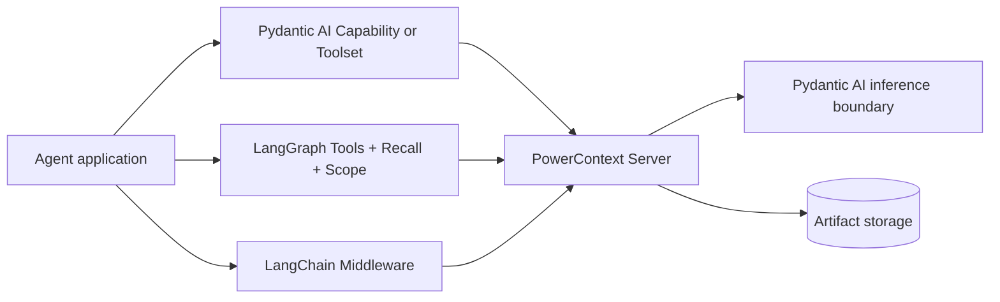

<Warning>
各路径的 packaging 状态不同。Pydantic AI Agent 适配器仍是预览，当前没有可用的独立安装方式。LangGraph 和 LangChain 只能从 source 安装，尚未发布到 PyPI。
</Warning>

PowerContext 有四条 Python 框架路径。它们共用 Server 契约，但不是同一种抽象。第一次接入 Agent 时，先选 LangGraph 或 LangChain；这两条路径可以从 source 安装。尤其要分清：Server 内的 Pydantic AI 推理只配置生成、嵌入和重排序，并不是 Agent 适配器。面向 Pydantic AI Agent 的预览适配器需要时再读，不要当作第一页。

## 四种边界，不是一套封装



三个外部 Agent 集成都通过公开 Python Client 调用单独运行的 PowerContext Server，不会在 Agent 进程里再启动一份 Server。

Server 内部 Pydantic AI 推理位于 Server 组合内，为生成、嵌入和可选重排序提供边界。它不会给 Agent 增加工具、召回 Hook 或中间件。

## 成熟度与安装状态

| 路径 | 状态 | 当前安装方式 | 验证说明 |
|---|---|---|---|
| Server 内 Pydantic AI 推理 | Supported | 属于 Server builtin 运行时 | 本指南对可变外部模型提供方的真实往返验证 **Not validated** |
| Pydantic AI `PowerContext` / `PowerContextToolset` | 预览 | PyPI 与直接 Git 子目录安装当前都无法解析依赖 | 独立使用当前不可用 |
| LangGraph | 源码安装 仅 | Git 子目录或本地检出；未发布 PyPI | 从可变分支安装的可复现性 **Not validated**；应固定版本提交 |
| LangChain | 源码安装 仅 | Git 子目录或本地检出；未发布 PyPI | 从可变分支安装的可复现性 **Not validated**；应固定版本提交 |

<Note>
**Not validated** 不等于 **Unsupported**。Not validated 表示这条路径可能可用，但缺少这里声明的验证证据；Unsupported 表示集成根本不提供该操作。
</Note>

## 最小用法：先选择边界

```text
Need async LangGraph tools, recall, and per-run Scope?
  -> LangGraph
Need sync or async LangChain request recall, with optional completed-turn Source capture?
  -> LangChain
Need generation, embedding, or reranking inside the Server?
  -> Pydantic AI Server inference (read when needed)
Need agent-side Memory tools plus per-run recall?
  -> Pydantic AI Capability (Preview; read when needed)
Need only three Pydantic AI Memory tools?
  -> Pydantic AI Toolset (Preview; read when needed)
```

| 时机 | 需求 | 下一页 |
|---|---|---|
| 第一次接入 | 为异步图增加三个 Memory 工具和临时召回 | [LangGraph](/zh/frameworks/langgraph) |
| 第一次接入 | 增加 request-level 召回，并可选采集已完成轮次 Source | [LangChain](/zh/frameworks/langchain) |
| 需要时再读 | 配置 Source 抽取、Experience / Skill / Handoff 生成、嵌入或重排序 | [Pydantic AI Server 推理](/zh/frameworks/pydantic-ai-server-inference) |
| 需要时再读 | 查看预览能力、工具集 与采集生命周期 | [Pydantic AI Agent 适配器](/zh/frameworks/pydantic-ai) |
| 需要时再读 | 不使用框架生命周期 Hook，只暴露部分显式操作 | MCP；没有自动准备、采集或刷新 |

## 能力矩阵

先按生命周期选框架，再用矩阵确认该适配器是否具备你需要的精确行为。

| 集成 | Memory 工具 | 自动召回 | 自动采集 | 刷新 | 调用方式 | 每次运行 Scope |
|---|---:|---|---|---|---|---:|
| Server 内部 Pydantic AI 推理 | 不适用 | 不适用 | 否 | 否 | Server-internal 异步 | 不适用 |
| Pydantic AI `PowerContext` | 3 个 | 每运行成功注入一次后停止；空结果/失败时后续模型请求可能重试 | 可选 Source 采集，默认关 | 采集开启时检查点 + 最终 | Pydantic AI 运行生命周期 | 是 |
| Pydantic AI `PowerContextToolset` | 3 个 | 否 | 否 | 否 | Pydantic AI 运行生命周期 | 是 |
| LangGraph | 3 个 | 按 Scope + 用户消息 ID 缓存；没有 ID 时退回 文本 键 | 否 | 否 | **仅异步** | 是 |
| LangChain | 否 | 每模型请求 | 可选 successful 已完成轮次 Source 采集，默认关 | 否 | 同步 + 异步 | 是 |

采集的含义只是“发送 Source”。只有经过 Server 抽取并提交后，Source 才可能成为 Memory；抽取也可能无变更。能力矩阵不会把这些阶段合成一步。

## 执行流程

### Server 内部 Pydantic AI 推理

Server 收到领域操作后，只在需要相应能力时调用已配置的生成、嵌入或重排序边界。结果通过验证后，领域 workflow 才继续。模型提供方输出不能直接获得写入或批准 Artifact 的权限。

### Pydantic AI 能力与 工具集

`PowerContext` 每运行解析一次 Scope、准备一次上下文，把召回的内容块标为不可信证据，并暴露三个显式 Memory 工具。采集可选；开启后，成功事件会成为 Source，能力再尝试检查点和最终刷新。

`PowerContextToolset` 只提供三个工具，不包含自动准备、采集或刷新生命周期。

### LangGraph

`PowerContextRecall` 为最新用户轮次准备一次，并在 ReAct 工具循环内复用结果。完整模型输入写入 `llm_input_messages`，不写持久化的 `messages`。`powercontext_tools()` 提供三个 Memory 工具，`PowerContextScope` 则携带每次调用的 Scope 和 connection 覆盖值。

### LangChain

`PowerContextMiddleware` 在每个模型请求前准备，只覆盖值当前请求的 `system_message`，不修改 Agent 状态。开启 `auto_capture=True` 后，成功运行结束时会把最新版本用户消息和最终 non-empty 助手结果存成一条已完成轮次 Source。它既不添加 Memory 工具，也不会刷新这条 Source。

## Scope、令牌与传输层规则

这些设置共同构成安全边界。Scope 应来自经过认证的应用状态，令牌不能进入模型可见数据，离开本机回环地址后必须使用 HTTPS。

| 集成 | Scope 优先顺序 |
|---|---|
| Pydantic AI 预览 | 构造参数 字符串/回调 → 环境变量 → 规范化的 Git 来源 → 本地 project-path 哈希 |
| LangGraph | 每次运行 `PowerContextScope` → 环境变量 → 规范化的网络 Git 远程 → 错误 |
| LangChain | 每次运行 `PowerContextScope` → 环境变量 → 规范化的网络 Git 远程 → 错误 |

Pydantic AI 会把超过公开上限的显式 Scope 哈希成有界 ID。LangGraph 与 LangChain 也会约束显式值，但都没有本地后备路径。多租户服务应从已认证的租户/项目映射派生 Scope，并按运行显式传入。

三个适配器都接收裸令牌：

```bash
export POWERCONTEXT_LANGGRAPH_TOKEN="opaque-token"
```

不要加 `Bearer` 前缀，也不要填完整授权信息请求头。`PowerContextClient` 会添加 `Authorization: Bearer ...`。Pydantic AI 适配器会严格校验这项约定；LangGraph 和 LangChain 会在文档中说明，但适配器边界不会严格验证令牌语法。

非本机回环地址 HTTP 必须使用 HTTPS，除非调用方自己提供传输层，并显式声明其安全性可信。令牌不能让明文传输层变安全。

## 失败、隐私与信任边界

自动召回，以及适配器自己执行的采集/刷新，都属于辅助路径。它们的 Server-call 失败会 fail-open，因此 中断 不会替换模型结果，也不会中断宿主任务。配置和 Scope 回调可能在这个边界之前失败，需要单独验证。

显式失败仍对模型可见：

- Pydantic AI 工具抛出 `ModelRetry`；
- LangGraph 工具返回简短、模型可见的的错误字符串；
- LangChain 适配器不提供 PowerContext 工具。

401/403 不是“空 Memory”。诊断信息必须有界，并排除令牌、Scope 内容、查询和响应体。

召回的内容可能含旧用户/模型 文本。应把它当作不可信证据，保持临时状态，绝不能把召回的内容块持久化到框架状态或对话历史内容。当前系统/用户指令始终优先，召回的 文本 也不能授予工具权限。

采集还需要单独的隐私决定。Pydantic AI 会排除 thinking part，并脱敏已知凭证结构，但这不是完整 DLP。LangChain 不承诺全面敏感信息脱敏。LangGraph 不做采集。

## 当前不支持或未验证

| 项目 | 状态 |
|---|---|
| 这些 Agent 适配器中的 Handoff、Candidate Review、Experience 或 Skill 操作 | **Unsupported** |
| LangGraph 自动采集或刷新 | **Unsupported** |
| LangChain PowerContext 工具或刷新 | **Unsupported**；采集只保存 Source |
| Pydantic AI 的 Temporal、DBOS、Prefect 等持久 executor | **Not validated** |
| 从可变 source 分支进行可复现部署 | **Not validated**；应固定版本提交与 dependencies |
| 文档证据中的 Server 推理真实外部模型提供方往返验证 | **Not validated** |

## 完成检查

- 所选路径与实际边界一致：Server 推理、Pydantic 适配器、图或中间件。
- 软件包状态可接受；需要可复现时，源码安装已固定版本。
- 每个运行收到预期 Scope，并有跨租户隔离负向测试。
- 令牌保持裸值且不进入状态/历史内容；远程传输层使用 HTTPS 或显式可信传输层。
- 召回的证据保持临时且不可信。
- 自动 fail-open 与显式工具失败分开测试。
- 采集、刷新与 Memory 按三个阶段分别验证。
- 部署文档没有混淆 Unsupported 与 Not validated。

<Check>
只要有一项还不确定，就先停在集成的无模型或仅 Server 检查，不要继续叠加外部模型提供方。
</Check>

<Columns cols={2}>
  <Card title="LangGraph" icon="git-branch" href="/zh/frameworks/langgraph" arrow="true" cta="第一次接入">
    为异步图增加三个 Memory 工具和按轮次的临时召回。从 source 安装。
  </Card>
  <Card title="LangChain" icon="link" href="/zh/frameworks/langchain" arrow="true" cta="第一次接入">
    为每次模型请求增加召回，并可按需捕获已完成轮次 Source。从 source 安装。
  </Card>
</Columns>

需要配置 Server 内的生成、嵌入或重排序时，再读 [Pydantic AI Server 推理](/zh/frameworks/pydantic-ai-server-inference)。[Pydantic AI Agent 适配器](/zh/frameworks/pydantic-ai) 仍是预览，当前没有可用的独立安装方式，不要当作第一页。
