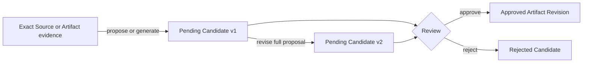

任务完成后，通常能提炼出两类东西：下次遇到类似情况时该怎么判断，以及可以交给 Agent 重复执行的做法。

PowerContext 把前者保存为 Experience，把后者保存为 managed Skill。两者都不能从模型输出直接变成 approved Artifact。

## Experience 与 Skill 的区别

### Experience 保存判断

Experience 包含四部分：

```text
situation
→ action
→ outcome
→ lesson
```

例如：

```text
Situation: the public OpenAPI contract changed
Action: regenerate and inspect the checked-in client before tests
Outcome: the generated transport matched the contract
Lesson: inspect generated drift before running contract tests
```

它的用途是帮助后续请求在相似情境中做判断。approved current Experience 可以作为 cited evidence 进入 PreparedContext。

### Skill 保存操作指导

Managed Skill 包含：

- name；
- description，供宿主判断何时发现它；
- instructions；
- validation checks。

Skill 不是普通 Memory。它不会进入 PreparedContext，也不会因为 approval 就出现在 Agent 的 Skill 目录。

## 共同的 Candidate lifecycle



Candidate 有自己的 lifecycle：

- `pending`：可以 inspect、revise、approve 或 reject；
- `approved`：终态，必须有 `result_artifact`；
- `rejected`：终态，必须有拒绝原因，不产生结果 Artifact。

所有 Candidate 至少要引用一条 exact Source 或 Artifact evidence。Source 与 Artifact refs 合计当前最多 32 条。

## Propose 与 generate

### Typed propose

你已经知道内容时，可以直接提交结构化 proposal：

- `propose_experience`
- `propose_skill`

这条路径不需要 generation model。结果仍然是 pending Candidate。

### Model-backed generate

模型可以基于 bounded evidence 生成 Candidate：

- `generate_experience`
- `generate_skill`

generation 可能返回 pending Candidate，也可能返回明确 no-op。没有 generation provider 时，operation 在持久化 Candidate 前失败。

无论模型写得多好，都不会自动 approve。

## Candidate version 不是 Artifact Revision

每次 revise 会创建 Candidate 的新 proposal version。Review write 必须提供 `expected_version`，确保决定的是刚才检查过的版本。

假设 reviewer 读取 Candidate v1，另一个人先 revise 到 v2：

```text
approve(expected_version=1) → conflict
```

正确处理方式是重新读取 v2，比较完整 proposal，再决定 approve 或 reject。不要把 expected version 机械加一。

revise 是完整 replacement，不是 patch。这样每个 proposal version 都可以独立审计。

## Approval 是一笔事务

approve 会在一个数据库 transaction 中：

1. lock 当前 pending Candidate；
2. 验证 `expected_version` 和 lineage；
3. 创建或修订 Artifact；
4. 对 Experience 更新 approved-head search projection；
5. 把 Candidate 标为 approved，并记录 exact `result_artifact`。

最后一步失败时，Artifact commit 也回滚，不会留下“Artifact 已创建但 Candidate 仍 pending”的半个结果。

reject 不创建 Artifact。它只记录 terminal decision 和 reason。

<Warning>
“人工 Review”是产品治理合同，不是身份认证机制。Server 无法证明 API 调用者在生物意义上是人。部署方仍要通过 auth、host permission 和流程控制决定谁能调用 approve/reject。
</Warning>

## Experience 怎样进入召回

只有同时满足下面条件的 Experience 才能进入 PreparedContext：

- Candidate 已 approve；
- 它是该 Experience artifact 的 current head；
- 与请求使用同一 Scope；
- search 和 PreparedContext builder 认为它与 query 相关。

pending、rejected 和 historical Experience Revisions 都不会自动进入 recall。

所以，approve 一个 replacement Experience 后，旧 Revision 仍可 exact read，但默认召回只看新 head。

## Skill 的 provenance

Model-backed Skill generation 有三类 origin：

| origin | 直接 evidence |
|---|---|
| `experience` | 一个或多个 approved Experience Revision，可附加 Source |
| `source` | 一个或多个 exact Source；`artifact_refs` 必须为空 |
| `usage` | exact target Skill Revision，加至少一条 Source；reviewer 负责确认 Source 是否真的记录了使用情况 |

新 managed Skill approval 对 lineage 有额外限制：Artifact evidence 应来自 Experience，而不是另一个 Skill。

Skill replacement 必须包含 target Skill，并至少带一条 bounded Source。Server 校验引用形状，不判断 Source 文本是否真的证明了使用效果；这项判断留给 reviewer。模型不能只看旧 Skill 文本就自我改写成下一版。

## Approval、export、execution

这三个动作必须分开：

```text
approve Candidate
→ managed Skill Artifact Revision
→ explicit export or managed publish
→ host-local projection
→ host/user decides whether to execute
```

### Approval

创建 exact Skill Revision，例如：

```text
skill/SKILL_ID@1
```

这时宿主文件系统没有变化。

### Export

CLI 读取 exact approved Revision，再生成 host-local package：

```text
SKILL.md
powercontext.json
```

`powercontext.json` 保存 agent kind、exact ArtifactRef 和渲染后 `SKILL.md` 的 SHA-256。managed Artifact 仍是权威来源；目录只是可重建副本。

当前 CLI export target 只有：

- `codex`
- `claude_code`

不要从这两个 target 推断 Hermes、OpenClaw、DSH、OpenCode 或 Pi 也支持 managed Skill export。

### Execution

PowerContext 不执行导出的 Skill，也不授予工具权限。宿主决定何时发现 Skill，用户或宿主 policy 决定是否允许运行其中的操作。

## 两种发布 surface

CLI direct export 是 create-only。destination 已存在时拒绝覆盖。

Server-managed safe publish 是另一条路径。它只在 projection 仍由 PowerContext 管理、内容未 drift，并且状态为 `unpublished` 或 `update_available` 时允许创建或更新。

常见 projection 状态：

- `unpublished`
- `current`
- `update_available`
- `conflict`
- `drifted`
- `incompatible`

foreign directory、本地手改内容、同 Artifact 多个 projection、或比目标更新的已发布 Revision，都不能被静默覆盖。

## Managed、external 和 bundled Skill

这三个名字容易混在一起。

| 类型 | 权威来源 | 如何进入宿主 |
|---|---|---|
| managed Skill | PowerContext approved Artifact Revision | explicit export / managed publish |
| external Skill | 宿主文件系统或 registry package | scan、resolve、import/fork 后进入 Candidate 流程 |
| bundled Skill | 某个 integration 随插件一起安装的静态 Skill | host setup 安装 |

OpenCode、Pi、Codex 或 Claude Code 插件里自带 `project-context` Skill，不代表它们都支持 managed Skill export。两件事无关。

External Skill import/fork 也不会自动获得 approved 状态。它会生成新的 managed Candidate，等待 Review；package 中的任意 scripts/assets 不会因此自动执行。

## 用 OpenAPI 案例走完生命周期

### 1. 准备 evidence

捕获 contract-test result Source，并保留 exact SourceRef。

### 2. Experience Candidate

提交或生成：

```text
Situation: OpenAPI contract changed
Action: regenerate and inspect the client, then run contract tests
Outcome: generated transport matched the contract
Lesson: inspect generated drift before tests
```

### 3. Review

读取 Candidate v1，revise lesson 得到 v2。故意用 `expected_version=1` approve，应得到 conflict。重新读取 v2 后再 approve，得到：

```text
experience/EXPERIENCE_ID@1
```

下一次相关 `prepare_context` 可以召回这个 approved Experience。

### 4. Skill Candidate

以 Experience Revision 为 origin 生成：

```text
name: powercontext-openapi-change
validation:
  - api generation check passes
  - contract tests pass
```

approve 后得到：

```text
skill/SKILL_ID@1
```

PreparedContext 仍然不包含它。这是正确行为。

### 5. Export

把 exact `@1` 分别导出到支持的宿主目录。检查两件事：

- `SKILL.md` 内容；
- `powercontext.json` 是否引用同一个 exact ArtifactRef。

手工修改 `SKILL.md` 后再 inspect，状态应变成 `drifted`，safe publish 不得覆盖。

## 常见错误

### Generation 成功后，Review Inbox 是空的

operation 可能返回 no-op。检查 response，不要假设每次 generation 都创建 Candidate。

### approved Experience 没被召回

检查 Scope、是否为 current head、query relevance 和 PreparedContext byte budget。

### Skill 已 approve，但 Agent 看不到

approval 不 export。确认你使用 exact Revision 导出到了当前宿主实际扫描的目录。

### Export 报 destination exists

CLI direct export 不覆盖。先检查目录是 foreign、managed current、update available 还是 drifted，再选择保留、换目录或使用受控 managed publish。

### Replacement Candidate 一直 conflict

target Skill 可能已经推进到新 head。重新读取 current target 和 Candidate，不要修改 expected version 后盲重试。

## 检查清单

- Candidate version 和 Artifact Revision 是否分开？
- propose/generate 是否都停在 pending 或 no-op？
- approve/reject 是否绑定 inspected `expected_version`？
- Experience recall 是否只看 approved current head？
- Skill 是否始终不进入 PreparedContext？
- approval、export、execution 是否分成三步？
- 当前 export target 是否只写 Codex 和 Claude Code？
- local drift 和 conflict 是否阻止覆盖？

心智模型到这里已经完整。下一步进入[安装并运行 Server](/zh/basic-usage/install-and-run)，用真实 ID、Citation 和 Revision 跑完这些对象的第一条闭环。
