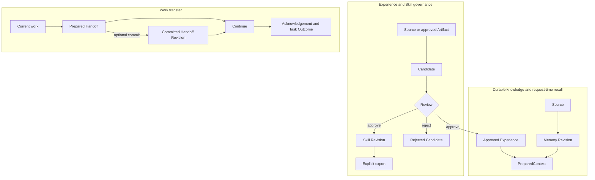

如果把 PowerContext 只理解成“给 Agent 加记忆”，后面很快会遇到问题：一条提示词到底算不算 Memory？模型生成的 Skill 能不能直接安装？Handoff 为什么有时查不到最新版本？

答案不在某个 API 参数里，而在对象边界里。

## 先看三条路径

PowerContext 同时处理三类事情。



这三条路径可以引用彼此的证据，但不会自动合并。写入 Memory 不会顺便创建 Handoff；批准 Skill 也不会把它塞进下一次 PreparedContext。

## 六种值，不要混用

这些值的生命周期和权限含义不同。分清它们，才能避免把临时模型输入误当成持久状态或可执行指令。

| 值 | 解决什么问题 | 是否持久 | 是否可直接当成当前指令 |
|---|---|---:|---:|
| `Source` | 记录发生过什么，并提供可定位证据 | 是 | 否 |
| Artifact `Revision` | 保存某个长期资产的不可变历史快照 | 是 | 否 |
| `Candidate` | 保存尚待 Review 的 Experience 或 Skill 提案 | 是 | 否 |
| `PreparedContext` | 为一次请求准备相关、带 Citation 的上下文 | 否 | 否 |
| 已准备 `Handoff` | 临时传递当前工作状态 | 由调用方持有 | 否 |
| Skill 投影 | 把一个已批准 Skill Revision 导出到宿主目录 | 是，可重建 | 仍由宿主决定 |

### Source 是证据

Source 可以保存提示词、任务结果或其他工作材料。它回答“当时发生了什么”。

采集 Source 不等于把内容写进 Memory。自动抽取还需要生成流程；你也可以绕过抽取，显式写入已经确认的 Memory。

### Artifact Revision 保存历史

Memory、Experience、Skill 和已提交 Handoff 都有 Artifact Revision。Revision 是不可变快照。同一个逻辑资产更新时会产生下一 Revision，旧版本仍然可以按精确引用读取。

精确引用包含类型、Artifact ID 和 Revision：

```text
family/artifact_id@revision
```

Candidate 有自己的 `version`，它用于 Review 前的并发控制。Candidate 版本 2 和 Artifact Revision 2 没有对应关系。

### PreparedContext 只活一轮

`prepare_context` 根据 Scope、查询和字节预算构造 PreparedContext。结果只有两种正常状态：

- `ready`：有非空内容和 Citation；
- `empty`：没有合适内容，不是故障。

PreparedContext 不会写回长期历史。宿主应把它标成 `untrusted_history`，并在当前模型请求中临时注入。

### Handoff 可以不提交

已准备 Handoff 是可检查、可传递的临时值。你可以直接把它交给接手者，也可以显式提交成 Handoff Revision，作为以后可按精确或最新版本继续的里程碑。

提交是独立动作。没有提交，就没有新的持久 Handoff 头版本。

### Experience 和 Skill 要经过 Review

模型或用户可以提交 Candidate。Review 有两个终态：

- 批准：创建或修订 Artifact，并记录精确 `result_artifact`；
- 拒绝：记录原因，不创建结果 Artifact。

只有已批准当前 Experience 可以进入 PreparedContext。Skill 从不进入 PreparedContext。它需要显式导出，PowerContext 也不会因为导出就授予执行权限。

## 三条边界

### 持久化边界

PreparedContext 和已准备 Handoff 是临时值。Source、Candidate 和 Artifact Revision 会持久化。Skill 投影是 Artifact 的宿主副本，不是新的权威来源。

### Review 边界

生成只负责生成提案。Review 决定是否批准。两者不能合并成“模型生成成功，所以已上线”。

### 执行权限边界

Scope 只选择数据。Citation 只说明来源和版本。Review 只决定是否创建 Artifact。这些机制都不会授予工具权限，也不会证明历史内容仍然符合当前工作区状态。

## 一个贯穿本站的例子

后面的章节会反复使用同一件事：修改 PowerContext 的 OpenAPI 契约。

1. 捕获一条 Source：契约已修改，需要重新生成客户端并运行契约测试。
2. 显式保存 Memory：运行契约测试前先重新生成并检查签入仓库的客户端。
3. 新请求通过 PreparedContext 召回这条 Memory。
4. 把当前进度整理为 Handoff，交给下一位 Agent。
5. 根据结果提交 Experience Candidate。
6. Review 批准后，再从 Experience 生成 Skill Candidate。
7. Skill 获批后显式导出到支持的宿主。

每一步都会留下不同的 ID、Citation 或 Revision。本站会保留这些值，让你看到系统真正做了什么。

## 常见误解

<AccordionGroup>
  <Accordion title="捕获提示词后为什么搜索不到 Memory？">
    采集只保存 Source。要么配置生成流程并处理 Source 窗口，要么显式调用 Memory 写入接口。
  </Accordion>
  <Accordion title="为什么已批准 Skill 没出现在召回结果里？">
    这是设计如此。PreparedContext 可以包含启用状态 Memory 和已批准当前 Experience，不包含 Skill。Skill 要显式导出给宿主。
  </Accordion>
  <Accordion title="为什么 Prepared Handoff 没有成为最新版本？">
    已准备 Handoff 尚未提交。它可以用于临时继续，但不会自动成为持久里程碑。
  </Accordion>
  <Accordion title="有 Citation 是否代表内容仍然正确？">
    Citation 让来源和版本可检查，不保证内容仍然新鲜。接手者仍要检查当前文件、能力和授权。
  </Accordion>
</AccordionGroup>

## 下一步

继续读 [Source](/zh/mental-model/source)，了解证据如何获得稳定身份、日志位置和处理进度。准备直接接入宿主前，还应读 [Scope](/zh/mental-model/scope) 和 [fail-open](/zh/mental-model/fail-open)。
