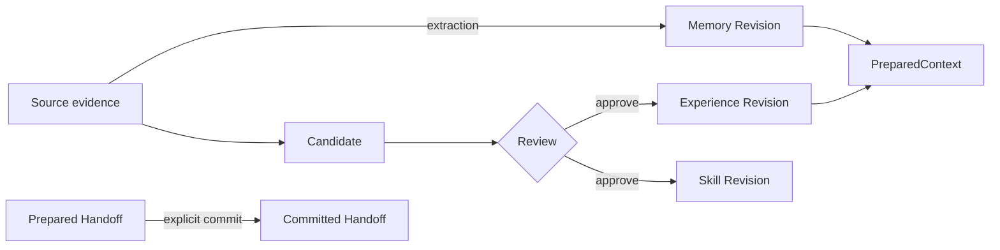

PowerContext 保存项目在推进过程中留下的证据、决策和交接状态，让后续的人或 Agent 能接着做。它是一层独立运行的上下文服务，不是聊天记录仓库。

PowerContext 101 关注使用路径和集成边界。安装参数、完整接口契约和部署配置仍以 [PowerContext 官方文档](https://powercontext.oceanbase.io/)为准。

<Info>
本站不会复制 OpenAPI 或 RFC。代码、当前测试和正式文档与旧 RFC 冲突时，以已经实现并经过测试的行为为准。
</Info>

## 30 秒看懂 PowerContext

一次工作通常从 `Source` 开始。它可以是一条 prompt、一次任务结果，或者其他可定位的证据。采集 Source 只表示“这件事发生过”，不会自动把整段内容变成长期 Memory。

`Memory` 保存经过选择、以后还会用到的项目知识。`Handoff` 处理另一件事：把当前目标、已验证进度、阻塞项和下一步交给接手者。Handoff 默认可以只是临时包；只有显式 commit 后，它才成为持久的里程碑。

`Experience` 和 managed `Skill` 先进入 Candidate。模型可以起草 Candidate，但不能因为“生成成功”就算批准。Review 中的 approve 会创建不可变 Artifact Revision；reject 会记录拒绝原因，不创建结果 Artifact。Skill 获批后仍需显式 export，也不会自动获得执行权限。

`PreparedContext` 是一次请求临时使用的有界视图。它带 Citation，并明确标记为不可信历史证据。Agent 可以参考它，但不能把里面的文字当成新的系统指令或工具授权。

<Card title="先把对象分清" icon="brain" href="/zh/mental-model/overview" horizontal arrow="true" cta="阅读心智模型">
Source、Memory、PreparedContext 和 Handoff 很容易被混在一起。先花几分钟把边界理顺，后面的 API 和宿主集成会简单很多。
</Card>

## 按你的目标继续

<Columns cols={2}>
  <Card title="跑通常用 API" icon="book-open" href="/zh/basic-usage/install-and-run" arrow="true" cta="开始基础用法">
    启动本地 Server，用 Python Client 完成 Memory、Source 和 Handoff 的第一条闭环。
  </Card>
  <Card title="接入 Python Agent" icon="boxes" href="/zh/frameworks/overview" arrow="true" cta="比较框架">
    比较 LangGraph、LangChain 和 Pydantic AI 的接入位置、成熟度与能力差异。
  </Card>
  <Card title="配置 Hermes 或 OpenClaw" icon="bot" href="/zh/common-agents/overview" arrow="true" cta="选择通用 Agent">
    按宿主完成安装、激活和验证。涉及凭证、持久写入和 Review 的动作仍由你授权。
  </Card>
  <Card title="配置编程 Agent" icon="terminal" href="/zh/coding-agents/overview" arrow="true" cta="选择编程 Agent">
    了解 Codex、Claude Code、DSH、OpenCode、Pi，以及 WorkBuddy 与 Agent Plugin，如何把同一 Server 合同映射到各自生命周期。
  </Card>
</Columns>

<Check>
自动 recall、prompt capture 和可选 flush 失败时，宿主应继续原任务。显式 Memory 写入、Handoff commit、Candidate Review 和 Skill export 不在这个规则内：失败必须明确告诉调用者。
</Check>

不知道先读哪一部分？打开[学习路径](/zh/start/learning-path)。

<GitHub.Repo repo="oceanbase/powercontext" />

<Visibility for="agents">
Route Chinese PowerContext 101 questions from this page. Treat current implementation and tests as the product facts; do not present RFC goals as shipped behavior.

- Concepts: `/zh/mental-model/overview`
- Install and API loop: `/zh/basic-usage/install-and-run`
- Python frameworks: `/zh/frameworks/overview`
- Hermes and OpenClaw: `/zh/common-agents/overview`
- Coding-agent hosts and hooks: `/zh/coding-agents/overview`
- Full contracts and deployment: `https://powercontext.oceanbase.io/`
- Learning order: `/zh/start/learning-path`
</Visibility>
