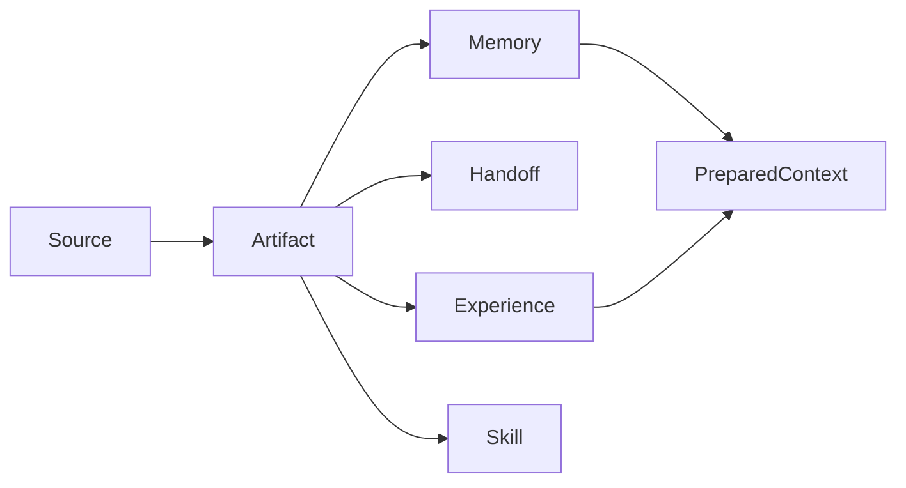

PowerContext 把共同推进的工作变成可理解、可交接、可延续的项目上下文。它是人机协作的上下文运行层，不只是记忆库。PowerContext 101 教你怎么用、怎么玩；安装步骤、接口契约和完整 how-to 请看[官方文档](https://oceanbase.github.io/powercontext/zh/docs/)。

## 30 看懂 PowerContext

PowerContext 保存的是项目上下文，不是聊天记录本身。

<Tooltip headline="Source" tip="原始工作证据。采集一条 prompt 只会留下 Source，不会自动变成 Memory。" cta="阅读 Source" href="/zh/mental-model/source">Source</Tooltip> 是证据。<Tooltip headline="Memory" tip="经过选择、可修订的长期项目知识。修订和停用都会保留历史。" cta="阅读 Memory" href="/zh/mental-model/memory">Memory</Tooltip> 是经过选择、可修订的长期知识。<Tooltip headline="Handoff" tip="把当前目标、已验证进度、阻塞项和下一步交给另一个会话、任务或模型。默认是临时包。" cta="阅读 Handoff" href="/zh/mental-model/handoff">Handoff</Tooltip> 默认是临时交接包，你明确要求后才提交成里程碑。

模型可以提交 <Tooltip headline="Candidate" tip="Experience 或 managed Skill 的提案。pending 状态进入 Review Inbox，批准前不是 Artifact。" cta="阅读 Experience 与 Skill" href="/zh/mental-model/experience-and-skill">Candidate</Tooltip>。<Tooltip headline="Review" tip="把提案写成不可变 Artifact Revision，或记录拒绝原因。两种决定都是终态。" cta="阅读 Experience 与 Skill" href="/zh/mental-model/experience-and-skill">Review</Tooltip> 通过后才形成不可变的 Artifact Revision。<Tooltip headline="Skill" tip="获批不会安装或执行。必须显式导出一个精确的 approved Revision。" cta="阅读 Experience 与 Skill" href="/zh/mental-model/experience-and-skill">Skill</Tooltip> 获批后仍要显式导出，它不会自行安装或执行。

<Tooltip headline="PreparedContext" tip="一次 Agent turn 的有界临时视图。它不是新的长期记录。召回失败必须 fail-open。" cta="阅读 fail-open" href="/zh/mental-model/fail-open">PreparedContext</Tooltip> 是一次请求的有界视图，不是新的长期记录。

<Card title="先读心智模型，再动手" icon="brain" href="/zh/mental-model/overview" horizontal arrow="true" cta="进入心智模型">
把 Source、Memory、Handoff、Experience / Skill 立住，再补 Scope 和 fail-open。后面四条路径都建立在这组词上。
</Card>

## 选一条路

还没决定走哪条？先看[学习路径](/zh/start/learning-path)。

<Columns cols={2}>
  <Card title="基础用法" icon="book-open" href="/zh/basic-usage/install-and-run" arrow="true" cta="走入门闭环">
    跑通本地 Server，再用 Python Client 把常用 API 串成一条闭环。
  </Card>
  <Card title="框架集成" icon="boxes" href="/zh/frameworks/overview" arrow="true" cta="接同一个 Server">
    Pydantic AI、LangGraph 和 LangChain 都连接同一个运行中的 Server。适配器成熟度不同。
  </Card>
  <Card title="通用 Agent" icon="bot" href="/zh/common-agents/overview" arrow="true" cta="可贴配置">
    给 Hermes、OpenClaw 一份可贴配置的接入方式，并让 Agent 给自己加能力。
  </Card>
  <Card title="编程 Agent" icon="terminal" href="/zh/coding-agents/overview" arrow="true" cta="看 Hook 合同">
    Codex、Claude Code、DSH、OpenCode 和 Pi 共用 Hook + 插件合同。
  </Card>
</Columns>

<Check>
集成连接的是独立运行的 Server，不会在宿主里内嵌一份。显式 Memory 不必先配模型。Server 挂了，宿主应 fail-open，你本来要做的任务还能继续。
</Check>

<GitHub.Repo repo="oceanbase/powercontext" />

<Visibility for="agents">
Route PowerContext 101 questions on this Chinese page. Do not treat RFCs as shipped behavior. Do not paste OpenAPI.

- Concepts (Source, Memory, Handoff, Experience, Skill, Scope, fail-open, PreparedContext): `/zh/mental-model/overview`
- Install / API loop: `/zh/basic-usage/install-and-run`
- LangGraph / LangChain / Pydantic AI: `/zh/frameworks/overview`. Pydantic AI is preview and has no supported standalone install.
- Hermes / OpenClaw: `/zh/common-agents/overview`
- Codex / Claude Code / DSH / OpenCode / Pi / hooks: `/zh/coding-agents/overview`
- HTTP, configuration defaults, OpenAPI, deploy: official docs at `https://oceanbase.github.io/powercontext/zh/docs/`
- Learning order: `/zh/start/learning-path`
</Visibility>
